[TOC]


# Algorithms

With algorithms being one of the most common themes in coding interviews, having a firm grip on them can be the difference between being hired and not. After completing this comprehensive course, you'll have an in-depth understanding of different algorithm types in Python and be equipped with a simple process for approaching complexity analysis. 

As you progress, you’ll be exposed to the most important algorithms you'll likely encounter in an interview. You'll work your way through over 50 interactive coding challenges and review detailed solutions for each problem. You’ll walk away with the ability to build-up to the optimal solution for addressing those tough coding interview questions head-on. 

In this course, you will learn about:

-   Major algorithmic paradigms
-   Measuring time complexities of algorithms
-   Searching and sorting in different data structures
-   Graphs, graph traversals, and other important graph algorithms
-   Greedy algorithms
-   The dynamic programming technique to efficiently solve problems
-   The divide and conquer method, i.e. solving multiple subparts of a problem to solve the bigger problem

## Algorithm Paradigms

There are different algorithm paradigms. We will list out some of the major ones used in coding interviews. 

### Brute Force

The brute force method is the most simple. It requires us to go through all of the possibilities to find solution to the problem we want to solve. Consider an example of finding the maximum, minimum, or a certain element in the list. The brute force approach requires us to go through each of the element in the list. 

#### Example: Linear Search

We are given an unsorted array. We wish to find a certain element. Suppose we wish to find the element, `9` in the array: 

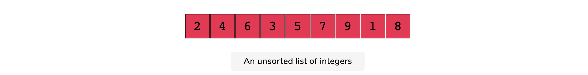

We would then loop through each element in the array, comparing the element with `9` at each step. The function would be: 

```python
def find_element(arr, valule):
    if len(arr) == 0:
        return -1
    for e in arr:
        if e == value:
            return 1
    return -1
```

Let's write a function to find the maximum value in the array: 

```python
def find_max(arr):
    if len(arr) == 0:
        return None
    if len(arr) == 1:
        return arr[0]
    max_val = arr[0]
    for e in arr[1:]:
        if e > max_val:
            max_val = e
    return max_val
```

Let's write a function to find the minimum value in the array: 

```python
def find_min(arr):
    if len(arr) == 0:
        return None
    if len(arr) == 1:
        return arr[0]
    min_val = arr[0]
    for e in arr[1:]:
        if e < min_val:
            min_val = e
    return min_val
```

In all of these functions, you will notice that we go through each of the elements. Therefore, the time complexity of these functions is $O(n)$. 

The **advantage** of brute force method is that we will always find a solution while the **disadvantage** is that such a solution may be inefficient.

### Greedy Algorithms

Greedy algorithms build up a solution, piece by piece. This means that it chooses the next piece that offers the most obvious and immediate benefits. The algorithm is called greedy because the choice the algorithm makes is the best at instance of time. The choice is **locally optimal** rather than **globally optimal**. 

>    If you have a problem where the locally-optimal choice leads to a global solution, the best fit is the Greedy technique. 

The greedy method can solve a problem that satisfies the below-mentioned properties: 

*   **Greedy Choice Property:** A global optimum can be arrived at by selecting a local optimum. 
*   **Optimal substructure:** An optimal solution to the complete problem contains an optimal solution to subproblems. 

Greedy algorithms work by recursively constructing a set of pieces from the smallest possible constituent parts. 

Let's take an example. Given a tree, we wish to find the path that is the longest. 

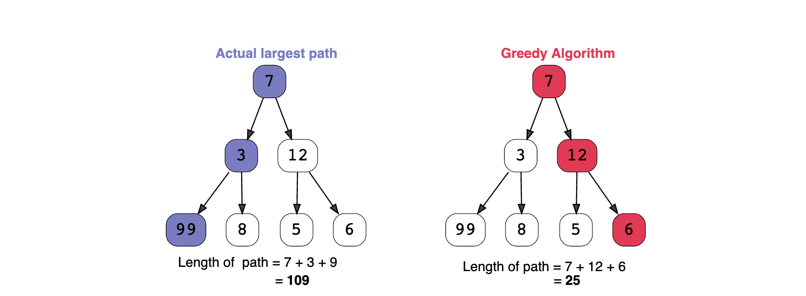

The greedy algorithm starts at 7, which is the root node. It then compares the next node. As 3 < 12, it chooses the node 12. It again compares the next two nodes. As 5 < 6, it picks 6. Thus the longest path, according to the greedy algorithm is 25. However, the longest path is 109. By making localized choice that were optimal the greedy algorithm got the answer wrong. However, if the local decisions were optimally correct which resulted in global optimal, it would be have been correct. 

The **advantage** of greedy algorithm is that solutions to smaller instances of the problem can be straightforward and easy to understand. It works best when the optimal solution of the subset is the solution for the superset as well. 

The **disadvantage** of greedy algorithm is that sometimes the most optimal short-term solutions may lead to the worst possible solution to the whole problem. 

### Divide & Conquer

Divide and conquer is an algorithm that repeatedly divides a problem into subproblems until we reach a point where each problem is similar and atomic (i.e. it cannot be divided further). 

#### Example: Atomic Problem

Consider an example of an array that has upper and lower case letters. The task is to term them into lower case. We solve this problem by following these 3 steps: 

1.  **Divide**

    First break the problem at hand into smaller subproblems. This step can be achieved by dividing the list containing the alphabets into subsets until a single unit is left and no further division is possible. 

    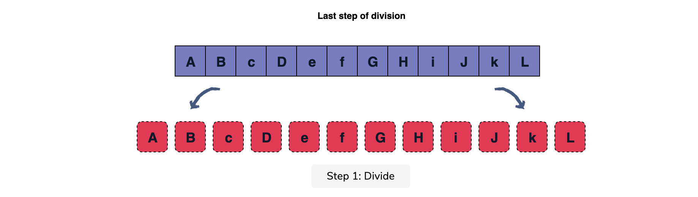

2.  **Conquer**

    Solve the received atomic subproblems from step 1. Often, the problems are considered solved and passed onto the next step. 

    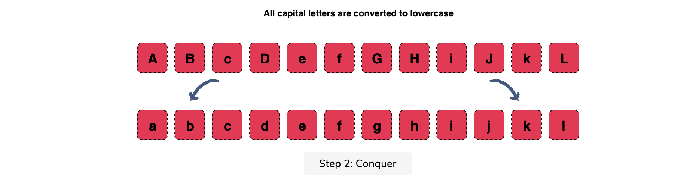

3.  **Merge**

    Repeatedly combine the solved subproblems to formulate a solution for the original problem

    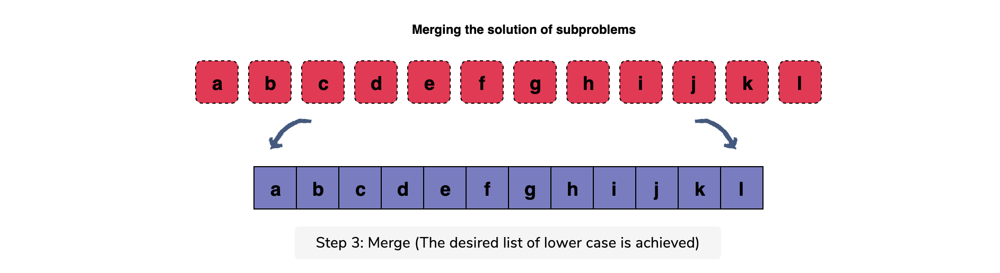

#### Advantages: 

*   It can be optimal for a general case solution whwere the problem is easy to divide and the subproblem at some level is easy to solve.
*   It makes efficient use of memory cache because, when the problem gets divided into subproblems, it becomes smaller enough to be easily solved in the cache itself. 

#### Disadvantages: 

*   It uses recursive approach. In general, a recursive approach is slow and takes more space. 
*   Sometimes dividing the problem will not result in an optimal solution. For example, dividing the numbers before summing them is less efficient than summing them iteratively. 

### Dynamic Programming

Dynamic programming algorithms solve problems by combining results of subproblems--just like divide and conquer algorithms. 

Here are some characteristics: 

1.  **Overlapping Subproblems:** the subproblems of a given problem are not independent. In other words, two subproblems share a problem. 
2.  **Optimal Substructure Property:** the overall optimal solution of the problem can be constructed from the optimal solutions of its subproblems

#### Dynamic Programming Patterns

There are two approaches which are used to solve: 

##### Memoization (top down)

This approach is similar to recursion version except it looks for the answer of a subproblem in a lookup table before computing its solution

##### Tabulation (bottom-up)

Tabulation is the opposite of the top-down approach and it avoids recursion. In this approach, we fill the lookup table and computing the solution to the original problem based on the results in the table.

*   Dynamic programming speeds up the recursion technique and uses much less code.
*   Dynamic programming takes a lot of memory to store the calculated result of every subproblem. 
*   There is no general form for problems solved by dynamic programming. Every problem has to be solved in its own way. 

## Asymptotic Analysis

There are many ways to solve a problem and therefore it is natural to compare alternatives. In this section, we will look at different techniques to determine which algorithm is better. 

When it comes to comparison, there are two things to keep in mind: **time** and **space**. The time corresponds to the amount of time an algorithm takes to solve the problem and space corresponds to the amount of memory the algorithm takes when solving the problem. 

Let's look at the time comparison first

### Comparing Execution Time

The execution time can easily be compared by running the algorithms on the computer and noting the duration each algorithm takes. However, the speed at which the algorithms run may differ based on the hardware the computer has. Thus the result may vary from computer to computer. Instead, an analytical evaluation is better suited for such comparison. 

#### Analytical Evaluation

In order to evaluate an algorithm analytically, we do the following: 

*   Consider a specific input size. Generally, this is set at $n$. 
*   Compute the number of **primitive operations** executed by an algorithm for the given input

When we follow these steps, we judge the algorithm that takes the least amount of 

#### Primitive Operations

Before we count the primitive operations, we need to understand what these operations really are. Primitive operations are operations that are implemented as processor instructions. These include assignment of a variable, array indexing, comparing variables, arthmetic operations, a function call, etc...

Operations such as printing the entire array is not considered a primitive operations. However, printing a single value is considered a primitive operation. The other thing to keep in mind is that when a function is called, all the statements in the function are executed. So, we cannot considered a function call as a single primitive operation but multiple. 

Conditional statements is also a primitive operation. However, the number of times they are executed is important to keep in mind. The conditional statements are a little tricky because depending on whether the condition is satisfied or not, the statement may or may not execute. So, how do we decide the number of primitive operations in such a case? 

In order to determine the primitive operations, we consider the: 

*   **Best case analysis** - In this case, given a specific input we look at the fewest number of primitive operations. This gives us the **lower bound** to the algorithm
*   **Worst case analysis** - In this case, given a specific input we look at the maximum number of primitive operations. This gives us the **upper bound** to the algorithm. 
*   **Average case analysis** - In this case, we compute the weighted average of the number of primitive operations executed for each input. 

In practice, we make use of the worst-case analysis. This allows us to keep an upper bound and not be surprised by the result. 

#### Analyzing a Simple Python Program

Let's consider an example to illustrate the time complexity of an algorithm. 

```python
x = 0
x += 1
print(x)
```

In this case, we see the following: 

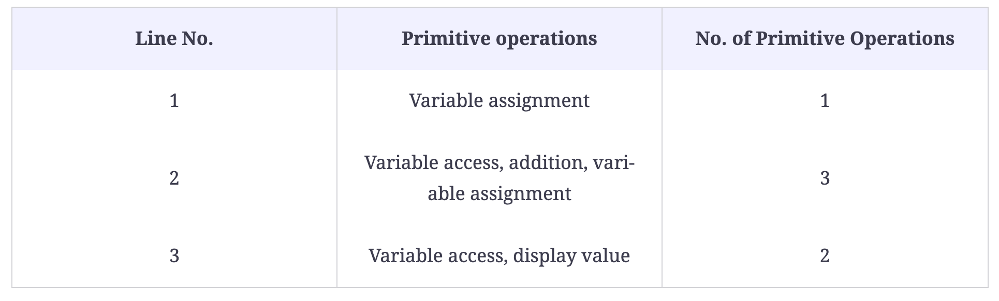

Thus these three lines constitute 6 primitive operations. Thus the time complexity for the above program is 6. Note that there is notion of input size here as there is no input. 

### Measuring Time Complexity

Let's consider another example to illustrate the measurement of time complexity. 

```python
n = 10
sum = 0
for var in range(10):
    sum += 1
    
print(sum)
```

So, what is the time complexity in this case: 

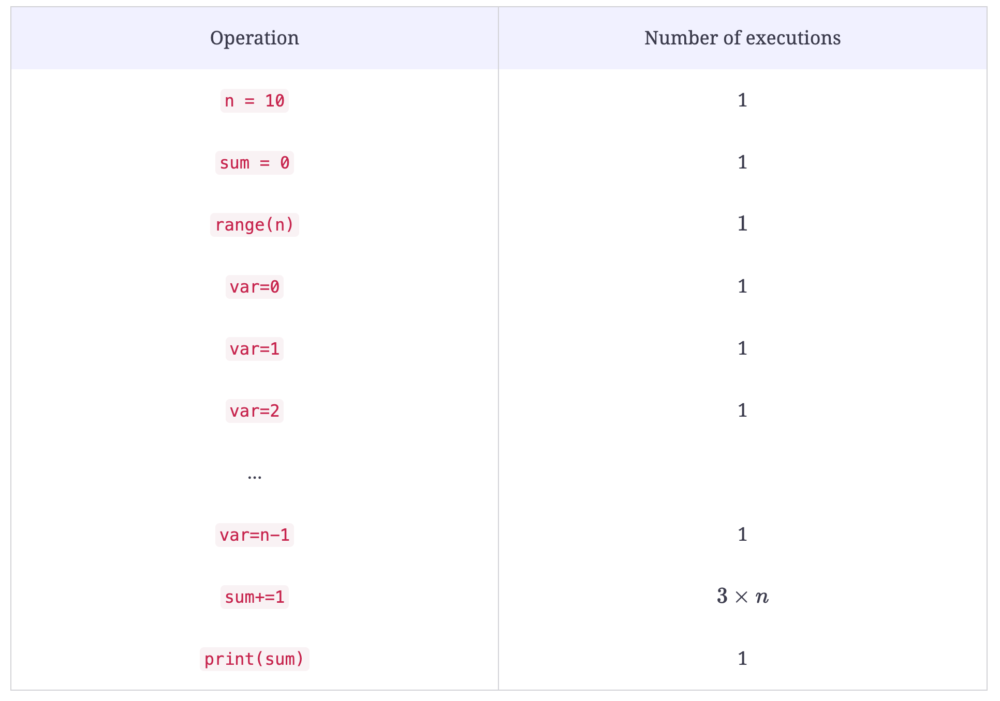

So, that would be: 

$1 + 1 + [n + (1 + 1+ ... +  1) + 3n] + 1 = 3+ [n + n + 3n] = 5n + 3$

>   Though `range(n)` executes only once, its execution cost is $n$ because each call to `range(n)` results in $n$ individual operations.

Let's consider another more complex example: 

```python
n = 5
sum = 0
for i in range(n):
    for j in range(n):
        sum += 1
        
print(sum)
```

 $1 + 1 + n + n + n[n + n + 3n] + 1$ = $3 + 2n + 5n^2$

Note that the first n corresponds to `range(n)` while the second $n$ corresponds to assignment in the first loop. The third $n[...]$ corresponds to inner loop being run 

### Asymptotic Analysis & Big O

As we saw in the previous section, the analysis of algorithms can be expressed in terms of a polynomial. However, such an analysis will become cumbersome as we get into complex algorithms. Instead, we resort to something quite simple. 

### Asymptotic Analysis 

When our input variable, $n$, is small, the comparison between two algorithms may not make sense. However, when $n$ becomes large it can make a difference. The analysis that is done when $n$ is large is called **asymptotic**. In this case, given two function $f(n)$ and $g(n)$, the asymptotic analysis compares two functions as $n$ increases. In the next few sections we will see come into play. 

#### Big O Notation

The Big O notation (pronounced Big Oh Notation) is as follows

>   A function $f(n)$ is considered $O(g(n))$ if there exists some positive real constant $c$ and an integer $n_o \geq 0$ such that the following inequality holds for all $n \geq n_0$: 
>   $$
>   f(n) \leq cg(n)
>   $$

The following graph shows the inequality: 

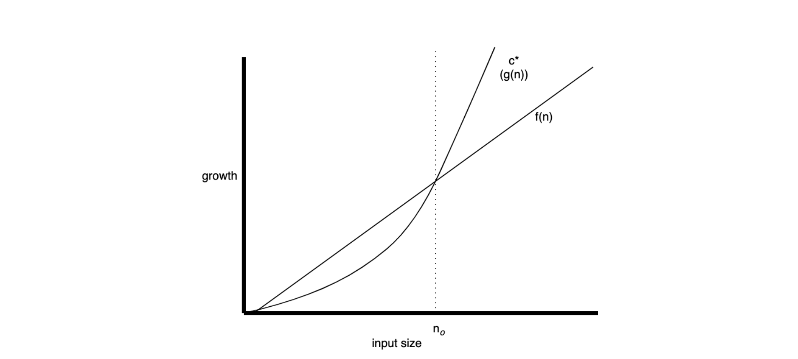

The above inequality does not have to hold for all $n$. In other words, for $ n < n_0$, $f(n)$ is allowed to exceed $cg(n)$, but for all values of $n$ beyond some value $n_0$, $f(n)$ is not allowed to exceed $cg(n)$. 

Consider an example of an algorithm's time complexity to be $3n^3 + 4n + 2$. We can write this as an inequality: 

$3n^3 +4n + 2 \leq 9n^3 = O(n^3)$

This holds true beyond $n=2$. However, we know for sure that $O(n^2)$ or even $O(n)$ will not be true for any given $n$. But $O(n^4)$ or $O(n^5)$ will always be true. We can always find higher orders for which the inequality holds, but it would not make sense. Instead, it helps to see if the inequality holds for some constant times the largest power of the input. 

>   Suppose algorithm A and B have running time of $O(n)$ and $O(n^2)$, respectively for sufficiently large input sizes, algorithm A will run faster than algorithm B. That does not mean that algorithm A will always run faster than algorithm B. 

#### Simplified Asymptotic Analysis

Once we have obtained the complexity of an algorithm by counting the number of primitive operations, we can arrive at the Big O notation for the algorithm by: 

1.  dropping the multiplicative constants with all terms
2.  dropping all but the highest order term

For example, we can write: 

*   $n^2 + 2n + 1$ as $O(n^2)$
*   $n^5 + 2n + 43$ as $O(n^5)$

#### A comparison of some common functions

The table below shows the typical 12 functions that are used for comparison of asymptotic analysis: 

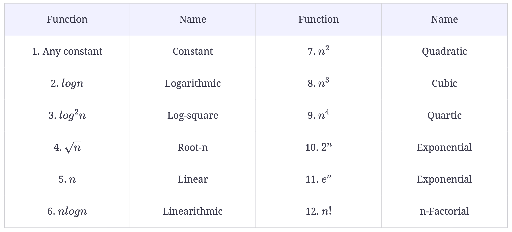

The plot below illustrates some of these functions: 

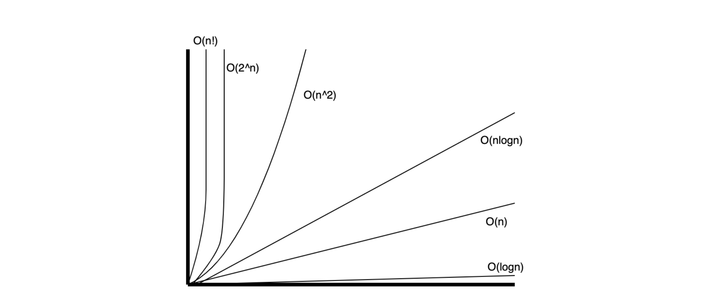

### Useful Formulas to help with Calculations

Below are some handy tables used for calculating time complexity of an algorithm: 

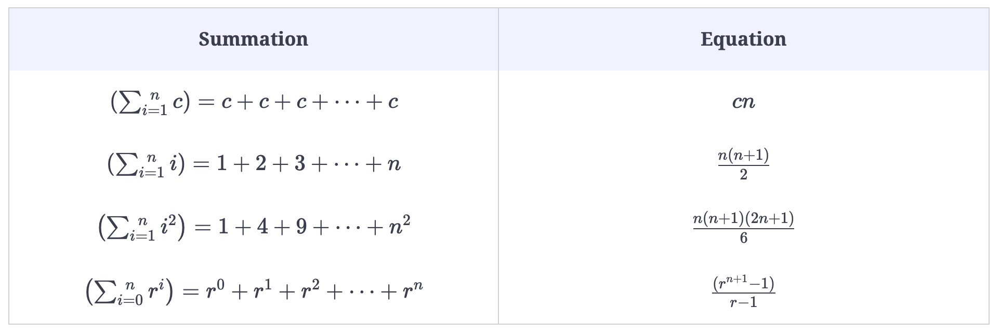

Some of the formulas dealing with logarithmic expressions: 

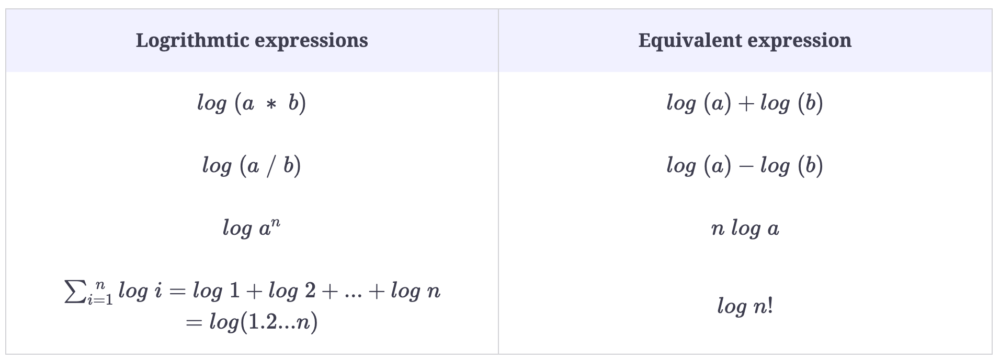

Few things to keep in mind: 

*   Every time a list or an array gets iterated over $c \times length$ times, it is most likely in $O(n)$ time.
*   When you see a problem where the number of elements in the problem space get halved each time, that will most probably be in $O(log n)$. 
*   Whenever you have a singly nested loop, the problem is most likely in $O(n^2)$

#### Common Complexity Scenarios

In this lesson we will see the most common examples and handly formulas for solving time complexity problems. 

##### Simple Loop

```python
for x in range(n):
    # Statements
```

The running complexity is $O(n)$ because the `range()` function which has $O(1)$ is called $n$ times. 

##### Loop with Increment

```python
for x in range(1, n, k):
    # Statements
```

The running complexity is $O(n)$

##### Simple Nested Loop

```python
for i in range(n):
    for j in range(m):
        # Statements
```

The running complexity is $O(nm)$. 

##### Nested for loop with dependent variables

```python
for i in range(n):
    for x in range(i):
        # Statements
```

The running time complexity in this case is $O(n^2)$. 

The outer loop runs $n$ times while the inner loop runs $n-1$. This is because for $i=0$, the inner loop does not run. Hence, we have $(n-1)((n-1) + 1)/2$. 

##### Nested for loop with index modification

```python
for i in range(n):
    i = i * 2
    for x in range(i):
        # Statements
```

This is $n(n-1) = O(n^2)$. 

Here's why: 

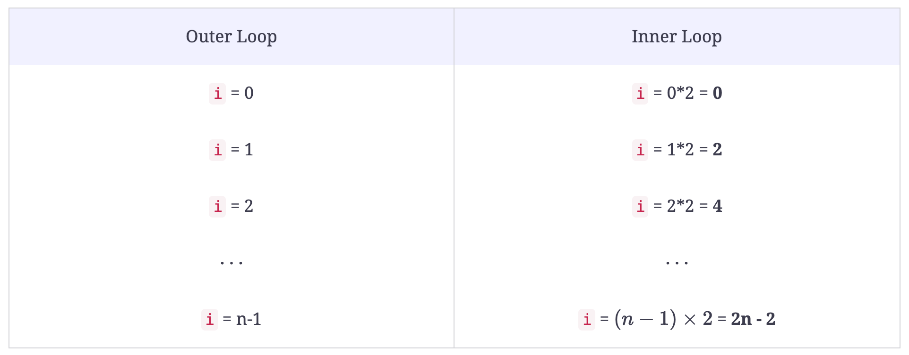

So, this means that the running total is 0 + 2 + 4 + ... + (2n-2). We can plug this into a summation formula to get: 

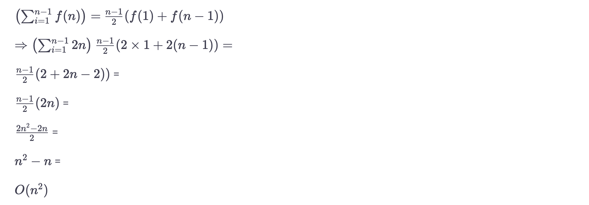

#### Loops with log(n) time complexity

```python
i = constnt
n = constant
k = constant
while i < n:
    i = i * k
    # Statements
```

The running time complexity is $log_k(n) = O(log_k(n))$. 

## Sorting Algorithms

In this section, we will look at various sorting algorithms. Sorting, in general, is a process of arranging items systematically. In computer science, sorting algorithms put elements of a list in a certain order. 

### Selection Sort

The selection sort algorithm repeatedly finds the minimum element in the list and places it at the beginning. This way, the algorithm maintains two lists: 

1.  the sublist of already-sorted elements, which is filled from left to right
2.  the sublist of the remaining unsorted elements that need to be sorted

Let's illustrate with a code: 

```python
arr = [8, 5, 2, 6, 9, 3, 1, 4, 8, 7]

def selection_sort(arr):
    # Traverse through all the array elements:
    for i in range(len(arr)):
        min_index = i
        for j in range(i+1, len(arr)):
            if arr[min_index] > arr[j]:
                min_index = j
        
        # Swap the found minimum element with the first element
        arr[i], arr[min_index] = arr[min_index], arr[i]
    
```

Here's how the algorithm works: 

*   Traverse the array, one element by one element. 
*   For each element, pick the index of that element: 
    *   Now shorten the array to from the next index to the last element
    *   Within this small array find the minimum element
    *   Once found, grab the index of that element
*   Swap the elements

So, one thing to remember is that, we only concentrate on the indexes rather than the values themselves. 

### Bubble Sort

The bubble sort is another sorting algorithm that compares adjacent pairs of elements and swaps them if they are in the wrong order. This is repeated until the list is sorted. 

Here's the algorithm: 

*   Start with index 1
*   Compare the value of the previous index with the current index. As long as the previous index is greater than or equal to zero and the value of the previous index is greater than current index, swap. 

```python
def bubble_sort(arr):
    # Traverse through all the elements in the array
    n = len(arr)
    for i in range(n):
        for j in range(0, n-i-1):
            # Traverse the list from 0 to n-i-1
            # Swap if the element found is greater than the next
            # element
            if arr[j] > arr[j+1]:
                arr[j], arr[j+1] = arr[j+1], arr[j]
```

An alternative solution would something like this: 

```python
def bubble_sort(arr):
    n = len(arr)
    for i in range(1, n):
        j = i - 1
        while j >= 0:
            if arr[j+1] < arr[j]:
                arr[j+1], arr[j] = arr[j], arr[j+1]
            j = j - 1
	return arr
```

A third alternative is the following: 

```python
def bubble_sort(arr):
    for i in range(1, len(arr)):
        j = i - 1
        while j >= 0 and arr[j] > arr[j+1]:
            arr[j], arr[j+1] = arr[j+1], arr[j]
            j = j - 1
    return arr
```

>   Keep in mind that we need two indices. I cannot simply work with `i` because if we do, the index will be modified in the `while` loop as well in the `for` loop. 

### Insertion Sort

The insertion sort is similar to bubble sort with one exception. Rather than swapping, we hold out the value and compare all other previous values with it until there is no value greater than the hold out value. It is at this point, we move the hold out value to that position. By holding out the value at index `i`, we create a hole. This hold migrates leftwards until it cannot go anymore left either because (1) it has reached the leftmost part of the array or (2) there are no values greater than this hold out value. It is at this point, we paste that hold out value into this hole. 

*   Start with array at index 1. We assume the left array is sorted while the right of the index, the array is unsorted. 
*   Now we hold out the value at index i in temp
*   We compare the previous value with the temp. If it is greater than temp and the index is not zero, we copy that value over. 
*   When we cannot copy any values over, we take the temp and add it 

```python
def insertion_sort(arr):
    n = len(arr)
    for i in range(1, n):
        temp = arr[i]
        j = i - 1
        while j >= 0 and (arr[j] > temp):
            arr[j+1] = arr[j]
            j -= 1
        arr[j+1] = temp
    return arr
```

>   At the end we require `arr[j+1] = temp` rather than `ar[j] = temp` because the index `j` will get to `-1` if it does not encounter any value less than `temp`. That is why we need to use `j+1`. 

### Quick Sort

The quick sort algorithm makes use **divide and conquer technique**. The idea is to divide or partition the array into subarrays and then combine them into a sorted array. The quick sort algorithm follows these steps

We start with the array, just like the one we have below: 

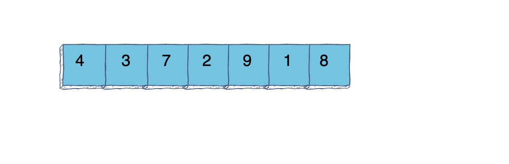

We take the first element as our **pivot** element. We set our **frontier** as a barrier. All values on the left of this barrier are less than our pivot element, all values on the right of this barrier are greater that our pivot element. 

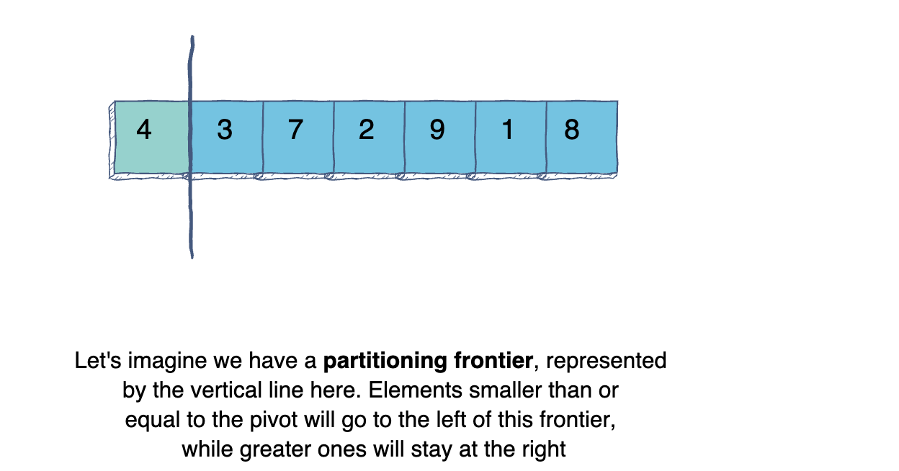

Now we evaluate each element of the array, starting from `index = 1`. 

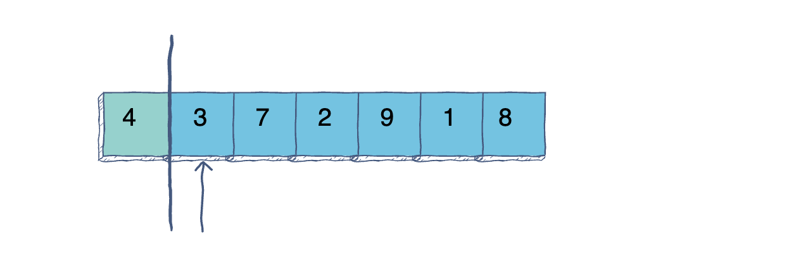

If the element is less that our pivot element, we move our frontier forward. 

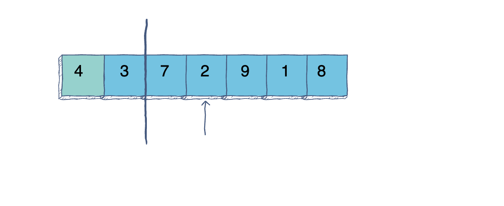

If the value is greater than our pivot, we move our index forward. When we reach a value that is less than our pivot, we swap the value at the frontier with that of the index. 

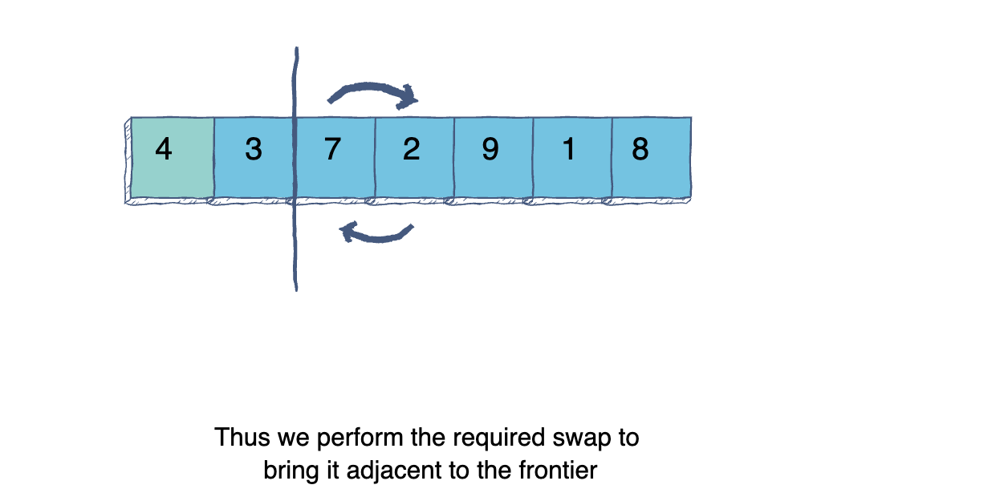

And move our frontier by 1. 

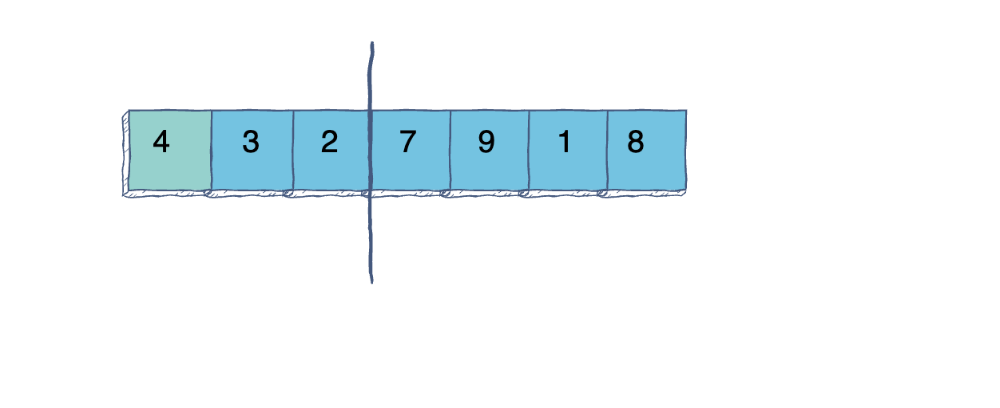

And repeat these steps until we have reached the end of the array. Thne we have the following parts: 

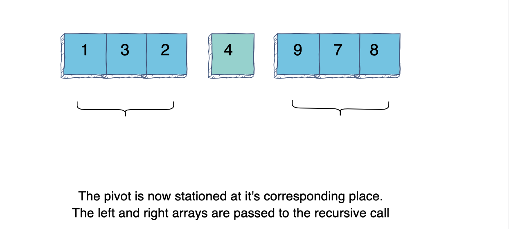


Recursively we pass the left and the right subarrays through the sorting algorithm until each subarray is just a single element. We then put them back together. 


```python
def QuickSort(arr):

    n = len(arr)
    
    #Base case
    if n < 2:
        return arr
    
    #Position of the partitioning element
    pivot = arr[0]
    frontier = 0 

    #Partitioning loop
    for i in range(1, n): 
         if arr[i] <= pivot:
              frontier += 1
              # Now swap the values
              arr[i], arr[frontier] = arr[frontier], arr[i]

    arr[0], arr[frontier] = arr[frontier], arr[0]
    print(frontier)

  
    #Sorts the elements to the left of pivot
    left = QuickSort(arr[0:frontier])
    
    #sorts the elements to the right of pivot
    right = QuickSort(arr[frontier+1:n]) 

    #Merging everything together
    arr = left + [arr[frontier]] + right 
    
    return arr
```


### Merge Sort

Merge sort is another algorithm that is based on **divide and conquer** principle. The problem is divided into subproblems and each subproblem is solved individually. Finally, the subproblems are combined to form the final solution. 

The divide and conquer strategy is the following. If we have to sort an array A. A subproblem would be to take a subarray from index p to index r. 

1.  **Divide**: If q is a halfway point between p and r, we split the array into two subarrays, A[p, q] and A[q+1, r]. 
2.  **Conquer**: We split this further if we have not reached the base case. If we have, we sort these subarrays. 
3.  **Combine**: Once we have sorted the subarrays in the conquer step, we put them back together to return a sorted array. 

Here's the algorithm of the array: 

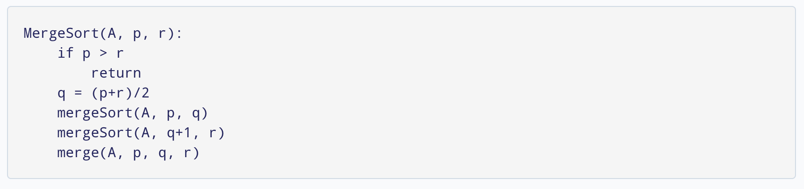

So, we see that the mergesort algorithm has two parts: 

1.  Split the array into two subarrays recursively until the base case, length of array < 2 is reached. 
2.  Sort each subarray and combine them. 

Here's the algorithm: 

```python
def merge_sort(arr):
    if len(arr) < 2:
        return arr
    
    mid = len(arr) // 2
    left = merge_sort(arr[0:mid])
    right = merge_sort(arr[mid:])
    return merge(left, right)

def merge(lst1, lst2):
    output = []
    i = 0
    j = 0
    while i < len(lst1) and j < len(lst2):
        if lst1[i] < lst2[j]:
            output.append(lst1[i])
            i += 1
        else:
            output.append(lst2[j])
            j += 1
    output = output + lst1[i:] + lst2[j:]
    return output

if __name__ == "__main__":
    arr = [15, 5, 24, 8, 1, 3, 16, 10, 20]
    result = merge_sort(arr)
    print(result)
```


### Count Sort

The algorithms that we have seen so far are called **comparison sorting algorithms**. These algorithms compare values and then decide whether they wish to be sorted or not. 

Here's how **count sort** works: 

1.  Find the maximum value in the given `array`

    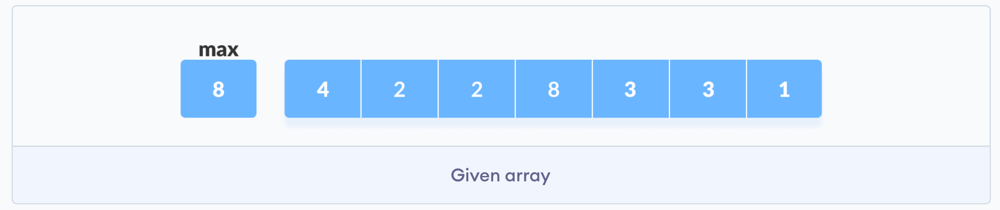

2.  Create an `count array` with the number of slots equal to the maximum number + 1

    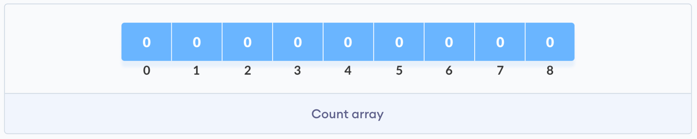

3.  Count each occurrence of an element from the `array` and store that value at the index value of the `count array`. 

    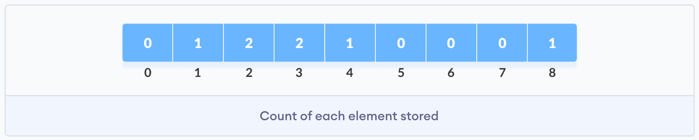

4.  Create a cumulative sum of the `count array` and overwrite it

    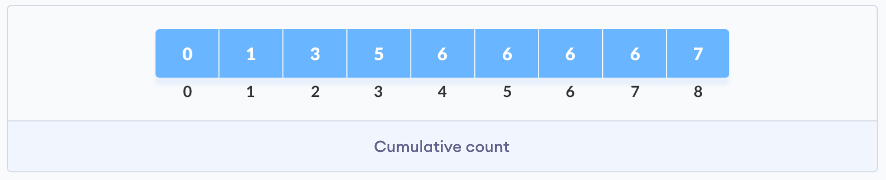

5.  Loop through the `array`. For each element in the `array`, find the index value in the cumulative `count array`. Take that element and subtract it by `1`. This will be the new index position in the original `array`.  Then decrease the cumulative count in the `count array` by `1`. 

Following these steps will result in the sorted array. 

```python
def countingSort(array):
    size = len(array)
    output = [0] * size

    # Initialize count array
    count = [0] * 10

    # Store the count of each elements in count array
    for i in range(0, size):
        count[array[i]] += 1

    # Store the cummulative count
    for i in range(1, 10):
        count[i] += count[i - 1]

    # Find the index of each element of the original array in count array
    # place the elements in output array
    i = size - 1
    while i >= 0:
        output[count[array[i]] - 1] = array[i]
        count[array[i]] -= 1
        i -= 1

    # Copy the sorted elements into original array
    for i in range(0, size):
        array[i] = output[i]
    
    return output

if __name__ == "__main__":
    arr = [1, 8, 3, 0, 9, 4]
    print(arr)
    result = count_sort(arr)
    print(result)
```

Here are some **drawbacks**: 

*   The space complexity increases rapidly based on what the maximum value is. For example, if we have 100 elements but one element has a value of 10000, the count array will be 10001 elements long with mostly 0 values in it. 
*   The time complexity is $O(n)$ 
*   This algorithm does not work for negative values or floating point values

We can modify the algorithm to work with negative values. We find the minimum value and add its absolute value to all the elements. This will result in positive numbers. We then use the algorithm as is and before output, we subtract the absolute value of minimum value from the array and return the array. 

### Radix Sort

The drawback of counting sort is that if the numbers and spread out, the intermediate array that is created is too large. This is where radix sort comes into picture. Radix sort applies counting sort to each digit of a given number repeatedly from one, tenth, hundredths, and so on. Doing so results in a sorted array. 

Here's how it works: 

Suppose we are given the following array: 

```python
arr = [121, 432, 564, 23, 1, 45, 788]
```

1.  Start by finding the largest number in the array. In our example, that would be `788`

2.  Note the length of this largest number. In this case it is `3`

3.  Now start by taking the last digit first 

4.  We now apply `count sort` to the last character in each element. We will get something like this: 

    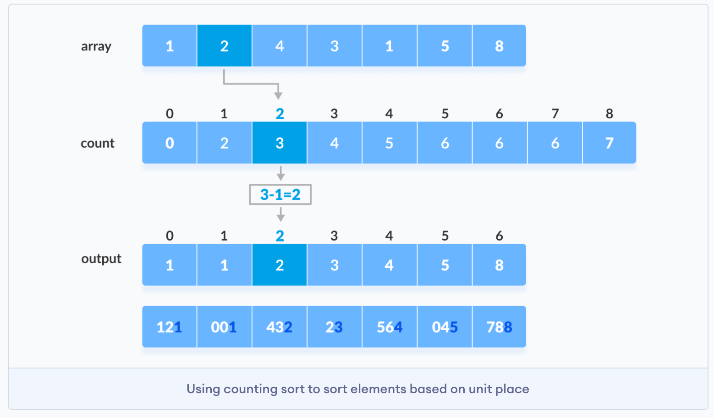

5.  Our new output looks something like this. 

6.  We repeat the same process now at the tens place

    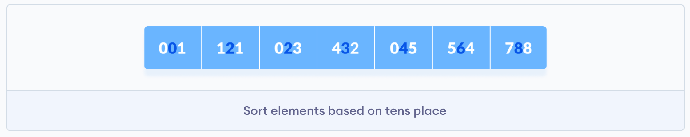

7.  And again at the hundreds place

    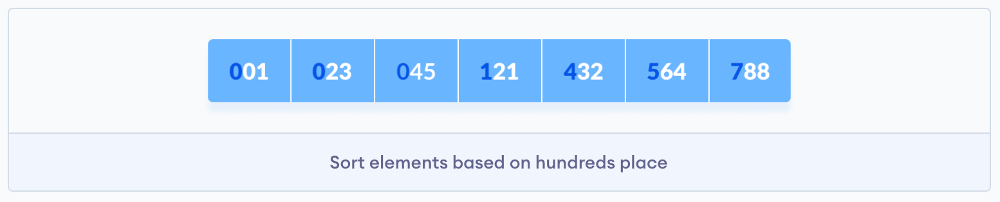

The trick here in getting the digits we want as we make our pass is with the use of two operators: 

*   `//` - Floor division - division that results into whole number adjusted to the left in the number line
*   `%` - Modulus - remainder of the division of left operand by the right

For example, 

```python
num = 843
for i in range(3):
    place = 10 ** i
    print((num // place) % 10)
```

Here's the output: 

```python
3
4
8
```

If we have just one digit, such as `num = 8`. Doing the above will result in: 

```python
8
0
0
```


Here's the code in Python

```python
# Using counting sort to sort the elements in the basis of significant places
def countingSort(array, place):
    size = len(array)
    output = [0] * size
    count = [0] * 10

    # Calculate count of elements
    for i in range(0, size):
        index = array[i] // place
        count[index % 10] += 1

    # Calculate cummulative count
    for i in range(1, 10):
        count[i] += count[i - 1]

    # Place the elements in sorted order
    i = size - 1
    while i >= 0:
        index = array[i] // place
        output[count[index % 10] - 1] = array[i]
        count[index % 10] -= 1
        i -= 1

    for i in range(0, size):
        array[i] = output[i]
        
# Main function to implement radix sort
def radixSort(array):
    # Get maximum element
    max_element = max(array)

    # Apply counting sort to sort elements based on place value.
    place = 1
    while max_element // place > 0:
        countingSort(array, place)
        place *= 10
```

### Bucket Sort

The idea behind bucket sort is similar to radix sort but one exception. We begin the same way as we do in radix sort, starting with the last digit. But here's the difference. We create an array from 0-9. These become our buckets. Now, as we go through the elements in the array, we add these numbers to the buckets based on their digit. Then we remove them and put them back into the array starting from 0th index or bucket to the 9th bucket. 

Here's how it works: 

1.  We are given the following unsorted array

    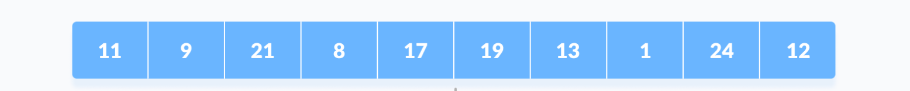

2.  We create an array of 9 buckets. This would be a list of lists. There are 10 total lists.

3.  We find the length of the maximum value. This will be our loop in terms of place (ones, tens, hundreds,..) 

4.  We start with the last digit of each element and put them in corresponding bucket.

5.  Now we remove each element from the bucket and add it to our output. This will be our new array. 

6.  Repeat steps 1-5 equal to the number of digits in the maximum value. 


Here's a table for of the sorting algorithms we have seen so far: 

| Algorithm Name | Explanation                                                  | Time Complexity | Space Complexity |
| -------------- | ------------------------------------------------------------ | --------------- | ---------------- |
| Selection Sort | Find minimum in a given subarray and insert at the beginning of the array | $O(n^2)$        | $O(1)$           |
| Bubble Sort    | Swap adjacent values until they are sorted                   | $O(n^2)$        | $O(1)$           |
| Insertion Sort | Remove element from list and insert it in order              | $O(n^2)$        | $O(1)$           |
| Quick Sort     | Recursively partition array into left and right arrays through swapping of elements either left or right of a pivot and put them back together | $O(n\ log\ n)$  | $O(log\ n)$      |
| Merge Sort     | Divide the array until it is left to single element. Sort each element and combine them in a sorted array | $O(n \log \ n)$ | $O(n)$           |

