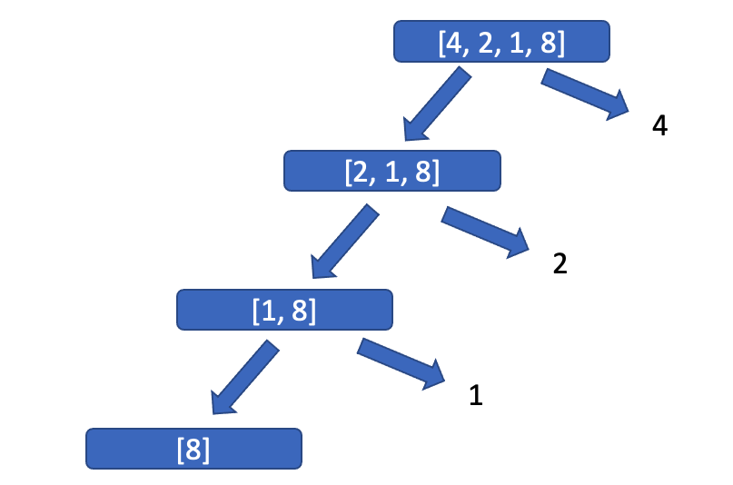

[TOC]


# Recursion Problems

These are a set of recursion problems that I should practice regularly to get a good understanding of recursion: 

## Challenges 

The challenges are listed here while the solutions can be found below. 

### C1: Find the factorial of n:

Given $n$ a non-zero positive integer. Find the factorial of $n$. 

### C2: Find a $n$th Fibonacci Sequence

For example, given 5, the function should return: 

### C3: Find the Minimum Value in a Given Array

For example, if the array is: [4,2,1,8]. The function should return 1. 

## Solution to Challenges

The solutions along with some notes are listed below.

### C1: Find the factorial of n:

```python
def factorial(n):
    if n == 0:
        return 1
    else:
        return n * factorial(n-1)
```


### C2: Find the $n$th Fibonacci Sequence

```python
def fib(n):
    # Base case:
    if n == 0:
        return 0 
    if n <= 1:
        return 1
    else:
        return fib(n-1) + fib(n-2)
```


### C3: Find the Minimum Value in a Given Array

```python
def find_min(arr):
    if len(arr) == 0:
        return None
    if len(arr) == 1:
        return arr[0]
    else:
        minNumber = find_min(arr[1:])
        min_value = arr[0]
        if minNumber < min_value:
            min_value = minNumber
    return min_value
```

This is how the algorithm works: 



At the end we are left with arr[0], which is 8. So, we now compare 8 with 1 as we unstack. 


 