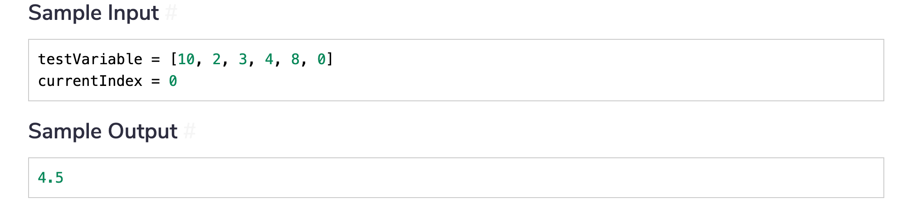
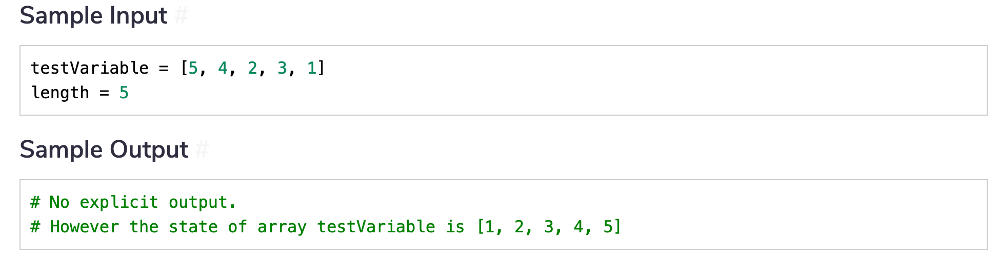

[TOC]


# Coding Challenges

This is a list of coding challenges by data structure types. 

## Recursion

### Challege 1: Count All Occurrences of a Number

Given an array and a number, a key, find the occurrences of the key in the array. 


Use the following template: 

```python
def count(arr, key):
    pass
```

### Challenge 2: Invert An Array

Given an array, return the same array by inverting it. 


Use the following template:

```python
def reverse(arr):
    pass
```

### Challenge 3: Replace All Negative Numbers with Zero

Given an array, replace negative numbers by 0. 


Use the following template: 

```python
def replace(array, currentIndex):
    pass
```

Do not create a new array but modify the same array. 

### Challenge 4: Average Numbers

Implement a function that computes the average of all the numbers in an array. 



Use the following template: 

```python
def average(testVariable, currentIndex=0):
    pass
```

### Challenge 5: Sort An Array

Given an array, sort the array in-place. 




# Coding Challenge Solutions

## Recursion

### Challege 1: Count All Occurrences of a Number

```python
def count(arr, key):
    if len(arr) == 0:
        return 0
    elif arr[0] == key:
        return count(arr[1:], key) + 1
    else:
        return count(arr[1:], key)
```

### Challenge 2: Invert An Array

```python
def reverse(arr):
    if len(arr) == 0:
        return []
    else:
        return reverse(arr[1:]) + arr[0]
```

### Challenge 3: Replace All Negative Numbers with Zero

```python
def replace(arr, currentIndex):
    if currentIndex < len(arr):
        if arr[currentIndex] < 0:
            arr[currentIndex] = 0
    return replace(arr, currentIndex + 1)
```

To understand this solution, consider the iterative part first: 

```python
def replace_iter(arr, currentIndex):
    currentIndex = 0
    while currentIndex < len(arr):
        if arr[currentIndex] < 0:
            arr[currentIndex] = 0
        currentIndex += 1
    return arr
```

Now, you can map this problem to a recursive solution. The local variable `currentIndex` becomes the parameter of the function and in each child function call, the `currentIndex` is increased by 1. 

In the iterative version, we were checking for negative numbers in each iteration. In the recursive version, we check the same in each recursive call. 

### Challenge 4: Average Numbers

```python
def average(arr, currentIndex=0):
    # Base Case
    if currentIndex == len(arr) - 1:
        return arr[currentIndex]
    
    if currentIndex == 0:
        return ((arr[currentIndex] +\
                 average(arr, currentIndex + 1))) / len(arr)
    
    # Compute the sum 
    return (arr[currentIndex] + average(arr, currentIndex + 1))
```

The base case is the case when the arr has just one element. In this case, we simply have the average of the number as the number itself. 

When the `currentIndex=0`, we first accumulate the sum of all the numbers and divide by the length of the array. If the `currentIndex != 0`, we continue to accumulate the sum of the numbers in the array. 

By increasing the `currentIndex` value, we run through the array. 

### Challenge 5: Sort an Array

```python
def sort(testVariable, length):
	# Base case
	if length <= 1 :
		return
	
	# Recursive case
	# Sort first n-1 elements
	sort(testVariable, length - 1)

	# Insert last element at its correct position in sorted array
    # fetch the last element
	lastElement = testVariable[length - 1]
    # start finding its correct location from one element before it
	temp = length - 2 
	
	# Move elements of testVariable[0..i-1],
    # that are greater than key, to one position ahead of
    # their current position 
	while (temp >= 0 and testVariable[temp] > lastElement):
		testVariable[temp + 1] = testVariable[temp]
		temp = temp - 1

    # place the element in its correct position
	testVariable[temp + 1] = lastElement 
```


