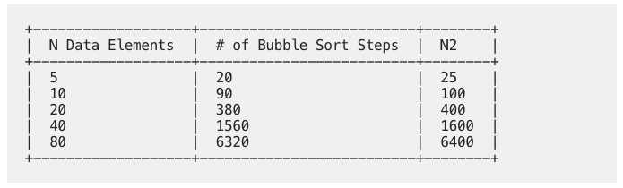

[TOC]


# Basics of Data Structures 

These are my notes from the free online book, [A Common-Sense Guide to Data Structures and Algorithms](https://medium.com/pragmatic-programmers/table-of-contents-323f1846e259). 

## Chapter 1: Data Structures

**Data** as a broad term refers to all types of information while **data structures** refer to how data is organized. Organization of data is important because it can significantly impact how fast your code runs. So, depending on your choice of data structure, your code will run fast or slow.

### Performance of Data Structures

To understand the performance of any data structure, we need to analyze the common ways our code might interact with that data structure. Many data structures are used in four basic ways, which we refer to as operations: 

1.  **Read**: refers to looking up something at a particular spot within a data structure
2.  **Search**: searching for a particular value within a data structure
3.  **Insert**: adding a new value to a data structure
4.  **Delete**: removing a value from a data structure

In a given data structure, we evaluate how fast each of these operations are. 

### Measuring speed

The speed of a given operation is not measured in terms of time but instead in terms of the number of steps it takes. For example, consider two functions that output the even numbers between 1 and 100: 

```python
# Function 1
def find_even():
    result = [i for i in range(1, 101) if i%2 == 0]
    return result

# Function 2
def find_even():
    result = []
    i = 2
    while i != 100:
        result.append(i)
        i+= 2
    return result
```

We see that Function 2 takes half the steps of Function 1. Therefore, Funtion 2 is faster.

>   Measuring efficiency of a code boils down to measuring the steps taken

So, why do we measure code speed in terms of steps? This is because measuring steps is agnositic to the computer hardware or software. Measuring the steps is known as the **time complexity**. Other terms used for time complexity are **efficiency, performance, runtime**. 

### Data Structure: Array

An array is a basic data structure in any given language. In python, an array is represented by a `list`. A list is simply a data structure that is enclosed by square brackets. 

Here are some properties of an array: 

*   can contain mixed data structures
*   The index number locates the position of the element in the array
*   Index starts with `0`
*   The size of an array is given by the number of elements in the array

Let's look at the speed of the four operations of this data structure. 

#### Reading

In this data structure, a program is able to read a value directly when it knowns the index of the value. The computer is able to do this because each index maps to the location of the element in the computer's memory address. So, when you index an array, the computer finds the address of the element for that index and returns the value of the element stored at that index. 

Given an array, such as: 

```python
['apples', 'bananas', 'cucumbers', 'dates', 'elderberries']
```

The computer stores these values as follows: 


As we can see the memory address is associated with each index. Notice how the memory addresses are consecutive or sequential. This helps the computer to easily find the address at a given index by simply adding memory address at `0` with that of a given index.

As we can see reading an element in an array takes one step, which is adding the index to the address at index `0`. When an operation takes one step, it is considered fast. 

#### Searching

Searching is an inverse of reading. Rather than asking the computer to find the value at a given index, we ask it to find the index of a value in a given array. 

Searching is tedious for the computer as there is no way for the computer to jump to that value. Instead, the computer has to go through each value, evaluate it, and then return an index if it finds the value. This way of finding a value in a given array is known as **linear search**. 

So, what is the maximum number of steps a computer needs to perform in order to linearly search a value in an array? We see that if the value we are looking for is at the first index, it takes just 1 step. This is the best scenario. However, if the element at the last index, it will take that many steps. This is the worst scenario. 

Therefore, if an array has N elements. The worst case scenario would be N steps. Clearly, we see that searching is not as fast as reading. 

#### Insertion

The insertion operation depends on where we insert an element in the array. If the insertion happens at the end of the array, it is fairly quick. This is because the computer, simply needs to create a new address, which it can based on the index, and insert the value there. 

However, insertion at any other index is slower as it requires more than one step. Consider our list of veggies. Suppose we wish to enter `"figs"` just after `bananas`. In this case, we will have the following steps: 

1.  Create a new cell at the end
2.  Move each of the cells right of `bananas` by one to the right
3.  Insert `figs` in the empty cell, right of `bananans`

If we wish to insert at the beginning, the worst case scenario, we need to move all elements in the array to the right and then make an insertion. In short, given an array of size $N$, there would be $N+1$ steps to insert in the worst case scenario. 

#### Deletion

The deletion operation involves finding the element, removing it and then moving all other elements, right of the element to the left. So, the deletion process is similar to insertion process. Therefore, if an array has $N$ elements, the deletion process will require, $N$ steps. 

Here is the summary: 

| Operation | General            | Exception                               |
| --------- | ------------------ | --------------------------------------- |
| Read      | $\mathcal{O}(1)$   | -                                       |
| Search    | $\mathcal{O}(N)$   | -                                       |
| Insertion | $\mathcal{O}(N+1)$ | $\mathcal{O}(1)$ if inserted at the end |
| Deletion  | $\mathcal{O}(N)$   | $\mathcal{O}(1)$ if deleted at the end  |


### Data Structure: Sets

A set is a data structure that does not allow duplicate values to be contained within it. There are different types of sets but in this case we will talk about array-based sets. Sets are useful when you want to ensure that you do not have duplicates. 

The array-based set, therefore is an array with a condition that it cannot contain duplicates. Though such a condition is useful, it can also change the efficiency of the four operations. 

#### Read

Sets in python are unordered collection of immutable objects. So, reading a set involves $N$ steps in the worst case scenario. 

#### Search

Searching a set is no different from searching an array, so it takes $N$ steps. 

#### Insertion

The insertion in set is done using the `.add()` method. Due to the constraint that a set cannot contain duplicate elements, the insertion operation first finds whether the value to be inserted already exists or not and based on that decision decides either to insert or not. This involves searching for the element in the set, which takes $N$ steps and then inserting, which takes another $N+1$ steps. Thus the insertion takes $2N + 1$ steps. 

#### Deletion

The deletion is similar to deletion in an array. This takes $N$ steps. 

## Chapter 2: Algorithms

Choosing the right data structure is important to make our code more efficient. Another major factor that affects the efficiency of our code is proper selection of which algorithm to use. 

An algorithm is simply a set of instructions for completing a specific task. 

We saw two algorithms in the previous chapter in finding all even values between 1 and 100. Now we will explore an algorithm which is much faster than these two. However, before that we will explore another data structure. 

### Data Structure: Ordered Array

An ordered array is an array where the elements are always sorted. When an element is inserted, it is inserting such that the order is maintained.

#### Insertion

If we were to insert an element, which happens to be smallest, it will be inserting in the beginning. So, if the array has $N$ elements, we will: 

1.  Make 1 comparison
2.  Move all $N$ elements to the right
3.  Insert the new element

Thus, this takes $N+2$ steps. Now if we were to insert an element that is the largest, we would:

1.  Make $N$ comparisons
2.  Move `0` elements to the right
3.  Insert the new element at the end

Thus, this would take $N+1$ steps. 

So, the insertion in an ordered array takes $N+2$ steps. We see that this is worse than insertion in an array. However, there is something quick that we can do with an ordered array. 

#### Searching

Let's look at linear search first. To search for an element in the array, we would use the following method: 

```python
def search(self, element):
    if len(self.list) != 0:
        for e in self.list:
            if element == e:
                return True
            elif element < e:
                return False
        return False
    else:
        print('emtpy array')
        return None
```

If we look at this method, we see that it takes at most $N$ steps (if the element we are looking for is the last element ). The method also quits as soon as the element in the sorted array becomes greater than the element, clearly indicating that we've passed the number.

It may seem that there is no difference between ordered array and arrays but the next algorithm will take advantage of this data structure. 

### Algorithm: Binary Search

The binary search algorithm works on the fact that at each step the algorithm divides the search space in half. This allows the algorithm to quickly reduce the searchable space  in each iteration. Here's how the algorithm works: 

1.  Pick a middle number in the ordered array.
2.  Ask if the number is greater than or less than this middle number
3.  if the number is higher, pick the middle of the higher array of numbers
4.  If the number is lower, pick the middle of the lower array of numbers
5.  Repeat steps 2-4 until convergence

Here's how I would write a recursive algorithm: 

```python
def binary_search(arr, element):
    if len(arr) == 0:
        return False
    else:
        middle_index = len(arr) // 2
        left = arr[:middle_index]
        right = arr[middle_index+1:]
        if element == arr[middle_index]:
            return True
        elif element < arr[middle_index]:
            return binary_search(left, element)
        else:
            return binary_search(right, element)
```

We see that if an array has 100 values, the maximum number of steps each type of algorithm takes are: 

*   Linear Search: 100 steps
*   Binary Search: 7 steps 

So, if there are 200 elements in the array, the binary search algorithm will take 8 steps while the linear search algorithm will take 200 steps. 

## Chapter 3: Big O Notation

We have seen that we can compute the efficiency of an algorithm by computing the total number of steps the algorithm takes. We can then generalize by saying this in terms of $N$ steps. For example, we can say that a linear search algorithm takes $N$ steps if the array it is searching has $N$ elements. Now this is very wordy, instead we use a notation from mathematics called the **Big O Notation**. 

### Big O: How Many Steps Relative to N Elements? 

The Big O achieves consistency by focusing on the number of steps an algorithm takes, but in a specific way. Let's use Big O on linear search. 

In the worst case, the linear search algorithm takes as many steps as there are elements in the array. So, if there are N elements, the linear search will take N. The appropriate way to express this in Big O notation is: 
$$
\mathcal{O}(N)
$$

>   The Big O notation expresses the answer to the *key question*, "if there are N data elements, how many steps will the algorithm take? "

Let's look at reading from the array, as we say in Chapter 1. How many steps are taken to read an element from an array? The answer is 1 step. So, we say that reading an element from an array takes $\mathcal{O}(1)$. So, this suggests that irrespective of how many elements are in the array, it takes exactly the same number of steps. We say that reading takes **a constant time**. 

>   An algorithm that takes $\mathcal{O}(1)$ is said to take constant time

The Big O notation describes the upper bound of the growth rate of the function. In mathematical terms, we say that if a function $g(x)$ grows no faster than $f(x)$, then $g$ is said to be a member of $\mathcal{O}(f)$. 

### The Soul of Big O

Knowing what we have learned so far, we may naively say that if an algorithm takes 3 steps irrespective of the number of elements in a given array, the Big O is $\mathcal{O}(3)$. However, the correct answer is $\mathcal{O}(1)$. Why is this? 

The main question that the Big O notation asks is, "**How will an algorithm's performance change as the data increases?**" So, if the algorithm's performance does not change with increasing $N$, then it does not matter if we have $\mathcal{O}(3)$ or $\mathcal{O}(1)$. 

Another thing to consider is that when an algorithm is said to be $\mathcal{O}(N)$, very often this is a pessimistic value. For example, the linear search could take $\mathcal{O}(1)$ if the first element it encounters is the element it is searching for.  However, it is hard to quantify if we have to depend on when and where the element happens to be. Instead, we talk about the Big O notation in terms of the worst-case scenario.

We have seen the Big O notation of linear search. Now let's define the Big O notation of binary search algorithm. 

We cannot define binary search as $\mathcal{O}(1)$ as the number of steps increase with increasing $N$. We cannot also call it a $\mathcal{O}(N)$, as the number of steps are much less with increasing $N$. So, it seems to fall in between $\mathcal{O}(1)$ and $\mathcal{O}(N)$. 

We describe the binary search to have a time complexity of $\mathcal{O}(log \ N)$. Let's see why this is the case. In computer science, the $log()$ function is defined in terms of base 2. So, technically, it should be written as $log_2()$. 

Now the $\mathcal{O}(log\ N)$ means that for $N$ data elements, the algorithm will take $log_2(N)$ steps. So, if there are 8 elements, the algorithm takes $log_2(8) = 3$ steps.  This is exactly what happens in the binary search. The algorithm keeps dividing the search space. The table below shows the difference between $\mathcal{O}(N)$ and $\mathcal{O}(log \ N)$. 


### Practical Examples

Let's look at the `for` loop and see what the efficiency of this algorithm is: 

```python
things = ['apples', 'baboons', 'cribs', 'dulcimers']

for thing in things: 
    print('Here is the thing: {s}'.format(s=thing))
```

Note that an algorithm does not have to be complex. Technically, any code that does anything is an algorithm. In this case, the algorithm prints things. 

To measure the time complexity we do the following: 

*   Break down the number of steps the algorithm takes: We see that it takes 4 steps here. But if there are $N$ elements in the array it will take $N$ steps. 

So, we say that this algorithm has a time complexity of $\mathcal{O}(N)$. 

Next, let's look at the algorithm that determines if a number is a prime or not: 

```python
def is_prime(n):
    for i in range(2, n):
        if n % i == 0:
            return False
    return True
```

When the number is N, the loop goes from 2 to N, so this corresponds to $N - 2$ steps. We can approximately state that the loop takes $N$ steps. The `if` statement takes $1$ step each time so it is constant in time. So, we conclude that this algorithm takes $\mathcal{O}(N)$. 

So, to conclude, with Big O Notation, we have a consistent system that allows us to compare any two algorithms. With it, we will be able to examine real-life scenarios and choose between competing data structures and algorithms to make our code faster and able to handle heavier loads.

## Chapter 4: Speeding Up Your Code with Big O

The Big O notation allows us to compare algorithms in general. However, once we have identfied an algorithm that is slow, we can try to figure out whether there is a way to optimize the algorithm at hand. 

Let's take an example of an algorithm and see if we can make it faster. The process illustrates how we can optimize an algorithm. 

### Algorithm: Bubble Sort

Sorting is an important subject of research in computer science. The basic idea behind sorting is the following, 

Given an array of unsorted elements, how can we sort them so that they end up in ascending order?

Bubble sort is a basic sorting algorithm but not the most efficient. The idea behind bubble sort is the following: compare the left neighbor of a given element. If the neighbour is larger, swap the places. Cotinue to do so until you either reach the end of the array and there is no more elements to swap or the neighbor is smaller than the current element. 

#### Bubble Sort in Action

Let's implement bubble sort in Python

```python
def bubblesort(arr):
    n = len(arr)
    if n <= 1:
        return arr
    for i in range(1, n):
        print("Pass: {s}".format(s=i))
        j = i - 1
        while j >= 0:
            if arr[j] > arr[j+1]:
                arr[j], arr[j+1] = arr[j+1], arr[j]
            j-=1
        print(arr)
        print("*"* 20)
    return arr
```

#### The Efficiency of Bubble Sort

The Bubble Sort Algorithm contains two significant kinds of steps: 

1.  **Comparisons**: two numbers are compared with one another to determine which is greater
2.  **Swaps**: two numbers are swapped with one another in order to sort them

Let's see an example and count the total comparisons: 

```python
a = [65, 55, 45, 35, 25, 15, 10]
```

Here are our observations: 

*   There are 7 passes in total as $N=7$

*   Now we count the comparisons and swaps for each pass which are given as:
     (comparison, swaps)

    *   Pass 1: (1, 1)
    *   Pass 2: (2, 2)
    *   Pass 3: (3, 3)
    *   Pass 4: (4, 4)
    *   Pass 5: ...

    In this case, we see that the number of swaps and the comparisons are the same. Now, this is the worst case as we passed an array in descending order. Thus, in the worst case scenario we have a total 2 * (6 + 5 + 4 + 3 + 2 + 1) = 42 steps which correspond to 21 comparisons and 21 steps. 

    We can generalize by stating that for given an array of length $N$, we have: 
    $$
    \text{Total Steps} = 2\times \sum_{i=1}^{N-1}i = n(n-1)
    $$
    Here's how the the total steps vary with increasing $N$:

    

This growth is approximately equal to $N^2$: 



Thus the bubble sort algorithm is said to take $\mathcal{O}(N^2)$ or **quadratic** time. 

#### A Quadratic Problem

The reason the Bubble Sort algorithm takes quadratic time is because of **nested loops**. We notice that the outer loop scans through the array once. But for each element in the array, the while loop does comparisons. When we have nested loops, the time complexity is generally quadratic. 

Whenever you encounter a slow algorithm, it's worth spending some time to consider whether there are any faster alteratives. Sometimes there aren't any but let's make sure. 

#### A Linear Solution

Unfortunately, the Bubble Sort algorithm does not have a linear solution but let's take another example which does. 

Let's write a function that checks whether an array has duplicates. If the algorithm finds a duplicate it returns `True` else it returns `False`:

```python
def find_dups(arr):
    n = len(arr)
    if n <= 1:
        return False
    for i in range(n):
        for j in range(n):
            if arr[i] == arr[j] and i != j:
                return True
    return False
```

We see that this algorithm has a nested loop and so, the time complexity of this algorithm is quadratic. So, can we make this linear in time? 

One way to implement a linear time, we do the following: 

```python
def find_dups_linear(arr):
    unique_vals = []
    for e in arr:
        if e not in unique_vals:
            unique_vals.append(e)
        else:
            return True
    return False
```

We see that this has a time complexity of $N$ because we have removed one loop. This algorithm will be a lot faster than the previous one. 

One thing to note that this algorithm, though takes linear time is not very efficient because it takes more memory. But we will see this later in Chapter 19. 

It’s clear that having a solid understanding of Big O Notation can enable you to identify slow code and select the faster of two competing algorithms.

However, there are situations in which Big O Notation will have us believe that two algorithms have the same speed, while one is actually faster. In the next chapter, you’re going to learn how to evaluate the efficiencies of various algorithms even when Big O isn’t nuanced enough to do so.

## Chapter 5: Optimizing Code With and Without Big O

The Big O is a good tool for comparing algorithms. However, there are times when two algorithms may have similar time complexity and yet one could be faster than the other. In this chapter, we will see how to discern between two algorithms that seem to have the same efficiency but one is faster than the other.

### Algorithm: Selection Sort

The selection sort algorithm is another of the sorting algorithm. The basic idea behind selection sort is to find a minimum value in a given array and push that to the beginning of the array. The resulting subarray is the again used to find the minimum value and pushed that minimum to the beginning of the array. 

The selection sort algorithm consists of two parts: 

1.  Find a minimum in a given sub-array
2.  Swap the minimum value to the beginning of the array

Let's write this out in Python:

```python
def selection_sort(arr):
    n = len(arr)
    if n < 2:
        return arr
    for i in range(n):
        min_val = arr[i]
        min_index = i
        for j in range(i+1, n):
            if arr[j] < min_val:
                min_val = arr[j]
                min_index = j
        arr[i], arr[min_index] = arr[min_index], arr[i]
```

Now if we were to compare Bubble Sort and Selection Sort, we see that Selection sort seems to do much better even when both have nested for loops: 


In fact, selection sort takes about half the steps as bubble sort indicating that selection sort is twice as fast. 

But in terms of Big O, both algorithms have the same time complexity. Here's why. 

*   Bubble Sort: $\mathcal{O}(N^2)$
*   Selection Sort: $\mathcal{O}(N^2/2)$

Now for Big O, the constants don't add much. So, in terms of Big O, both algorithm take $\mathcal{O}(N^2)$ time. So, even if we have an algorithm which has a time complexity of $\mathcal{O}(100N)$, it would be consider the same as one with time complexity of $\mathcal{O}(N)$. 

>   In general, the Big O notation ignores any constants there could be in the analysis

Here's a summary of some of the time complexities: 


Until now we have looked at the worst case scenarios. But in general, we will look at the time complexity on average, which is what we expect to happen. 

## Chapter 6: Optimizing for Optimistic Scenarios

So far we have considered the worst-case scenario for a given algorithm. However, it is important to consider all cases which will help to better choose the appropriate algorithm for every situation. 

### Algorithm: Insertion Sort

Here's the python code for insertion sort: 

```python
def insertion_sort(arr):
    n = len(arr)
    if n < 2:
        return arr
    for i in range(1, n):
        tmp = arr[i]
        j = i - 1
        while j >= 0 and arr[j] > tmp:
            arr[j+1] = arr[j]
            j -= 1
        arr[j+1] = tmp
    return arr
```

#### Efficiency of Insertion Sort

The insertion sort involves four types of steps: removals, comparisons, shifts, and insertions. Therefore, to get the efficiency of insertion sort, we will need to tally up each of these steps. 

##### Comparisons

In each loop we make comparisons. In the worst case scenarios, we would make $n-1$ comparisons corresponding to $n$ elements in the array. This would happen if the array is sorted in descending order. 

So, if there are 5 elements, we would have 10 comparisons, 10 element will have 45 comparisons and 20 elements have 190 comparison. So, we see a pattern here. If there are $N$ elements, there will be approximately, $N^2/2$ comparisons. 

##### Shifts

Shifts occur each time we move a value to the right. In the worst case scenario, we will have as many shifts as there are comparisons. Thus the number of shifts are the same as comparisons. 

##### Removals

