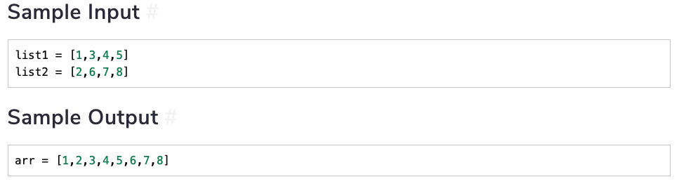
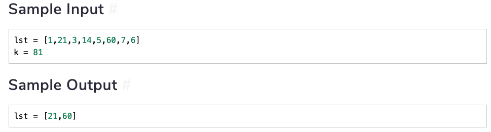
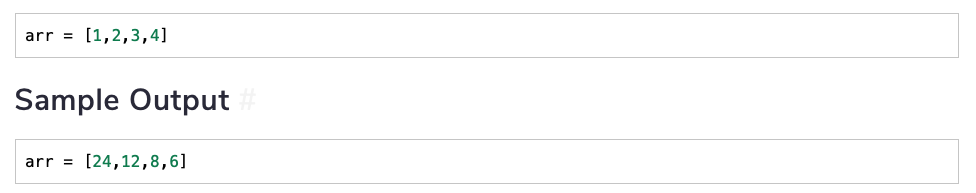
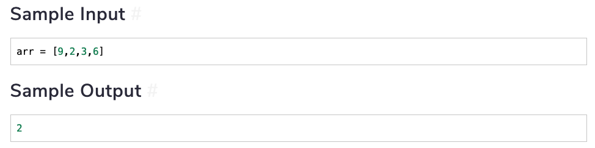
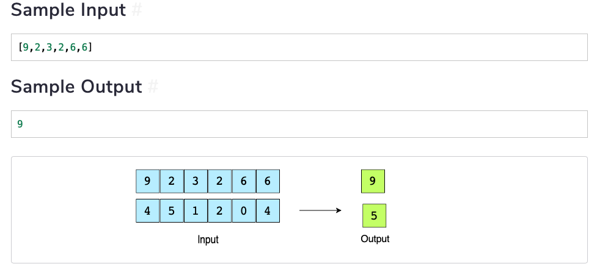
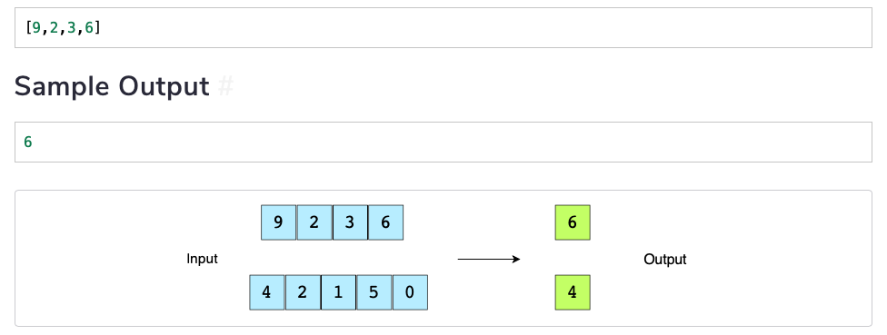

[TOC]

# Arrays

An array is also called a **list**. In python a list is an ordered sequence of heterogeneous elements. Here's an example of  a list: 

```python
list = ['a', 'apple', 23, 3.14, [24, 'a', 49]]
```

As we can see lists can hold literally any data structure. It can also hold functions. Lists are **indexed** using index `0`, which would be the first element and so on. 

There are two ways to initialize a list: 

*   Use of square brackets
*   Use of the function `list()`. 

## Important List Functions

The table below shows some of the important list functions that are used: 

| Function    | Explanation                                                  | Time Complexity  |
| ----------- | ------------------------------------------------------------ | ---------------- |
| `append()`  | Added a single element to the end of the list                | $O(1)$           |
| `insert()`  | Inserts an element at a specific index                       | $O(n)$           |
| `remove()`  | Removes a specific element from list                         | $O(n)$           |
| `pop()`     | Removes an element at given index or the last element if no index given | $O(1)$ or $O(k)$ |
| `reverse()` | Reverses the list                                            | $O(n)$           |

Here are some examples for each of the functions: 

```python
l = [24, 54, 9]

# Append to a list
l.append('a')

# Insert to a list
l.insert(2, 100)

# Remove from a list.
# You'll get runtime error is element does not exist
l.remove('a')

# Pop
l.pop()       # <- this will remove the last element
l.pop(2)      # <- this will remove the third element

# reverse
l.reverse()    # <- reverse function reverses a list in place
```

## Slicing

Slicing is done to create sublists. The general syntax for slicing is the following: 

```python
the_list[start_index:end_index:step]
```

>   When a sublist is created, all the elements from the `start_index` up until but not inclusive of the `end_index` are included. 

For example, 

```python
a = [100, 2, 43, 99, 73, 45]
print(a[1:5])

[2, 43, 99, 73]
```

We see that `45` is at index `5` but it is not included in the list. 

Arrays also allow for step indexing. The general syntax is: 

```python
a = list(range(10))
print(a)

[0, 1, 2, 3, 4, 5, 6, 7, 8, 9]

# Suppose we wish to only print out even numbers: 
print(a[::2])

[0, 2, 4, 6, 8]
```

List is a mutable object so the elements can easily be changed through slicing. 

```python
a[5:9] = [100, 200, 300, 400]
print(a)

[0, 1, 2, 3, 4, 100, 200, 300, 400, 9]
```

You can use a function `del` to delete a sublist from a list. This will remove all the elements from the sublist which are also in the main list: 

Suppose we wish to only get odd numbers from our list `a`:

```python
a = list(range(10))
print(a)

[0, 1, 2, 3, 4, 5, 6, 7, 8, 9]

del a[::2]

print(a)

[1, 3, 5, 7, 9]
```

Arrays also provide us with **negative indexing**. A negative index starts from the end of the list. 

```python
# Get the first three elements: 
print(a)

[1, 3, 5, 7, 9]

print(a[:-2])

[1, 3, 5]
```


## Challenge 1: Remove Even Integers from List

Implement a function that removes all the even elements from a given list. Name it `remove_even(list)`.

For example, 


This can be solved in two ways: 

*   **Using an extra space** - This involves simply creating a new array with only the odd numbers and returning that list. 
*   **Doing it with segragation** - This involves segragating odds on one side and evens on the other side and returning the sublist of odd numbers

```python
# Using extra space: 
def remove_evens(lst):
    return [e for e in lst if e % 2 !=0]

# Using Segragation
# Here we segregate even on the left and odd on the right
def remove_evens(lst):
    left = 0
    right = len(lst) - 1
    
    while left < right:

        # Move left index until you find an odd value: 
        while lst[left] % 2 == 0 and left < right:
            left += 1

        # Move right index until you find an even value: 
        while lst[right] % 2 != 0 and left < right:
            right -= 1

        # Once found, we swap even and odd: 
        if left < right: 
            lst[left], lst[right] = lst[right], lst[left]

    print(lst)
    # We return the desired subarray: 
    return lst[left:]
```


## Challenge 2: Merge Two Sorted Lists

Implement a function that merges two sorted lists of m and n elements respectively, into another sorted list. Name it `merge_lists(lst1, lst2)`.



There are two ways to do this: 

*   **Creating a New List** - Use two pointers one for each list. Compare the elements in each list. If one is smaller than the other, add the small one to the new list and increment the index of that list by 1.  
*   **Merging in Place** - Use two pointers for each list. You want to keep one list while inserting the elements from the other list into the first list. 

```python
# Creating a new list
def merge_lst(lst1, lst2):
    result = []
    n1 = len(lst1)
    n2 = len(lst2)
    l1 = 0
    l2 = 0
    while l1 < n1 and l2 < n2:
        if lst1[l1] < lst2[l2]:
            result.append(lst1[l1])
            l1 += 1
        elif lst2[l2] <= lst1[l1]:
            result.append(lst2[l2])
            l2 += 1
    result = result + lst1[l1:] + lst2[l2:]
    return result

# Merging in Place
def merge_arrays(lst1, lst2):
    ind1 = 0  # Creating 2 new variable to track the 'current index'
    ind2 = 0
    # While both indeces are less than the length of their lists
    while ind1 < len(lst1) and ind2 < len(lst2):
        # If the current element of list1 is greater
        # than the current element of list2
        if(lst1[ind1] > lst2[ind2]):
            # insert list2's current index to list1
            lst1.insert(ind1, lst2[ind2])
            ind1 += 1  # increment indices
            ind2 += 1
        else:
            ind1 += 1

    if ind2 < len(lst2):  # Append whatever is left of list2 to list1
        lst1.extend(lst2[ind2:])
    return lst1
```

## Challenge 3: Find Two Numbers that Add up to "k"

In this problem, you have to implement the `find_sum(lst,k)` function which will take a number `k` as input and return two numbers that add up to `k`.



Again there are two ways of solving this. 

*   **Scanning the list elements**  - from lst[1:] such that two elements add to k. This involves the use of two for loops. The time complexity in this case would be $O(n^2)$. 
*   **Using pointers** - Sort the list first. Start with two pointers from each end. If the sum is greater than k, then decrease the right pointer if the sum is less then increase the left pointer. 

```python
# Scanning the list
def find_sum(lst, k):
    # iterate lst with i
    for i in range(len(lst)):
        # iterate lst with j
        for j in range(len(lst)):
            # if sum of two iterators is k
            # and i is no
            t equal to j
            # then we have our answer
            if(lst[i]+lst[j] is k and i is not j):
                return [lst[i], lst[j]]
 
# Using Pointers
def find_sum(lst, k):
    lst.sort()
    start = 0
    end = len(lst) - 1
    while start < end: 
        sum = lst[start] + lst[end]
        if sum == k: 
            return [lst[start], lst[end]]
        elif sum > k: 
            end -= 1
        elif sum < k:
            start += 1
    if start < end:
        return [lst[start], lst[end]]
    else:
        return -1
```

## Challenge 4: List of Products of All Elements

Implement a function, `find_product(lst)`, which modifies a list so that each index has a product of all the numbers present in the list except the number stored at that index.



There are two ways of solving this: 

*   Using nested loops. This is easy but takes $O(n^2)$ time complexity
*   The most optimal way

```python
# Using Nested Loops
def find_product(lst):
    result = []
    left = 1  # To store product of all previous values from currentIndex
    for i in range(len(lst)):
        currentproduct = 1  # To store current product for index i
        # compute product of values to the right of i index of list
        for ele in lst[i+1:]:
            currentproduct = currentproduct * ele
        # currentproduct * product of all values to the left of i index
        result.append(currentproduct * left)
        # Updating `left`
        left = left * lst[i]

    return result

# Using optimal way: 
def find_product(lst):
    # get product start from left
    left = 1
    product = []
    for ele in lst:
        product.append(left)
        left = left * ele
    # get product starting from right
    right = 1
    for i in range(len(lst)-1, -1, -1):
        product[i] = product[i] * right
        right = right * lst[i]

    return product
```


## Challenge 5: Find Minimum Value in List

Implement a function `findMinimum(lst)` which finds the smallest number in the given list.



This is a classic example of pointer-method problem. We start with two pointers on the extremities. Then we compare the values of the pointers and move inward: 

```python
def find_minimum(lst):
    start = 0
    end = len(lst) - 1
    while start < end: 
        if lst[start] < lst[end]:
            end -= 1
        else:
            start += 1
    return lst[start]
```


## Challenge 6: Find First Non-Repeating Integer in List

 

The solution involves the use of two pointers. One moves slowly while the other scans for each move of the first. 

```python
def find_first_unique(lst):
    for i in range(len(lst)):
        end = 0
        while end < len(lst):
            if i != end and lst[i] == lst[end]:
                return lst[i]
            end += 1
    return None
```


## Challenge 7:  Find Second Maximum Value in a List

Implement a function `find_second_maximum(lst)` which returns the second largest element in the list.



The idea is to traverse the array once and keep a track on the maximum value and the second maximum value as we go through. 

```python
def find_second_max(lst):
    if len(lst) < 2:
        return None
    first_max = float('-inf')
    second_max = float('-inf')
    for i in range(len(lst)):
        if lst[i] > first_max:
            second_max = first_max
            first_max = lst[i]
        elif lst[i] < first_max and lst[i] > second_max:
            second_max = lst[i]
    
    if not second_max == float('-inf'):
        return second_max
    else:
        return None
```

## Challenge 8: Right Rotate List

Implement a function `right_rotate(lst, k)` which will rotate the given list by `k`. This means that the right-most elements will appear at the left-most position in the list and so on. You only have to rotate the list by one element at a time.