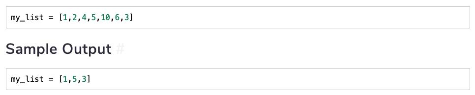

[TOC]

# Arrays

An array is also called a **list**. In python a list is an ordered sequence of heterogeneous elements. Here's an example of  a list: 

```python
list = ['a', 'apple', 23, 3.14, [24, 'a', 49]]
```

As we can see lists can hold literally any data structure. It can also hold functions. Lists are **indexed** using index `0`, which would be the first element and so on. 

There are two ways to initialize a list: 

*   Use of square brackets
*   Use of the function `list()`. 

## Important List Functions

The table below shows some of the important list functions that are used: 

| Function    | Explanation                                                  | Time Complexity  |
| ----------- | ------------------------------------------------------------ | ---------------- |
| `append()`  | Added a single element to the end of the list                | $O(1)$           |
| `insert()`  | Inserts an element at a specific index                       | $O(n)$           |
| `remove()`  | Removes a specific element from list                         | $O(n)$           |
| `pop()`     | Removes an element at given index or the last element if no index given | $O(1)$ or $O(k)$ |
| `reverse()` | Reverses the list                                            | $O(n)$           |

Here are some examples for each of the functions: 

```python
l = [24, 54, 9]

# Append to a list
l.append('a')

# Insert to a list
l.insert(2, 100)

# Remove from a list.
# You'll get runtime error is element does not exist
l.remove('a')

# Pop
l.pop()       # <- this will remove the last element
l.pop(2)      # <- this will remove the third element

# reverse
l.reverse()    # <- reverse function reverses a list in place
```

## Slicing

Slicing is done to create sublists. The general syntax for slicing is the following: 

```python
the_list[start_index:end_index:step]
```

>   When a sublist is created, all the elements from the `start_index` up until but not inclusive of the `end_index` are included. 

For example, 

```python
a = [100, 2, 43, 99, 73, 45]
print(a[1:5])

[2, 43, 99, 73]
```

We see that `45` is at index `5` but it is not included in the list. 

Arrays also allow for step indexing. The general syntax is: 

```python
a = list(range(10))
print(a)

[0, 1, 2, 3, 4, 5, 6, 7, 8, 9]

# Suppose we wish to only print out even numbers: 
print(a[::2])

[0, 2, 4, 6, 8]
```

List is a mutable object so the elements can easily be changed through slicing. 

```python
a[5:9] = [100, 200, 300, 400]
print(a)

[0, 1, 2, 3, 4, 100, 200, 300, 400, 9]
```

You can use a function `del` to delete a sublist from a list. This will remove all the elements from the sublist which are also in the main list: 

Suppose we wish to only get odd numbers from our list `a`:

```python
a = list(range(10))
print(a)

[0, 1, 2, 3, 4, 5, 6, 7, 8, 9]

del a[::2]

print(a)

[1, 3, 5, 7, 9]
```

Arrays also provide us with **negative indexing**. A negative index starts from the end of the list. 

```python
# Get the first three elements: 
print(a)

[1, 3, 5, 7, 9]

print(a[:-2])

[1, 3, 5]
```


## Challenge 1: Remove Even Integers from List

Implement a function that removes all the even elements from a given list. Name it `remove_even(list)`.

For example, 



This can be solved in two ways: 

*   **Using an extra space** - This involves simply creating a new array with only the odd numbers and returning that list. 
*   **Doing it with segragation** - This involves segragating odds on one side and evens on the other side and returning the sublist of odd numbers

```python
# Using extra space: 
def remove_evens(lst):
    return [e for e in lst if e % 2 !=0]

# Using Segragation
# Here we segregate even on the left and odd on the right
def remove_evens(lst):
    left = 0
    right = len(lst) - 1
    
    while left < right:
         # Increment left until we see an odd number: 
            while lst[left] % 2 == 0 and left < right: 
                left += 1
            
         # Decrement right until we see an even number: 
            while lst[right] % 2 != 0 and left < right: 
                right -= 1
                
         # Now we even on the left and odd on the right, we swap: 
            if left < right: 
                arr[left], arr[right] = arr[right], arr[left]
                left += 1
                right -= 1
    
    # Now we return the odd array: 
    return lst[left:]
                
  
```

