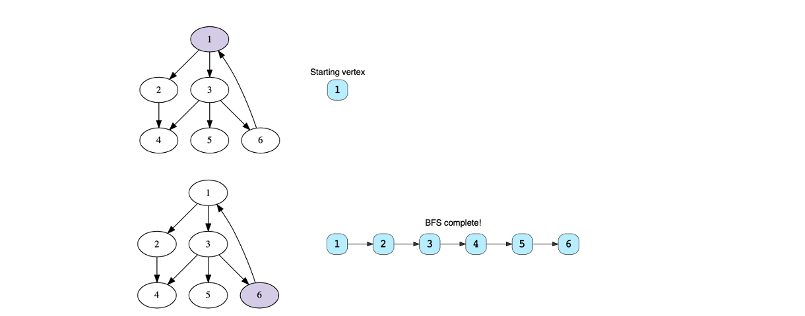

[TOC]


# Graphs

## Introduction

Graph is a data structure used to store and manipulate data. Graphs are used in GPS, neural networks, peer-to-peer networks, search engine crawlers, garbage collection in python, and social network sites.  Let's look more closely to graphs. 

### Graph Structure

A **graph** is a collection of nodes that are connected to each other in the form of a network. Graph has two basics components: 

*   **Vertex** - This is the most essential part of the graph. Think of this as the node.
*   **Edge** - An edge is a link between to vertices. 

Here's how a graph is represented: 


### Graph Properties

There are several other properties that we look at now. 

*   **Degree of a Vertex** - This is defined as the total number of edges incident on a vertex. Because the edges depend on the incidents on a vertex, there are two types: 
    *   **In-degree** - these are the total number of incoming edges onto a vertex
    *   **Out-degree** - these are the total number of outgoing edges from a vertex
*   **Parallel Edges** -  Edges that do not have direction are considered parallel if they have the same two vertices. Edges that have direction are said to be parallel if they both start and end from same vertices
*   **Self Loop** - When an edge starts and ends on the same vertex, it is considered a self loop
*   **Adjacency** - Two vertices are said to be adjacent if there is an edge connecting them directly. 

To illustrate these properties, let's look at the figure above.

*   The in-degree for `a` is 1. So, is the case with `b`. `c` has in-degree of 2 and out-degree of 1. 
*   `c` contains a self loop. 

### Types of Graphs

There are two types of graphs: 

*   **Undirected Graphs** - in these graphs, the edges are bi-directional. We can see in the example below. 

    

    In the pair, (2, 3) we see that there is an edge that connects them but one can go between them in any direction. 
    The maximum number of edges in a undirected graph is given by, $n(n-1)/2$ , where $n$ is the total number of vertices.  

*   **Directed Graphs** - in these graphs, the edges have a specific direction. We can see in the example below: 

    

    Taking the same example, we see that for a pair (2, 3) there is just one way to go between 2 and 3. The total number of edges in a directed graph is $n(n-1)$, where $n$ is the total number of vertices. 

### Graph Representation

There are two common ways to represent a graph. These are: 

*   **Adjacency Matrix** - This is a 2D matrix where a cell contains a boolean. The vertex number if listed on top and the side of the matrix. Think of it as a confusion matrix but bigger. When there is an edge between the two vertices, we  represent that with `1`. The figure below shows the representation of a undirected graph in an adjacency matrix: 

    

    The adjacency matrix is different for a directed graph. When the above graph is directed, we get something like this: 

    

    We can see that the matrix is much more sparse for a directed graph than for undirected graph.
    
*   **Adjacency List** - Rather than representing with a matrix, we can represent a graph as a linked list. Each vertex has its own linked list. For a undirected graph, the adjacency list looks like this: 

    

    For a directed graph, the representation looks something like this: 
    

    

    We see that each vertex is much smaller linked list than in undirected graph. 

## Graph Implementation

Let's implement the adjacency list method of graph representation. The implementation will be for a directed graph. We will create a class and represent the following graph. 


The graph class consists of two data members: 

*   The total number of vertices in the graph
*   A list of linked lists to store adjacent vertices

```python
from ll import LinkedList

class Graph():
    def __init__(self, vertices):
        self.vertices = vertices
        self.array = []
        
        for i in range(vertices):
            temp = LinkedList()
            self.array.append(temp)
```

As we have seen here, each vertex has an associated LinkedList. So, the class takes in the number of vertices. Next, we define an array which will store these vertices. Finally, we create a linked list associated with each vertex and store these linked lists into the array. So, we now have a list of linked lists. 

Next we will create few functionalities. These include: 

*   `add_edge()`
*   `print_graph()`

```python
def add_edge(self, source, destination):
    if source < self.vertices and destination < self.vertices:
        self.array[source].insert_at_head(destination)
```

This is for directed graph. If we had a undirected graph, then we would write this as: 

```python
def add_edge(self, source, destination):
    if source < self.vertices and destination < self.vertices:
        self.array[source].insert_at_head(destination)
        self.array[destination].insert_at_head(source)
```

The Graph constructor stores the linked list based on the indexes so it gets easier later to index a node based on the index. Now, when we implement a directed graph, then ```add_edge(0, 1)``` is not equal to `add_edge(1, 0)`. But when we have undirected graph, we create from source to destination and from destination to source. 

We should also consider the edge cases, when `source < 0` or when `destination < 0`.  

Finally, here's the code to represent a graph: 

```python
def print_graph(self):
    for v in range(self.vertices):
        print("|", v, end=" | => ")
        cur_node = self.array[v].head_node
        while cur_node != None:
            print("[", cur_node.data, end=" ] -> ")
            cur_node = cur_node.next
        print("None \n") 
    return None
```

When we run this code, we will get the following result: 

```python
if __name__ == "__main__":
    gs = Graph(4)
    gs.add_edge(0, 2)
    gs.add_edge(0, 1)
    gs.add_edge(1, 3)
    gs.add_edge(2, 3)
    gs.print_graph()
```

And the output is: 

```python
| 0 | => [ 1 ] -> [ 2 ] -> None 

| 1 | => [ 3 ] -> None 

| 2 | => [ 3 ] -> None 

| 3 | => None 
```

This matches exactly how we have in the image above. 

### Graph Operation Complexities

The graph complexities are defined in the table below where **V** stands for the total number of vertices and **E** stands for the total number of edges. 


#### Adjacency List

-   Adding an edge in adjacency lists takes constant time as we only need to insert at the **head** node of the corresponding vertex.
-   Removing an edge takes O(E) time because, in the worst case, all the edges could be at a single vertex and hence, we would have to traverse all **E** edges to reach the last one.
-   Removing a vertex takes O(V + E) time because we have to delete all its edges and then reindex the rest of the list one step back in order to fill the deleted spot.
-   Searching an edge between a pair of vertices can take up to O(V) if all **V** nodes are present at a certain index and we have to traverse them.

#### Adjacency Matrix 

-   Edge operations are performed in constant time as we only need to manipulate the value in the particular cell.
-   Vertex operations are performed in O(V2) since we need to add rows and columns. We will also need to fill all the new cells.
-   Searching an edge is O(1) because we can access each edge by indexing.

#### Comparison

Both representations are suitable for different situations. If your application frequently manipulates vertices, the adjacency list is a better choice.

If you are dealing primarily with edges, the adjacency matrix is the more efficient approach.

Keep these complexities in mind because they will give you a better idea about the time complexities of the several algorithms we’ll see in this section.

## Graph Traversal Algorithms

Graph traversal means visiting every vertex in the graph. There are two basic techniques used for graph traversal. These are: 

*   Breadth First Search (BFS)
*   Depth First Search (DFS)

In order to understand these algorithms, we need to first look at graphs in a slightly different way. The graph is not a linear data structure so there is no one starting point and one end point. So, how do we traverse a graph? Rather than points, graphs have levels. 

Take any starting point. This becomes our lowest level in our search. The next level corresponds to all the adjacent vertices. The next higher level would be vertices adjacent to the vertices to just looked at and so forth. 

### Breadth First Search 

This algorithm travels all the vertices at the same level first before moving on to the next level. It goes wide and then deep. Here's how the BFS looks like: 




The top is the starting point. We randomly decided to start from the vertex 1. In the BFS, we go down to 2 followed by 3 and then to 4, 5, and finally to 6. 

Note that if this were an undirected graph, the BFS would then be: 

```python
1 -> 2 -> 3 -> 6 -> 4 -> 5
```

This is because the vertex marked `6` is at the same level  as `2, 3` due to this edge from `1`. 

### Depth First Search

In this case, we go deep before we go wide. So, using our previous example, a DFS would look like: 


## Implemenation of Breadth First Search 

Let's implement a BFS. Before we implement the BSF, let us try to understand how it works. 

1.  We start with a vertex. We look for all outgoing edges that lead to a vertex
2.  Each time we go through an edge and come to a vertex, we will store that vertex in a queue that we have not visited
3.  Once we have exhausted all the vertices in a given vertex, we pick the first vertex in the queue
4.  Repeat steps 1-3. 


Here's the code for BFS. Let's break it down and explain the result: 

```python
def bfs_traversal_helper(gs, source, visited):
    result = ""
    q = Queue()
    q.enqueue(source)
    visited[source] = True
    while not q.is_empty():
        vertex = q.dequeue()
        result += str(vertex)
        node = gs.array[vertex].head_node
        while node is not None:
            if visited[node.data] is False:
                q.enqueue(node.data)
                visited[node.data] = True
            node = node.next
    return result, visited

def bfs_traveral(gs, source):
    result = ""
    num_of_vertices = gs.vertices
    if num_of_vertices is 0:
        return result
    visited = [False] * num_of_vertices
    
    result, visited = bfs_traversal_helper(gs, source, visited)
    for i in range(num_of_vertices):
        if visited[i] is False:
            result_new, visited = bfs_traversal_helper(gs, i, visited)
            result += result_new
    return result

if __name__ == "__main__":
    gs = Graph(6)
    gs.add_edge(0, 1)
    gs.add_edge(0, 2)
    gs.add_edge(1, 3)
    gs.add_edge(2, 3)
    gs.add_edge(2, 4)
    gs.add_edge(2, 5)
    gs.add_edge(5, 0)
    gs.print_graph()
    print(bfs_traveral(gs, 0))
```


Let's first look at what the helper function `bfs_traveral_helper` does. This is more of a actual BFS for a given vertex and not a helper function. 

*   We start with a string called `result`
*   We instantiate a `Queue` and add the source to this queue
*   We add that source to the visited list as we are visited it now
*   Now if the queue is not empty we look at one vertex at a time
    *   We remove the vertex from the queue one
    *   We add the vertex to our result as string
    *   Now we traverse this vertex, which is actually a Linked list. We traverse the Linked List one node at a time. However for each node we visit, we ask: 
        *   Has this node been visited before? If it is not: 
            *   We add that to our queue
            *   We mark it as visited 
        *   We move into the second node until we hit a `None`
*   Finally, we return the result and the visited. 


The second `bfs_traveral()` function does some housekeeping.

*   It sets up the `visited` list with `False` values for each of the nodes. 
*   Calls the `bfs_traveral_helper()` function. 
*   Finally, it checks whether all the vertices are visited. If they are not, it calls the helper function on them again. 

Since the algorithm traverses the whole graph once, the time complexity is $O(V + E)$. 

## Implemenation of Depth First Search 

In the DFS method, we make use of Stacks instead of Queues. The beauty of this is that everything else remains the same. 

Here is the implementation: 

```python
from stack_class import Stack
from graph import Graph

def dfs_traversal_helper(gs, source, visited):
    result = ""
    s = Stack()
    s.push(source)
    visited[source] = True
    while s.isEmpty() is False:
        vertex = s.pop()
        result += str(vertex)
        node = gs.array[vertex].head_node
        while node is not None:
            if visited[node.data] is False:
                s.push(node.data)
                visited[node.data] = True
            node = node.next
    return result, visited

def dfs_traversal(gs, source):
    result = ""
    num_of_vertices = gs.vertices
    if num_of_vertices == 0:
        return result
    visited = [False] * num_of_vertices
    result, visited = dfs_traversal_helper(gs, source, visited)
    for index, tf in enumerate(visited):
        if tf == False:
            result_new, visited = dfs_traversal_helper(gs, index, visited)
            result += result_new
    return result

if __name__ == "__main__":
    gs = Graph(6)
    gs.add_edge(0, 1)
    gs.add_edge(0, 2)
    gs.add_edge(1, 3)
    gs.add_edge(2, 3)
    gs.add_edge(2, 4)
    gs.add_edge(2, 5)
    gs.add_edge(5, 0)
    gs.print_graph()
    print(dfs_traversal(gs, 0))
```

Since the algorithm traverses the whole graph once, the time complexity is $O(V + E)$.