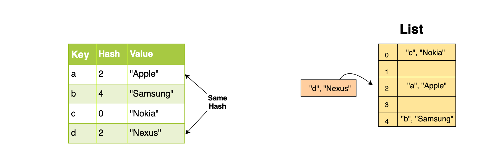
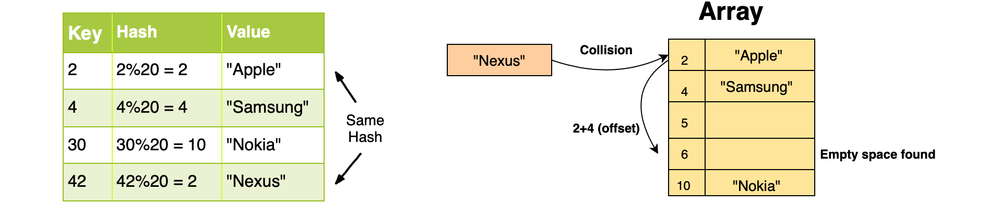

[TOC]


# Hash Tables

The data structures such as arrays, linked lists, stacks, queues, and trees have an overall time complexity of $(Ologn)$ or $O(nlogn)$ for opertions such as: 

*   Insertion
*   Deletion
*   Search

For small $n$, this does not pose a problem but when $n$ increases, this begins to turn into a challenge. We wish to find a data structure that takes constant time to perform these operations. This is where the hashing data structure comes into the spotlight. 

Hashing is a process to store an object according to a unique key. This means that hashing always creates a **key-valule pair**. A collection of such pairs forms a dictionary where every object or value can be looked up according to its key. Hence, the search operation can be performed in $O(1)$. 

In python hash tables are generally implemented using lists as they provide access to elements in constant time.  A hash table in Python is a **dictionary**, a data structure that is composed of a **key-value** pair. There are two built-in types that exist in Python, `set()` and `dict()`. 

Rather than using an built-in hash table that Python has, we will build our own hash table as it is very popular topic in coding interviews. We start by defining the building blocks on an efficient hash table. 

The performance of a hash table depends on three fundamental factors: 

1.  Hash Function
2.  Size of the hash table
3.  Collision handling method

## The Hash Function

We start with the first building block, the hash function. 

The data is stored in a list and a key is used to map the value on the list. The efficiency of the hash table depends on how the key is computed. We could simply use index of a list as a key. Though this may work as the index is unique, this process will fail when the key exceeds the length of the list. We could resize the list and therefore continue to use the index but resizing of a list takes $O(n)$ time. 

In order to limit the range of the keys to the length of the list, we need a function that converts a large key into a smaller key. This is done by the **hash function**. 


A hash function simply takes an item's key and returns the corresponding index in the list for that item. This process can simply be arithmetic or a complicated encryption method. Nonetheless, the hash function needs to be efficient. 

Let's look at some hash functions used. 

### Arithmetic Modular

Such a hash function maps the keys such that they are within the size of list. This is done by taking the mod of the key with the size of the list. 
$$
index = key \ MOD \ table\_size 
$$
This allows the index to always lie between the boundaries of the list. 

```python
def hash_modular(key, size):
    return key % size


if __name__ == "__main__":
    lst = [False] * 10
    key = 35
    index = hash_modular(key, len(lst))
    print(index)
```

This will return an index of `5`. So, even though `35` was outside of the size of the list, we were able to add that to the list. 

### Truncation

Another hash function is to take the key and truncate it. 
$$
key = 123456 -> \ index = 3456
$$

```python
def hash_truncate(key):
    return key % 1000  # this gives us a key of up to 3 digits

if __name__ == "__main__":
    lst = [False] * 10
    key = 1235433
    index = hash_truncate(key)
    print(index)
```

In this example, we get `433`, the last three digits. 

### Folding

Another hash function is to take the key, break it into smaller chunks, and add them up to create an index. 

```python
def hash_fold(key, chunk_size):
    str_key = str(key)  # Convert integer into string for slicing
    print("Key: " + str_key)
    hash_val = 0
    print("Chunks:")
    for i in range(0, len(str_key),  chunk_size):

        if(i + chunk_size < len(str_key)):
            # Slice the appropriate chunk from the string
            print(str_key[i:i+chunk_size])
            hash_val += int(str_key[i:i+chunk_size])  # convert into integer
        else:
            print(str_key[i:len(str_key)])
            hash_val += int(str_key[i:len(str_key)])
    return hash_val

if __name__ == "__main__":
    key = 3456789
    chunk_size = 2
    print(hash_fold(key, chunk_size))
```

This returns the following: 

```python
Key: 3456789
Chunks:
34
56
78
9
177
```

### Collisions in Hash Tables

When you map large keys into a small range of numbers from 0-N where $N$ is the size of the list, there is a possibility of two different keys mapping to the same index. This is called **collision**. 



There are ways to avoid this from happening. The three most common strategies are: 

*   Linear Probing
*   Chaining
*   Resizing the list

Let's look at them in more detail. 

#### Linear Probing

This suggests that if the hash function returns an index that is already filled, move to the next index. The next is based on an offset, which we set. If that index is also filled to move to the next. Do this until an empty index is found. Now the choice of offset is important. If chosen wrongly, we may end up where we started. 

Let's look at an example. Our size of a list is 20. We decide to use a modular hash function. So, when the key is 2 and the key is 42, we get the same index. So, we have a collision. Let's see our offset is 4. So, when 42 key is mapped, we get a collision at 2 but with the offset we have a new index of 6, which is empty. 



#### Chaining

In this strategy, each slot in the hash table holds a pointer to another data structure such as a linked list or a tree. Every entry at that index will be inserted into the linked list for that index. This allows us to add multiple key-pair values to the same index in constant time. 


This strategy works but it adds more space. 

#### Resizing the List

This involves increasing the size of the list when the list is filled to a certain threshold. By convention we use 0.6. So, when 60% of the list is filled, we resize. However, resizing can be expensive therefore the threshold must be chosen carefully. Another thing to keep in mind is that the content might be concentrated at one end of the list and resizing will not pick this up. 

Some other strategies to handle collisions are: 

*   quadratic probing
*   bucket method
*   random probing
*   key rehashing

## Building a Hash Table from Scratch

In our implementation of hash table, we will use the chaining strategy along with the resize operation to avoid collisions in the table. 

All the elements with the same hash key will be stored in a linked list at that index. This is called bucketing. The size of the hash table is set as $n \times m$ where $n$ is the number of keys it can hold and $m$ is the number of slots each bucket contains. Each slot holds a key-value pair. 


We will start by building a simple `HashEntry()` class. It has three data members:

*   key
*   value
*   reference to a new entry

```python
class HashEntry():
    def __init__(self, key, data):
        self.key = key
        self.value = value
        self.next = None
        
```

Now we will create a `HashTable()` class which is a collection of `HashEntry()` objects. In this case we keep track of two variables: 

*   Total number of slots in the table
*   Current size of the table

These two will become handy when we need to resize the table. 

```python
class HashTable():
    def __init__(self):
        # Size of the HashTable
        self.slots = 10
        # Current entries in the table
        # Used while resizing the table when half of the table gets filled
        self.size = 0
        # List of HashEntry objects (by default all None)
        self.bucket = [None] * self.slots

    def get_size(self):
        return self.size

    def isEmpty(self):
        return self.get_size() == 0

    # This is a hash function
    def get_index(self, key):
        # hash() is a built-in function in python
        hash_code = hash(key)
        index = hash_code % self.slots
        return index
```

 ### Resizing the Hash Table


