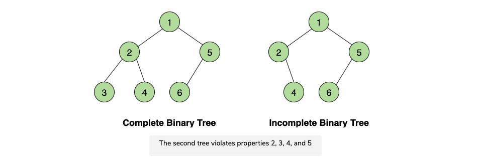
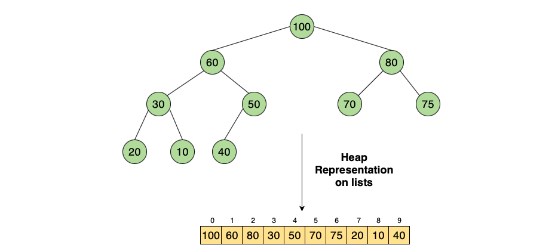

[TOC]

# Heap

## Introduction

Heaps are advance data structures that are useful for problems involving sorting and implementing priority queues. 

>   Heaps are regular binary trees with two special properties: 
>
>   1.  Heaps must be **Complete Binary Trees**
>   2.  The nodes must be ordered according to the Heap Order Priority

Let's look at each of these two properties in more detail. 

### Heaps must be Complete Binary Trees

A **complete binary tree** is a tree that has at most two children and the nodes at all levels are full, except for the leaf nodes, which can be empty. Here are some properties of complete binary trees: 

1.  All leaves are either at depth $d$ or depth $d-1$. 
2.  The leaves at depth $d$ are to the left of the leaves at depth $d-1$. 
3.  There are at most one node with just one child
4.  If the singular child exists, it is the left child of its parent
5.  If the singular child exists, it is the right most leaf at depth $d$

Here's an example of complete binary tree and incomplete one. 

### Nodes Must be Ordered According to Heap Order Property

The heap order property depends on the two heap data structures: 

*   **Min Heap** - all parent node keys are less than or equal to their child node keys. So, the root will always contain the smallest element in the heap.  
*   **Max Heap** - all the parent node keys must be greater than or equal to their child node keys. In order words, the root node will always contain the largest element in the Heap. 

### Where are Heaps Used? 

The primary purpose of a heap is to return a smallest or largest element. This is because getting a max or min value is $O(1)$ in time complexity. Heaps are also used to design **Priority Queues**. Some famous algorithms that are implemented in heap are: 

*   Prim's Algorithm
*   Dijkstra's Algorithm
*   Heap Sort Algorithm

Here's an example of Heap as a priority queue: 

### Heap Representation in Lists

Heaps can be represented as arrays or lists in Python. The node values are stored such that all the parent nodes occur in the first half of the list (where index $\leq$ floor$(\frac{n-1}{2})$), where $n$ is the last index and the leaves exist in the rest. This means that the last parent will be at the floor($\frac{n-1}{2}$) index. The left child of the node at the $k$th index will be at the $2k + 1$ index and the right child will be at $2k+2$. 

In other words, the following properties hold: 

*   $LeftChild = 2k + 1$
*   $RightChild = 2k + 2$
*   $Parent = k / 2$

Let's see this in example. We have a following heap: 

The $k$ value goes from $0$ at the root to $1$ at the first left node and then $2$ to the first right node and so forth. In other words, $k$ indexes the nodes in a given heap, counting from $0$ at the root and counting up as it goes left to right from the parent node to the child node and so forth. 

The values listed on the top of the array, the indexes of the array are the k-values. Now, we can find the index of a left child of say, 60 as: 

*   k = 1, so $LeftChild = 2 \times 1 + 1 = 3$. We find that at index 3 we have `30`, which is the left child of `60`. 
*   $k = 1$, so the $RightChild = 2 \times 1 + 2 = 4$. We find that at index 4, we have 50, which is the right child of `60`

Heaps are sometimes called **Binary Heaps** because heaps are complete binary trees. Elements in the heap are not sorted but that the Heaps follows that the largest or the smallest element be placed at the top (parent node) depending on which heap order is used. 

## Max Heap Introduction

As we saw earlier, Max Heap is a complete binary tree where the parent node is larger than their children. Given the following complete binary tree,

We can build a Max Heap by comparing each of the nodes and swapping them. Here are the steps followed: 

*   Compare the leaf nodes first. We compare 15 and 20. Because 20 > 15, we swap them. 
*   Next we compare 8 and 5. Because 8 is a parent node, we leave it as is.
*   The same goes with 8 and 1. 
*   We compare 8 and 2. As 2 < 8, we may decide to swap, but we should compare the other child on the parent, which now would be 20. 2 < 8 and 2 < 20. So, we swap 20 and 2.
*   With this configuration, we now have 2 in the parent node and 15 in its child node. So, we swap again to make 2 the child of 15. 

This completes our Max Heap ordering resulting in the following structure: 

