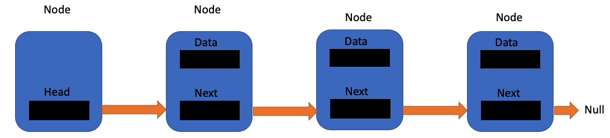
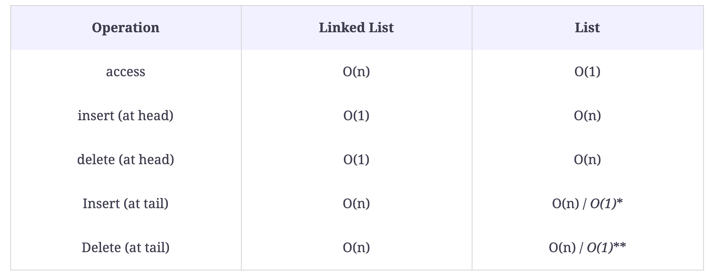

[TOC]


# Linked Lists

In the case of arrays or lists, we have seen that lists are used to store and organize data. However, linked lists allow us to further improve the use of data structures. 

## Structure of A Singly Linked List

The most basic form of a linked list data structure is a singly linked list. This looks something like this: 


The "link" in a linked list consists of a **node**. Each node holds two things: 

1.  The data - which is a value that you wish to store in a node
2.  A pointer - a way of referring to the next node

A singly linked list has a **head**, which is start of the linked list and a **tail**, which is the end. A singly linked list is a **uni-directional data structure** which can be seen by the direction of its pointer, it points only in one direction. 

## Building A Linked List

There are two classes in creating a linked list: 

*   Node Class - to create each node
*   Linked List Class - to join the nodes into a linked list

Let's create these classes: 

```python
class Node():
    def __init__(self, data=None):
        self.data = data
        self.next_element = None
```

Here the pointer is `next_element`. 

```python
class LinkedList():
    def __init__(self):
        self.head_node = Node()
```

The `head_node` is simply a node that does not contain any data. It is simply a placeholder that points to the first node in the list that contains data. The `head_node` can be seen here along with other nodes: 



So, we have the head node which points to the first node that has data in it. Subsequent nodes follow until we have the tail node which has data but which does not point to the next node. 

## Linked Lists Vs. Lists

The main difference between lists and linked lists is in the way the elements are inserted and deleted. Here are the time complexities between these two data structures: 



` *` The insert at tail for lists takes $O(1)$ because of python's `append()` method. The same goes for deletion due to python's `pop()` method both of which take $O(1)$. 

## Creating the `LinkedList` Class

The `LinkedList` class has the following methods: 

*   `get_head()` - returns the head of the list
*   `insert_at_head(element)` - inserts an element at the start/head of the linked list
*   `insert_at_tail(element)` - inserts an element at the end of the linked list
*   `delete(element)` - deletes an element with your specified value from the linked list
*   `delete_at_head()` - deletes the first element
*   `search(element)` - searches for an element with the specified value in the linked list
*   `is_empty()` - returns true if the linked list is empty

Now, let's define these methods in the `LinkedList` class: 

```python
class Node():
    def __init__(self, data=None):
        self.data = data
        self.next = None

class LinkedList():
    def __init__(self):
        self.head_node = Node()
    
    def get_head(self):
        return self.head_node

    def isEmpty(self):
        if self.head_node is None:
            return True
        else:
            return False
```

## Singly Linked List Insertion

There are three types of insertion strategies used in singly linked lists: 

1.  Insertion at the head
2.  Insertion at the tail
3.  insertion at the $k^{th}$ index

Let's look at each one of them in detail: 

### Insertion at the head

To insert at the head, we need to follow these steps: 

1.  Create a new node with data and the pointer set to null
2.  Make the pointer of the new node, point to the current pointer of the head node
3.  Make the head pointer point to the newly created node. 

Let's create that method: 

```python
def insert_at_head(self, data):
    new_node = Node(data)
    new_node.next = self.head_node
    # The head node IS the new node:
    self.head_node = new_node
    return head_node
```

### Insertion at the tail

To insert at the tail, we need to follow these steps: 

1.  Traverse the linked list until we come to the node whose `.next` points to `null`. This is the last node in the linked list. 
2.  Create a new node
3.  Make the `.next` of the last node point to the new node.

Let's create this method: 

```python
def insert_at_tail(self, data):

    new_node = Node(data)

    # Check if the linked list is empty: 
    if self.head_nodke is None:
        self.head_node = new_node
        return

    # If the linked list is not empty:     
    cur_node = self.head_node
    while cur_node.next != None:
        cur_node = cur_node.next

    cur_node.next = new_node
        return 
```

### Insertion at *k*th index

To insert at the *k*th index, we need to follow these steps: 

1.  Define a counter so it can count to the *k*th index
2.  Create a new node
3.  Point the *k-1*th pointer to the new node
4.  Point the new node to *k+1* node

Let's create this method: 

```python
def len(self):
    if self.head_node is None:
        return 0
    count = 0
    curr = self.head_node
    while curr is not None:
        curr = curr.next
        count += 1
    return count

def insert_at_index(self, index, data):
    new_node = Node(data)
    
    # Check if the linked list is empty
    if self.isEmpty():
        self.insert_at_head(data)
        
    n = self.len()
    if index > n:
        return 'Index out of range'
    elif index == n:
        return self.insert_at_tail(data)
    else:
        count = 0
        curr = self.head_node
        while count < index:
            print(count)
            prev = curr
            curr = curr.next
            count += 1
    # Point the previous to new node:
    new_node.next = curr
    prev.next = new_node
    return 
    
```


## Challenge 2: Search in a Singly Linked List

Given a list and a value. Find whether the value exist in the list. Call the method `search(lst, value)`. 


# Challenge Solutions

Here are the solutions to challenges.

## Challenge 2: Search in a Single Linked List

```python
from linked_list_class import LinkedList
from node_class import Node

def search()
```

