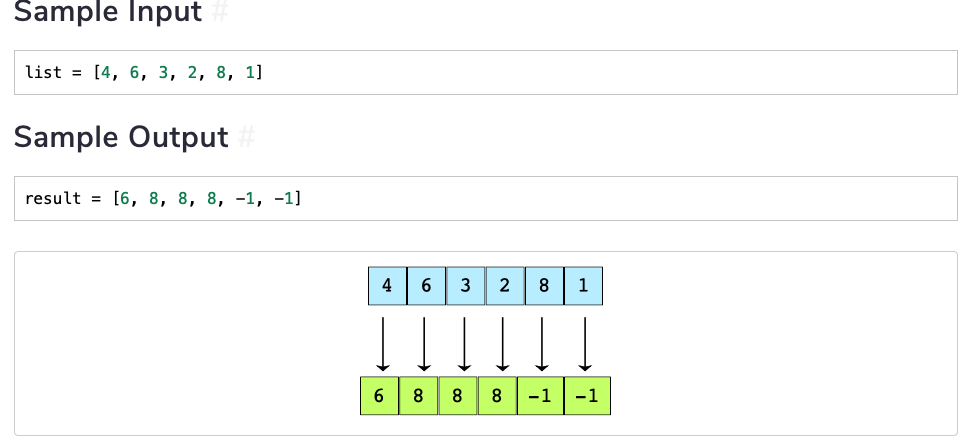

[TOC]

# Stacks

Stacks are used in various many places, particularly in the browser. For example, the back button allows the user to retrace the steps they take. The Undo button in most applications make use of stacks. 

Stack follows the **Last In First Out (LIFO)** ordering. This means that the last element added is the element on the top and the first element added is at the bottom. In real life the stack could be dishes that are pilled on top of each other. The last one goes on the top of the stack of dishes and when the time comes to unload the dishes, the top one goes out first. 

Though stacks by themselves may look simple, they are used in very complex problems. There are many algorithms such as **Depth first Search** and the **Expression Evaluation Algorithm** that use stacks. Stacks are also used in recursive algorithms. 

## How do Stacks Work?

Stacks are implemented using the following functionalities: 

*   `push(element)` - Used to insert an element into a stack
*   `pop()` - Used to remove an element from the stack
*   `isEmpty()` - Used to check if the stack is empty
*   `top()` - Used to find the element that is add on the top of the stack
*   `size()` - Used to find the number of elements in the stack

Stacks have one opening from which the elements enter and leave. Here’s an example: 

We have a data structure called stack. We have 4 elements which are to be added to this stack. The left figure shows how the elements are arranged before to add them to the stack. The right figure shows after the operations. 


And when we remove the elements, we see that element 4 comes out first followed by 3 and so on. In fact, by unstacking, we get the order of the elements as they were before entering. 

## Implementing Stack in Python

Let’s implement the four methods along with the `Stack()` class: 

```python
class Stack():
    def __init__(self):
        self.items = []
        
    def isEmpty(self):
        return self.items == []
    
    def push(self, element):
        return self.items.append(element)
    
    def pop(self):
        if self.Empty():
            return None
        return self.items.pop()
    
    def top(self):
        return self.items[-1]
    
    def size(self):
        return len(self.items)
   
    def print_stack(self):
        print(self.items)
```

### Complexities of Stack Operations

Here’s a quick table to evaluate the complexities of stack operations


# Queues

Queues are similar to stacks with a little difference. Queues use the principle, **First In First Out (FIFO)**. In other words, Queues are open on both ends. The elements enter from one end and leave out of the other. So, you add the element from the back and remove the element from the front. 

## How do Queues Work? 

The methods that are implemented in Queues are the following: 

*   `enqueue(element)` - inserts an element at the end of the queue
*   `dequeue()` - removes an element from the start of the queue
*   `front()` - returns the first element of the queue
*   `back()` - returns the last element inserted into the queue
*   `isEmpty()` - checks if the queue is empty
*   `size()` - returns the size of the queue

As mentioned earlier, the queue has the front and the back as we see here: 


## Types of Queues

There are four common types of queues: 

*   **Linear Queue** - Is the most common queue we have. It has the front and the back. 
*   **Circular Queue** - is like a linear queue but where the front and the back are joined together. Initially, the front and the back are at the same location but they move apart as more elements are inserted into the queue. 
*   **Priority Queue** - is a linear queue but where each element is associated a priority. The elements are sorted by priority such that the most prioritized object appears at the front and the least prioritized appears at the end of the queue
*   **Double-ended Queue** - is a linear queue that acts as a queue from both the back and the front. In other words, it provides functionality for `enqueue` and `dequeue` on either end. 


## Implementing Queue in Python

Let’s implement a Queue class in python: 

```python
class Queue():
    def __init__(self):
        self.items = []

    def isEmpty(self):
        return self.items == []

    def enqueue(self, value):
        self.items.append(value)
    
    def dequeue(self):
        if self.isEmpty():
            return None
        return self.items.pop(0)

    def front(self):
        if self.isEmpty():
            return None
        return self.items[0]
    
    def back(self):
        if self.isEmpty():
            return None
        return self.items[-1]
    
    def size(self):
        return len(self.items)
```

### Complexities of Queue Operations

The complexities of queue operations are: 


>   The queue implementation was done using python lists. If we implemented queue using Linked lists, the time complexity can be optimized to $O(1)$. 


## Challenge 1: Generate Binary Numbers from 1 to n using Queue

Given the input `n`, implement a function `find_bin(n)` which will generate binary numbers from 1 till `n` in the form of a string using a queue. 


```python

def compute_binary(n):
    result = []
    queue = Queue()
    queue.enqueue(1)
    for i in range(n):
        result.append(str(queue.dequeue()))
        s1 = result[i] + "0"
        s2 = result[i] + "1"
        queue.enqueue(s1)
        queue.enqueue(s2)
        return result
```

## Challenge 2: Implement Two Stacks Using One List

Implement the following functions to implement two stacks using a single array such that for storing elements both stacks should use the same array. An illustration is also provided for your understanding. Also, for this problem, use Python **arrays** and not lists!

*   `push1(value)` - pushes value in stack 1
*   `push2(value)` - pushes value in stack 2
*   `pop1(value)` - pops an element from stack 1
*   `pop2(value)` - pops an element from stack 2


Create a class and call it `TwoClass()`. Use the following template: 

```python
class TwoStacks:
    """
    Stack 1 is on the left while Stack 2 is on the right

                --------------------------
    stack 1 --->|    |    |    |    |    |<--stack 2
                --------------------------
    """
    def __init__(self, n):  # constructor
        self.size = n
        self.arr = [0] * n
        # Index for stack to the left
        self.index1 = -1
        # Index for stack to the right
        self.index2 = self.size

    # Method to push an element x to stack1
    def push1(self, x):

        # There is at least one empty space for new element
        if self.index1 < self.index2 - 1:
            # Increase the index by 1
            self.index1 = self.index1 + 1
            # and then Add the element to the first stack
            self.arr[self.top1] = x

        else:
            print("Stack Overflow ")
            return

    # Method to push an element x to stack2
    def push2(self, x):

        # There is at least one empty space for new element
        if self.index1 < self.index2 - 1:
            # Decrease the index by 1
            self.index2 = self.index2 - 1
            # Add the element to the second stack
            self.arr[self.index2] = x

        else:
            print("Stack Overflow ")
            return

    # Method to pop an element from first stack
    def pop1(self):
        if self.top1 >= 0:
            x = self.arr[self.top1]
            self.top1 = self.top1 - 1
            return x
        else:
            print("Stack Underflow ")
            return

    # Method to pop an element from second stack
    def pop2(self):
        if self.top2 < self.size:
            x = self.arr[self.top2]
            self.top2 = self.top2 + 1
            return x
        else:
            print("Stack Underflow ")
            return
```


## Challenge 3: Reversing First $k$ Elements of Queue

Implement the function `reverseK(queue, k)` which takes a queue and a number $k$ as input and reverses the first $k$ elements of the queue. 


```python
from queue_class import Queue
from stack_class import Stack

def reverseK(q, k):
    if k == 0:
        return q
    if q.size == 0:
        return None
    # check the size:
    if q.size() < k:
        return None
    
    # Define a stack: 
    s1 = Stack()
    result = []
    
    for i in range(k):
        s1.push(q.dequeue())
    for i in range(k):
        result.append(s1.pop())
    while not q.isEmpty():
        result.append(q.dequeue())
    return result
```

## Challenge 4: Implement a Queue Using Stacks


## Challenge 5: Sort Values in a Stack

Implement a function called `sort_stack()` which takes a stack and sorts all of its elements in ascending order such that when they are *popped and printed*, they come out in ascending order. So the element that was pushed last to the stack has to be the smallest.


The iterative method of sorting values in the stack are shown below: 

```python
from stack_class import Stack
def sort_stack(stack):

    temp_stack = Stack()

    while stack.isEmpty() is False:

        value = stack.pop()

        if (temp_stack.top() is not None and 
           value >= int(temp_stack.top())):
            # if value is not none and larger, push it at the top of temp_stack
            temp_stack.push(value)
        else:
            while temp_stack.isEmpty() is False:
                stack.push(temp_stack.pop())
            # place value as the smallest element in temp_stack
            temp_stack.push(value)

    # Transfer from temp_stack => stack
    while temp_stack.isEmpty() is False:
        stack.push(temp_stack.pop())

    return stack
```

Another method is to use a sorting algorithm and add the sorted values in reverse order. 

```python
from stack_class import Stack

def sort_stack(s):
    if s.size == 0:
        return None
    interm = [s.pop() for i in range(s.size)]
    interm.sort()
    for i in range(s.size()):
        s.push(interm.pop())
    return s
```


## Challenge 7: Next Greater Element Using a Stack

You must implement the `next_greater_element()` function. For each element $i$ in a list, it finds the first element to its right which is greater than i*i*. For any element that such a value does not exist, the answer is `-1`.



```python
from stack_class import Stack
def next_greater_element(lst):
    s = Stack()
    res = [-1] * len(lst)
    # Reverse iterate list
    for i in range(len(lst) - 1, -1, -1):
        # While stack has elements
        # and current element is greater than top element
        # pop all elements
        while not s.isEmpty() and s.top() <= lst[i]:
            s.pop()
        # if stack has an element
        # Top element will be greater than ith element
        if not s.isEmpty():
            res[i] = s.top()
        # push in the current element in stack
        s.push(lst[i])

    for i in range(len(lst)):
        print(str(lst[i]) + " -- " + str(res[i]))
    return res
```


## Challenge 8: Check Balanced Parentheses Using Stack

In this problem, you have to implement the `is_balanced()` function which will take a string containing only curly `{}`, square `[]`, and round `()` parentheses. The function will tell us whether all the parentheses in the string are balanced or not.

For all the parentheses to be balanced, every opening parenthesis must have a closing one. The order in which they appear also matters. For example, `{[]}` is balanced, but `{[}]` is not.

Note that the input solely of `(`, `)`, `{`, `}`, `[`, and `]`. 


```python
from stack_class import Stack

def is_balanced(exp):
    paren_dict = {'(': 1, ')': -1, 
                  '{': 1, '}': -1,
                  '[': 1, ']': -1}
    sum_val = 0
    if exp.isEmpty():
        return False
    for i in range(exp.size()):
        this_paren = exp.pop()
        sum_val = sum_val + paren_dict[this_paren]
    if sum_val == 0:
        return True
    else:
        return False
```

This method works but uses a data structure such as the dictionary. Another way is to use a list: 

```python
from stack_class import Stack

def is_balanced(exp):
    opening_paren = ['(', '{', '[']
    s = Stack()
    # If the characters are in opening_paren
    # Add them to the stack
    for char in exp:
        if char in opening_paren:
            s.push(char)
        else:
            if s.isEmpty():
                return False
            this_char = s.pop()
            if this_char == '(':
                if char != ')':
                    return False
            if this_char == '{':
                if char != '}':
                    return False
            if this_char == '[':
                if char != ']':
                    return False
    if s.isEmpty():
        return True
    else:
        return False
```


## Challenge 9: `min()` Function Using a Stack

Implement the `MinStack` class which will have a `min()` function. Whenever `min()` is called, the minimum value of the stack is returned in *O(1)* time. The element is not popped from the stack. Its value is simply returned.


```python
from stack_class import Stack

class MinStack():
    def __init__(self):
        self.min_stack = Stack()
        self.main_stack = Stack()
    
    def push(self, value):
        self.main_stack.push(value)
        if self.min_stack.isEmpty() or self.min_stack.top() > value:
            self.min_stack.push(value)
        else:
            self.min_stack.push(self.min_stack.top())
    
    def pop(self):
        self.min_stack.pop()
        return self.main_stack.pop()
    
    def min(self):
        if not self.min_stack.isEmpty():
        	return self.min_stack.top()
        
```


