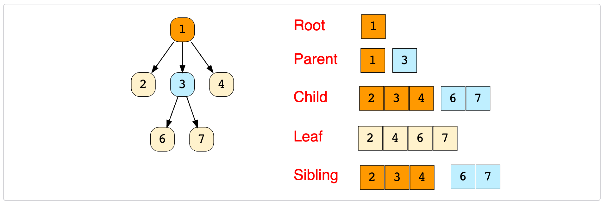
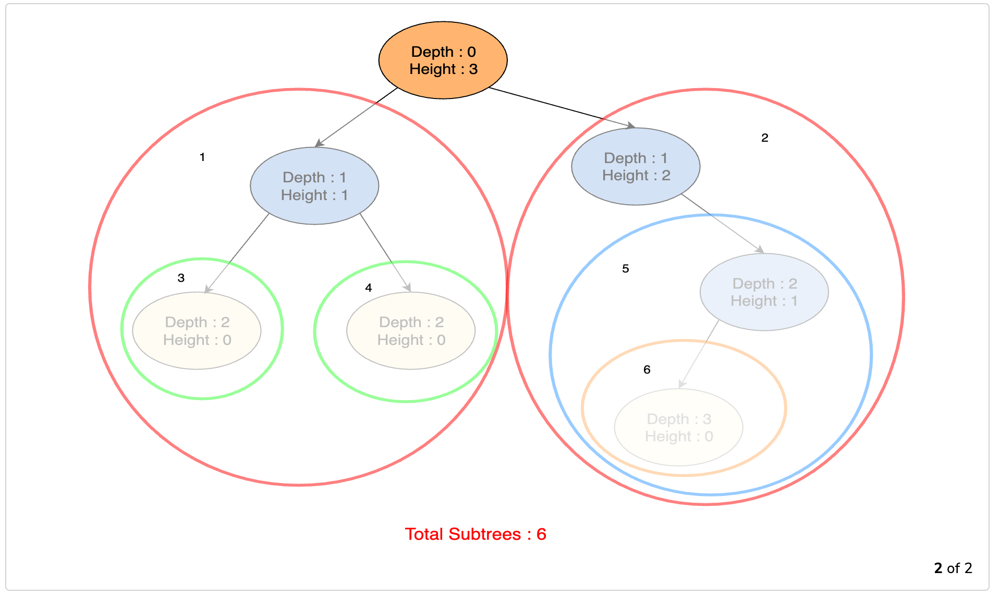
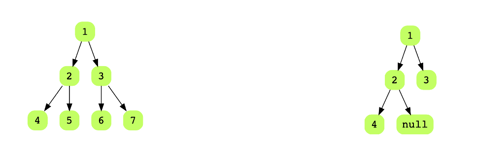
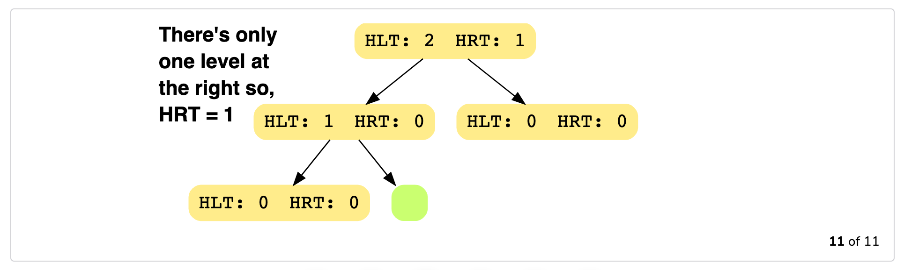
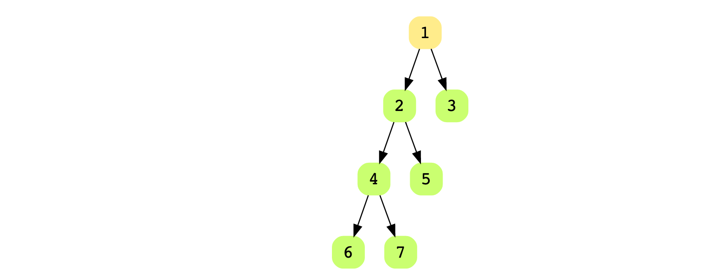

[TOC]


# Introduction to Trees

In this chapter, we will look at another data structure called trees. Unlike linear data structures that we have seen so far, trees is a non-linear data structure. The structure of a tree is the following: 

*   **Root Node**: A node with no parent nodes.
*   **Child Node**: A node which is linked to an upper node (**parent node**)
*   **Parent Node**: A node that has links to one or more **child node**. 
*   **Sibling Node**: Nodes that share same **parent node**
*   **Leaf Node**: A node that does not have any **child node**
*   **Grantparent Node**: A node that traces above the parent node
*   **Ancestor Node**: A node that traces up the grandfather node or more

The figure shows all the terminologies described above: 



Here are some other terminologies to keep in mind: 

*   **Sub-tree**: Essentially, a tree starting from its child node. The tree formed by a node and its descendants
*   **Degree of a Node**: Total number of children of a node
*   **Length of a path**: The number of edges in a path
*   **Depth of a node $n$**: The length of the path from a node $n$ to the root node. The depth of the root node is $0$. 
*   **Level of a node $n$**: $\text{Depth of a Node} - 1$. 
*   **Height of a node $n$**: The length of the path from $n$ to its deepest descendant. Start counting from the leaf to the root. The height at the leaf is 0. 
*   **Height of Tree**: Height of its root node

Here's an example: 


And here are some examples of subtrees: 



## Types of Trees

There are different types of trees that are optimized for particular use-case. Most common trees are: 

*   Binary Trees
*   Binary Search Trees
*   AVL Trees
*   Red-Black Trees
*   2-3 Trees

### The N-ary Tree

Binary trees are a special case of N-ary tree. An N-arry tree is a tree that has a N most children from a parent node. For example, in this case, this is a N = 4, as the root has a maximum number of 4 children. 


## Balanced Trees

A binary tree is height-balanced if, for each node in the tree, the difference between the height of the right subtree and the left subtree is at most one. In other words: 
$$
∣Height(LeftSubTree)−Height(RightSubTree)∣<=1
$$
From this definition, we find that the both the following trees are balanced: 



Here's a high-level algorithm to determine the height of a tree: 

1.  Start from the leaf nodes and move towards the root
2.  Along with traversing the tree, compute heights of the left-subtree and the right-subtree of each node. The height of a leaf node is always 0
3.  At each node, check if the difference between the height of the left and right subtree is more than 1. If so, it means that the tree is not balanced
4.  If you have completed traversed the tree and haven't caught the above condition, then the tree is balanced. 

As an example, consider the following tree. We ask ourselves if the following tree is balanced? 


We start with the leaf. Both for `4` and `null`, the height is `0`. We move up. At `2`, we see that `2` has one child so the height is `1`. For `3`, it has no child so the height is `0`. We get to the root. The height on the left hand side is `2` but on the right hand side it is `1`. Thus, the tree is not balanced. 



## Binary Trees

A binary tree is a tree in which each node has between 0-2 children. They are called the left and right children of a node. Below is an example of a binary tree: 


A **complete binary tree** is a binary three where all the levels are fully filled. The above is not a complete binary tree as the level below 3 is not filled. On the other hand, the following is a complete binary tree: 


A **full binary tree** is a tree where each node has either 0 or 2 children. The above tree is a complete binary tree but not a full binary tree. The one below is a full binary tree but not a complete binary tree. 



A **perfect binary tree** is a binary tree that is full and complete. 


## Writing a Binary Tree

Let's write the binary tree code. The binary tree class makes use of Linked Lists: 

```python
class Node():
    def __init__(self, data=None):
        self.data = data
        self.left = None
        self.right = None
```

So, we created a node. Next we created a binary tree class: 

```python
class BinaryTree():
    def __init__(self, data):
        self.root = Node(data)
```

Let's create a binary tree. For this example, we will use the above perfect binary tree: 

```python
bt = BinaryTree(1)
bt.root.left = Node(2)
bt.root.right = Node(3)
bt.root.left.left = Node(4)
bt.root.left.right = Node(5)
bt.root.right.left = Node(6)
bt.root.right.right = Node(7)
```

### Looking Back at Linked Lists

Before we go through traversing a binary tree, let's revisit singly linked lists. We have the following classes: 

```python
class Node():
    def __init__(self, data=None):
        self.data = data
        self.next = None

class LinkedList():
    def __init__(self):
        self.head = None
        
    def isEmpty(self):
        if self.head == None:
            return True
        else:
            return False
    
    def insert_at_head(self, data):
        new_node = Node(data)
        new_node.next = self.head
        self.head = new_node
        return ''
    
    def show(self):
        if not self.isEmpty():
            cur = self.head
            while cur:
                print(cur.data)
                cur = cur.next
            return ''
        else:
            return None
                
```

Notice how we wrote down the `show()` function which traverses the singly linked lists and prints the node values. We can write this in recursive way as follows: 

```python
def show_recursive(self, node):
    if node:
        print(node.data)
        return self.show_recursive(node.next)

def run(self):
    return self.show_recursive(self.head)
```

For the recursion case, we need to write two functions. Let's look at the first one. 

We pass the node as our argument. The first time the node will be `self.head`. If the node is not `None` which is checked on line 2 we move ahead. This check is also our base case. Next we print the data. The line 4 is then our recursive call to the function. Note, we pass `node.next` in order to move to the next node. 

With this knowledge, let's write the `BinaryTree()` class. 

```python
class Node():
    def __init__(self, data=None):
        self.data = data
        self.left = None
        self.right = None

class BinaryTree():
    def __init__(self, data):
        self.root = Node(data)
        
    def is_empty(self):
        if self.root.left == None and self.root.right == None:
            return True
        else:
            return False
    
    def preorder(self, node):
        if node:
            print(node.data)
            self.preorder(node.left)
            self.preorder(node.right)
        return ''
     
    def postorder(self, node):
        if node:
            self.postorder(node.left)
            self.postorder(node.right)
            print(node.data)
        return ''
        
    def inorder(self, node):
        if node:
            self.inorder(node.left)
            print(node.data)
            self.inorder(node.right)

    def run(self, flag):
        if flag == 'preorder':
            return self.preorder(self.root)
        elif flag == 'postorder':
            return self.postorder(self.root)
        elif flag == 'inorder':
            return self.inorder(self.root)
        else:
            return None
```

Let's first look at the `preorder()` method. The preorder method involves traversing to the bottom of the tree first all the way to the leafs, printing the values and then coming back up and printing them. 

Now, the `preorder()` is similar to our `show()` method in Linked List. We recursively call the left or the right until the node hits `None`. So the check is our base case while the recursive case is `self.preorder(node.left)` or `self.preorder(node.right)`. The position of `print(node.data)` before the recursive calls gets is the **preorder**, at the end of the recursive calls gets us **postorder** and inbetween recursive calls get us **inorder**. 

Given the following tree: 


*   Preorder: Start with the root and go the children on either side of the root. Printing the parent node before the children. In this example we will get:
     `6 4 2 5 9 8 12`.  The time complexity is $O(n)$. 
*   Postorder: Count the parent last while children first. So, we have: 
    `2 5 4 8 12 9 6`
*   Inorder: Go the child first then the parent and back to the child. So, in the example, we will have:
    `2 4 5 6 8 9 12`

## Binary Search Tree

Binary search trees or BSTs are a special kind of binary tree where each node of the tree has key-value pairs. The key-value pairs can be anything like `(username, bank)` or `(employee, ID)`. For all the nodes in BST, the values of all the keys in the left sub-tree of the node are less than the value of the nodes themselves. All the keys in the right subtree are greater than the values of the node. This is referred to as the BST rule. 

This is a valid BST: 


### Implementing a Binary Search Tree

