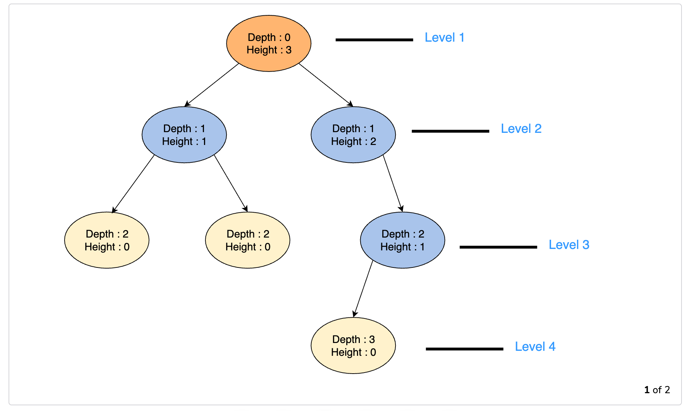

[TOC]


# Introduction to Trees

In this chapter, we will look at another data structure called trees. Unlike linear data structures that we have seen so far, tree is a non-linear data structure. The structure of a tree is the following: 

*   **Root Node**: A node with no parent nodes.
*   **Child Node**: A node which is linked to an upper node (**parent node**)
*   **Parent Node**: A node that has links to one or more **child node**. 
*   **Sibling Node**: Nodes that share same **parent node**
*   **Leaf Node**: A node that does not have any **child node**
*   **Grantparent Node**: A node that traces above the parent node
*   **Ancestor Node**: A node that traces up the grandfather node or more

The figure shows all the terminologies described above: 


Here are some other terminologies to keep in mind: 

*   **Sub-tree**: Essentially, a tree starting from its child node. The tree formed by a node and its descendants
*   **Degree of a Node**: Total number of children of a node
*   **Length of a path**: The number of edges in a path
*   **Depth of a node $n$**: The length of the path from a node $n$ to the root node. The depth of the root node is $0$. 
*   **Level of a node $n$**: $\text{Depth of a Node} - 1$. 
*   **Height of a node $n$**: The length of the path from $n$ to its deepest descendant. Start counting from the leaf to the root. The height at the leaf is 0. 
*   **Height of Tree**: Height of its root node

Here's an example: 



And here are some examples of subtrees: 


## Types of Trees

There are different types of trees that are optimized for particular use-case. Therefore each type of tree has its own space and time complexities. Most common trees are: 

*   Binary Trees
*   Binary Search Trees
*   AVL Trees
*   Red-Black Trees
*   2-3 Trees

### The N-ary Tree

Binary trees are a special case of N-ary tree. An N-arry tree is a tree that has N most children from a parent node. For example, in this case, this is a N = 4, as the root has a maximum number of 4 children. 


## Balanced Trees

A binary tree is height-balanced if, for each node in the tree, the difference between the height of the right subtree and the left subtree is at most one. In other words: 
$$
∣Height(LeftSubTree)−Height(RightSubTree)∣<=1
$$
From this definition, we find that the both the following trees are balanced: 


Here's a high-level algorithm to determine the height of a tree: 

1.  Start from the leaf nodes and move towards the root
2.  Along with traversing the tree, compute heights of the left-subtree and the right-subtree of each node. The height of a leaf node is always 0
3.  At each node, check if the difference between the height of the left and right subtree is more than 1. If so, it means that the tree is not balanced
4.  If you have completed traversed the tree and haven't caught the above condition, then the tree is balanced. 

As an example, consider the following tree. We ask ourselves if the following tree is balanced? 


We start with the leaf. Both for `4` and `null`, the height is `0`. We move up. At `2`, we see that `2` has one child so the height is `1`. For `3`, it has no child so the height is `0`. We get to the root. The height on the left hand side is `2` but on the right hand side it is `1`. Thus, the tree is not balanced. 


>   We compare the left and right of the current subtree and NOT the right and left of the subtree from the root.

## Binary Trees

A binary tree is a tree in which each node has between 0-2 children. They are called the left and right children of a node. Below is an example of a binary tree: 


A **complete binary tree** is a binary three where all the levels are fully filled. The above is not a complete binary tree as the level below 3 is not filled. On the other hand, the following is a complete binary tree: 


A **full binary tree** is a tree where each node has either 0 or 2 children. The above tree is a complete binary tree but not a full binary tree. The one below is a full binary tree but not a complete binary tree. 


A **perfect binary tree** is a binary tree that is full and complete. 


## Writing a Binary Tree

Let's write the binary tree code. The binary tree class makes use of Linked Lists: 

```python
class Node():
    def __init__(self, data=None):
        self.data = data
        self.left = None
        self.right = None
```

So, we created a node. Next we created a binary tree class: 

```python
class BinaryTree():
    def __init__(self, data):
        self.root = Node(data)
```

Let's create a binary tree. For this example, we will use the above perfect binary tree: 

```python
bt = BinaryTree(1)
bt.root.left = Node(2)
bt.root.right = Node(3)
bt.root.left.left = Node(4)
bt.root.left.right = Node(5)
bt.root.right.left = Node(6)
bt.root.right.right = Node(7)
```

### Looking Back at Linked Lists

Before we go through traversing a binary tree, let's revisit singly linked lists. We have the following classes: 

```python
class Node():
    def __init__(self, data=None):
        self.data = data
        self.next = None

class LinkedList():
    def __init__(self):
        self.head = None
        
    def isEmpty(self):
        if self.head == None:
            return True
        else:
            return False
    
    def insert_at_head(self, data):
        new_node = Node(data)
        new_node.next = self.head
        self.head = new_node
        return ''
    
    def show(self):
        if not self.isEmpty():
            cur = self.head
            while cur:
                print(cur.data)
                cur = cur.next
            return ''
        else:
            return None
                
```

Notice how we wrote down the `show()` function which traverses the singly linked lists and prints the node values. We can write this in recursive way as follows: 

```python
def show_recursive(self, node):
    if node:
        print(node.data)
        return self.show_recursive(node.next)

def run(self):
    return self.show_recursive(self.head)
```

For the recursion case, we need to write two functions. Let's look at the first one. 

We pass the node as our argument. The first time the node will be `self.head`. If the node is not `None` which is checked on line 2 we move ahead. This check is also our base case. Next we print the data. The line 4 is then our recursive call to the function. Note, we pass `node.next` in order to move to the next node. 

With this knowledge, let's write the `BinaryTree()` class. 

```python
class Node():
    def __init__(self, data=None):
        self.data = data
        self.left = None
        self.right = None

class BinaryTree():
    def __init__(self, data):
        self.root = Node(data)
        
    def is_empty(self):
        if self.root.left == None and self.root.right == None:
            return True
        else:
            return False
    
    def preorder(self, node):
        if node:
            print(node.data)
            self.preorder(node.left)
            self.preorder(node.right)
        return ''
     
    def postorder(self, node):
        if node:
            self.postorder(node.left)
            self.postorder(node.right)
            print(node.data)
        return ''
        
    def inorder(self, node):
        if node:
            self.inorder(node.left)
            print(node.data)
            self.inorder(node.right)

    def run(self, flag):
        if flag == 'preorder':
            return self.preorder(self.root)
        elif flag == 'postorder':
            return self.postorder(self.root)
        elif flag == 'inorder':
            return self.inorder(self.root)
        else:
            return None
```

Let's first look at the `preorder()` method. The preorder method involves traversing to the bottom of the tree first all the way to the leafs, printing the values and then coming back up and printing them. 

Now, the `preorder()` is similar to our `show()` method in Linked List. We recursively call the left or the right until the node hits `None`. So the check is our base case while the recursive case is `self.preorder(node.left)` or `self.preorder(node.right)`. The position of `print(node.data)` before the recursive calls gets is the **preorder**, at the end of the recursive calls gets us **postorder** and inbetween recursive calls get us **inorder**. 

Given the following tree: 


*   Preorder: Start with the root and go the children on either side of the root. Printing the parent node before the children. In this example we will get:
     `6 4 2 5 9 8 12`.  The time complexity is $O(n)$. 
*   Postorder: Count the parent last while children first. So, we have: 
    `2 5 4 8 12 9 6`
*   Inorder: Go the child first then the parent and back to the child. So, in the example, we will have:
    `2 4 5 6 8 9 12`

Here's an easy way to remember these three: 

*   Preorder - Remember the parent first then the children
*   Postorder - Remember the children first then the parents 
*   Inorder - Remember the children between parents

## Binary Search Tree

Binary search trees or BSTs are a special kind of binary tree where each node of the tree has key-value pairs. The key-value pairs can be anything like `(username, bank)` or `(employee, ID)`. For all the nodes in BST, the values of all the keys in the left sub-tree of the node are less than the value of the nodes themselves. All the keys in the right subtree are greater than the values of the node. This is referred to as the BST rule. 

This is a valid BST: 


### Implementing a Binary Search Tree

To implement a binary search tree. Along with the class, we will create an `insert()` method as well. 

#### Insert Method 

*   Start with the root node
*   Check if the value to be inserted is greater than the root/current node's value
*   If yes, then repeat the steps above for the right subtree, otherwise repeat the steps above for the left sub-tree of the current node
*   Repeat until you find the node that has no right/left child to move onto. Insert the given value there and update the parent node accordingly

We begin by writing the `Node()` class first. This class will have the basics as we seen for `Node()` class as in Linked Lists but it will also include `self.left` and `self.right`. In addition we include `.insert()` to insert values into the BST. 

```python
class Node():
    def __init__(self, data=None):
        self.data = data
        self.left = None
        self.right = None
        
    def insert(self, value):
        if value < self.data:
            if self.left is not None:
                self.left.insert(value)
            else:
                self.left = Node(value)
                return None
        elif value > self.data
            if self.right is not None:
                self.right.insert(value)
            else:
                self.right = Node(value)
                return None
        else:
            print("Value " + str(value) + " already in BST")
            return None
        
class BST():
    def __init__(self):
        self.root = None
        
    def insert(self, value):
        if self.root:
            return self.root.insert(value)
        else:
            self.root = Node(value)
```

The `.insert()` is a recursive method. Here's how the algorithm for insertion works: 

*   We first check if the value is less than the node. If it is, we follow the left branch. If the left branch of the node is not empty, we recursively move down that node until we find a branch that is `None`. We then create a node and add it to that brank. 
*   If the value is greater, we follow the same process but going through the right branch. 

Here's some code to see how the insertion works: 

```python
if __name__ == "__main__":
    b = BST()
    arr = [10, 8, 7, 11, 5]
    for a in arr:
        b.insert(a)
    display(b.root)
    b.insert(9)
    display(b.root)
```

We first insert all the values in the BST from the array. This is shown here: 

```python
  _10_ 
  /   \
  8  11
 /     
 7     
/      
5  
```

Then we insert `9` into the BST. 

```python
   _10_ 
  /    \
  8   11
 / \    
 7 9    
/       
5     
```

There is another alternative way of writing the BST: 

```python
# Alternative Method

class Node():
    def __init__(self, data=None):
        self.data = data
        self.left = None
        self.right = None
        
class BST():
    def __init__(self):
        self.root = None
        
    def insert(self, value):
        if self.root is None:
            self.root = Node(value)
        else:
            self._insert(self, self.root, value)
            
    def _insert(self, cur_node, value):
        if value < cur_node.data:
            if cur_node.left is not None:
                self._insert(cur_node.left, value)
            else:
                cur_node.left = Node(value)
        
        if value > cur_node.data:
            if cur_node.right is not None:
                self._insert(cur_node.right, value)
            else:
                cur_node.right = Node(value)
```


#### Search Method

Now that we have created a BST, we will next create a `.search()` method to find a value in a BST. Just like `.insert()` method, we will have the `.search()` method within the `Node()` class and the `BST()` class. 

```python
# Search in the Node class: 
    def search(self, value):
        if value < self.data:
            if self.left:
                return self.left.search(value)
            else:
                return False
        elif value > self.data:
            if self.right:
                return self.right.search(value)
            else:
                return False
        else:
            return True
        return False

# Search in the BST class: 
def search(self, value):
    if self.root is None:
        return False
    else:
        return self.root.search(value) == value
```

Here we continue to work in the BST class. We add a new method called `search()` along with its helper function `_search()`. To things to note here: 

1.  The main function will call a recursive helper function `_search()`. Eventually, the helper function returns the value either `True` or `False`. This is what is captured by `is_found` variable. Then this variable is evaluated to either return True or False
2.  In the helper function, we want to return the recursive function. If we don't do that, we will not traverse through the nodes. 

Another alternative to the main `search()` method is the following: 

```python
def search(self, value):
    if self.root:
        return self._search(self.root, value) == True
    else:
        return None
        
def _search(self, cur_node, value):
    if value == cur_node.data:
        return True
    elif value < cur_node.data:
        if cur_node.left:
            return self._search(cur_node.left, value)
        else:
            return False
    elif value > cur_node.data:
        if cur_node.right:
            return self._search(cur_node.right, value)
        else:
            return False
```

#### Deletion Method

When it comes to deleting there are many scenarios. These include: 

*   Delete an empty tree
*   Delete a node with no children
*   Delete a node that has one child: 
    *   Delete a left child
    *   Delete a right child
*   Delete a node with two children

There are also complications that can occur when you delete child node. We will look at that in more detail later. 

##### Delete an Empty Tree

This is the easiest. If we have a null tree, we do nothing. We simply return `False`. 

#####  Delete a Leaf node

If we have a leaf node that we wish to delete, here are the steps we follow: 

1.  We search for the node in mind. 
2.  We ensure that the node is a leaf node
3.  We simply set either the left or the right of the parent node to `None` that corresponds to the leaf node in question. 

##### Delete a Node with One Child

Here are the steps we follow: 

1.  We first search for the node in the BST
2.  We ensure that the parent has just one child
3.  We copy the child of the child into a temporary variable
4.  We delete the child.
5.  We set the child of the child to be the parent's child. 

Here's how it looks graphically: 


##### Delete a Node with Two Children

This is a little more complicated. The idea is to swap the value in the current node with a value that is larger than the current value. So, here's how to: 

1.  We search for the node that has the value we are looking for in the BST
2.  Once found, we look to see if they have right child. 
3.  If they have a right child or a right subtree, we traverse, the left branch of the right subtree. This will ensure that we get the value which is higher than the value we wish to delete.
4.  We swap this value with the value we wish to delete.
5.  Now we delete the value we original planned to delete

Now let's implement the deletion method

#### Implement the Deletion Method

Let's build this up as we go. We will work in the `Node()` class

1.  **Delete an Empty Tree**

    ```python
    def delete(self, val):
        if val < self.val:  # val is in the left subtree
            pass
        elif val > self.val:  # val is in the right subtree
            pass
        else:  # val was found
            pass
    ```

    This is the basic template. It checks the value to see whether we need to traverse the left branch or the right branch or whether the value we are looking for has been found. All of the deletion will take place when the value has been found. 

2.  **Traversing the Tree**

    ```python
    def delete(self, val):
        if val < self.val:  # val is in the left subtree
            if(self.leftChild):
                self.leftChild = self.leftChild.delete(val)
            else:
                print(str(val) + " not found in the tree")
                return None
        elif val > self.val:  # val is in the right subtree
            if(self.rightChild):
                self.rightChild = self.rightChild.delete(val)
            else:
                print(str(val) + " not found in the tree")
                return None
        else:  # val was found
            pass
    ```

    When the value is not been found, we will continue to traverse the tree. This is very similar to search method. 

3.  **When the value is Found**: Deleting a Leaf Node

    ```python
    def delete(self, value):
        # if current node's val is less than that of root node,
        # then only search in left subtree otherwise right subtree
        if value < self.data:
            if(self.left):
                self.left = self.left.delete(value)
            else:
                print(str(value) + " not found in the tree")
                return self
        elif value > self.data:
            if(self.right):
                self.right = self.right.delete(value)
            else:
                print(str(value) + " not found in the tree")
                return self
        else:
            # deleting node with no children
            print('Value located..')
            if self.left is None and self.right is None:
                self = None
    
        return self
    ```

    This is the first case. Here we delete a leaf. A leaf is defined as a node that has no left or right children. Once the value has been found, which happens in line 16 as we enter the `else` statement, we check to see if this is a leaf. If it is a leaf, we set the current node, which is our `self` at the moment to `None`. Then we return `self`. If you don't have the return statement, you will end up with an empty tree!

    So, if we have a tree that looks like this: 

    ```python
      _9_   
     /   \  
     4  17_ 
    / \    \
    3 6   18
    ```

    We want to delete a leaf, say, `3`, we get the following:

    ```python
     _9_   
    /   \  
    4  17_ 
     \    \
     6   18
    ```

    

4.  **When the Value is Found**: Deleting a Right Node Only

    ```python
    def delete(self, value):
        # if current node's val is less than that of root node,
        # then only search in left subtree otherwise right subtree
        if value < self.data:
            if(self.left):
                self.left = self.left.delete(value)
            else:
                print(str(value) + " not found in the tree")
                return self
        elif value > self.data:
            if(self.right):
                self.right = self.right.delete(value)
            else:
                print(str(value) + " not found in the tree")
                return self
        else:
            # deleting node with no children
            print('Value located..')
            if self.left is None and self.right is None:
                self = None
            elif self.left is None:
                tmp = self.right
                self = None
                return tmp
        return self
    ```

    In this case we delete a node with ONLY a right child. So, note that such a node may not be a leaf. Now, if it is not a leaf, we need to preserve the subtree before deleting the node. 

    In line 21, we enter the `elif` statement. Here, we check to see if the current node has no left child but has a right child. Now, we want to preserve the child before we delete the node. So, we copy that child into a temporary variable, `tmp`. We then delete the node using `self=None` and we return `tmp`. Technically, you can simply return `self.right`, which works as well. 

    Suppose we wish to delete, 17 in the example, which is has just a right child. We will get the following: 

    ```python
    # Before: 
      _9_   
     /   \  
     4  17_ 
    / \    \
    3 6   18
    
    # After:
      _9_ 
     /   \
     4  18
    / \   
    3 6 
    ```

    

5.  **When a Value is Found**: Deleting a Node with a Left Child Only

    ```python
    def delete(self, value):
        # if current node's val is less than that of root node,
        # then only search in left subtree otherwise right subtree
        if value < self.data:
            if(self.left):
                self.left = self.left.delete(value)
            else:
                print(str(value) + " not found in the tree")
                return self
        elif value > self.data:
            if(self.right):
                self.right = self.right.delete(value)
            else:
                print(str(value) + " not found in the tree")
                return self
        else:
            # deleting node with no children
            print('Value located..')
            if self.left is None and self.right is None:
                self = None
            # Delete a node with no left child
            elif self.left is None:
                tmp = self.right
                self = None
                return tmp
            # Delete a node with no right child
           	elif self.right is None:
                tmp = self.left
                self = None
                return tmp
        return self
    ```

    This is exactly like the previous one. Again, we can simplify the code by simply returning `return self.left`. 

    

6.  **When a Value is Found**: Deleting a Node with Two Children

    ```python
    def delete(self, value):
        # if current node's val is less than that of root node,
        # then only search in left subtree otherwise right subtree
        if value < self.data:
            if(self.left):
                self.left = self.left.delete(value)
            else:
                print(str(value) + " not found in the tree")
                return self
        elif value > self.data:
            if(self.right):
                self.right = self.right.delete(value)
            else:
                print(str(value) + " not found in the tree")
                return self
        else:
            # deleting node with no children
            print('Value located..')
            if self.left is None and self.right is None:
                self = None
            # Delete a node with no left child
            elif self.left is None:
                tmp = self.right
                self = None
                return tmp
            # Delete a node with no right child
           	elif self.right is None:
                tmp = self.left
                self = None
                return tmp
            # Delete a node with two children
            else:
                current = self.right
                while current.left is not None:
                    current = current.left
                self.data = current.data
                self.right = self.right.delete(current.data)
        return self
    ```

    Here's how this works. Suppose we have the following tree: 

    ```python
      _9___       
     /     \      
     4    16___   
    / \  /     \  
    3 6 15    19_ 
             /   \
            18  20
    ```

    Now we wish to delete `16`. As 16 has two children, the code will go through and first locate 16. Next, the code will traverse the right subtree and find the minimim in that. This would be found in the left of the right subtree, which would be 18. Now, 16 and 18 are swapped and finally the 16, which is now a leaf is deleted. 

## Pre-order Traversal

In this method, the elements are traversed in "root-left-right" order. So, we start with the root, and move left and then right until we hit a leaf then we move to the right of the root. So, for example in the following tree we would traverse in the following way: 


Implementation of this traversal in python:

```python
import BST

def preorder(node):
     if node is not None:
            print(node.data)
            preorder(node.left)
            preorder(node.right)
```

How this works is best explained by looking at this [link](https://stackoverflow.com/questions/63962871/understanding-printed-output-for-a-bst-traversal). However, we can do a simple tree to explain the traversal. Consider the following simple tree: 

```python
        9
       / \
      4   17
     / \
    3   6
```

When we run the preorder, the function works like this: 

```python
tree = Tree(
        Node(
            9,
            Node(4,
                Node(3, None, None),  
                Node(6, None, None), 
            ),
            Node(17, None, None)
        )
    )
```

So, at each node, the recursive algorithm keep each of the nodes. Here's another way to look at it: 

```python
entering 9
    entering 4
        entering 3
        visiting 3
        exiting 3
    visiting 4
        entering 6
        visiting 6
        exiting 6
    exiting 4
visiting 9
    entering 17
    visiting 17
    exiting 17
exiting 9
```

## Post-Order Traversal

In the post-order traversal, the elements are traversed in "left-right-root" order. Thus, we have the following:


The code is very similar: 

```python
import BST

def postorder(node):
     if node is not None:
            postorder(node.left)
            postorder(node.right)
            print(node.data)
```

## In-Order Traversal

Finally, the in-order traversal can be thought of as "left-root-right" order. Thus, we have the following: 


The code is very similar to pre- and post-order: 

```python
import BST

def inorder(node):
    if node is not None:
        inorder(node.left)
        print(node.data)
        inorder(node.right)
```

