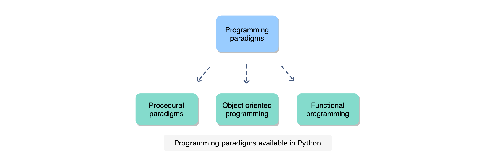
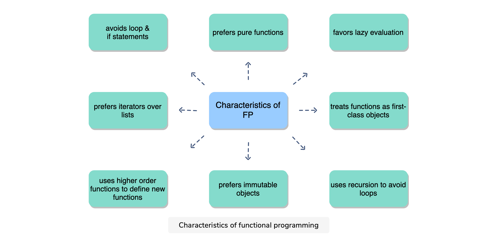
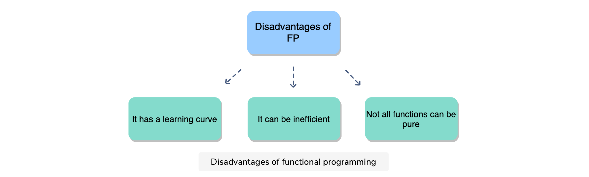

[TOC]


# Functional Programming

The functional programming paradigm can be a powerful tool, especially as it can be integrated seamlessly with procedural and object-oriented code in Python.   In this course, you’ll learn what functional programming is, how it’s used, and the features of Python that support it. To start, you’ll learn how functions act as objects, the role of mutability, and how to perform recursion.   In the latter half of the course, you’ll focus on closures, iterables & iterators, generators, and more. Throughout the course will be three exams which will test your understanding and really drive home what you’ve learned.   By the end, you’ll have a new programming paradigm to add under your belt and have the confidence to start using functional programming in your own projects

## Introduction

Python supports three major programming paradigms: **procedular, object-oriented programming, ** and **functional programming**. The latter is the least understood but it can be an equally powerful tool in your coding repetoire. 

Let's look at these three major programming paradigms in detail.



*   **Procedural Programming** - This is the most basic programming. It involves creating variables, assigning values to variables, using functions, and package and so on. Think of procedural programming as writing scripts to do a specific job. It lacks the sophistication of scalablity and other advanced techniques that object-oriented programming has. 
*   **Object-oriented Programming** - This paradigm makes use of objects and classes. This allows the user to create multiple copies of a class and objects such that the defined methods and attributes can be applied to these objects. OOP allows us scalability, which is often used in production. 
*   **Functional Programming** - This paradigm uses functions as the main building blocks. Functional programming treats functions as objects that can be passed as parameters, allowing new functions to be built dynamically as the program executes. FP tends to be more declarative than imperative. That is, your code defines what you want to happen, rather than stating exactly how the code should do it. 

Let's illustrate these three paradigms with an example: 

We have a list of numbers and we wish to compute their sum: 

```python
# Procedural Programming
def add_vallues(lst):
    return sum(list)

# Object-oriented Programming: 
class ListOperations(object):
    def __init__(self, lst):
        self.lst = lst
        
    def add_values(self):
        return sum(self.lst)
    
# Functional Programming
import functools
sum = functools.reduce(lambda x, y: x + y, lst)
```

## Functional Programming & Its Characteristics

If we were to summarize what functional programming, we would do it in the following way: 

>   Functional Programming uses functions as the fundamental building block for constructing software. It treats functions are objects, just like strings and lists are treated like objects in Python

When functions are treated like objects, we can: 

*   Store them as variables
*   Pass them into other functions as parameters
*   Return other functions as a result

In other words, anything we can do with objects, we do them with functions. One important cornerstone of functional programming is the idea of pure functions - functions that simply calculate a result without any other side effects. 

### Characteristics of Functional Programming



Let's look at these characteristics in more detail: 

*   A **pure function** is a function that calculates the result without any unexpected result or change in the state of the function. That is to say they compute the fundamental processes in a given language such as sum, mathematical operations, sorting, etc...Unpure functions are functions that change or reads from the global variables, modify a parameter, or write a file to a database. 
    *   A pure function is not allowed to return a value other than which depends only on its input parameters
    *   A pure function is not allowed to alter the state of the system
    *   A pure function should be repeatable
*   **Functions** are first-class objects and behave like such
*   Objects in Functional programming are **immutable**. This goes along the idea of pure functions
*   Functional programming prefers **iterators**. This is because an iterator can only read data one element at a time; it ha no ability to change the data. 
*   Functional programming prefers **Lazy Evaluation**. In procedural programming, the call to the function will process the entire list of data in one call. Functional programming is lazy in the sense, a single call will only process what is needed. This reduces the amount of memory used and allows the program to start creating output with less initial delay. 
*   Functional programming avoids **loops** and **if** statements. Instead it makes use of `map`, `filter` and other higher-order functions. 
*   Functional programming often uses recursion to avoid loops
*   Functional programming uses higher-order functions to define new functions

### Advantages of Functional Programming

Here are some main advantages of functional programming: 

*   FP creates less code. This is because it makes use of higher-order functions to create new functions
*   Intent of the code is clearer. Because FP uses higher-order functions, it is clear what the intent of each of the functions are. 
*   There are often fewer bugs. Again, the use of built-in functions cause less bugs 
*   Multiprocessing can be applied easily. As FP makes use of functions, the whole process if modular which allows for multiprocessing.


### Disadvantages of Functional Programming

Here are some disadvantages of FP: 

*   Not all functions can be pure. It is hard to always write pure functions. There will times when you have to work with non-pure functions. 
*   FP is a learning curve. Like any other paradigm, it takes time to learn the trade. 
*   FP can be inefficient. For example, the use of recursion to avoid loops can be more inefficient than using loops



## Functions As Objects

Consider the following function that computes the square of an object: 

```python
def square(x):
    return x * x
```

Now, if you were to type the following: 

```python
print(type(square))
print(id(square)) 
print(str(square))

<class 'function'>
140450326098416
<function square at 0x7fbd23cbb1f0>
```

We see that the function is a type object. The ID is some unique number associated with this function and the str(square) shows the address in memory. In other words, the function behaves as an object. 

Another property that the function has which is similar to any object in python is **aliasing**. Aliasing corresponds to the associating an object to another variable such that both variables point to the same object: 

```python
x = 24
y = x
```

We see the same with functions: 

```python
def square(x):
    return x * x

sq = square
print(sq(9))
```

So, again we see that functions behave like objects. However, note that the use of aliasing of functions should be done carefully as aliasing within a function can have unexpected behaviors. 

Consider this case: 

```python
def a():
    print(1)
    
def b():
    a()
    
print(b())
```

Doing this will print 1. However, see what happens if you change `a()`:

```python
def a():
    print(2)
```

When you run `b()`, the output will be 2 rather than 1. Therefore, it is advised not to use functions within functions, unless those functions are defined only within and not on the outside. 

### Function As Parameters & Return Values

Suppose we wish to write a function that converts from inches to centimeters. We would write this as: 

```python
def inch2cm(x):
    return x * 2.54
```

What if we wish to write another function that converts from centigrade to Fahrenheit? We would write this as: 

```python
def c2f(x):
    return x * 1.8 + 32
```

Now, we have two functions. What if we wish to have just one function `convert()` that calls one of the two functions. We would write this as: 

```python
def convert(x, flag):
    if flag = 'dist':
        return inch2cm(x)
    elif flag = 'temp':
        return c2f(x)
    else:
        return None
        
```

However, we can pass a function as a parameter in our `convert()` function make this more efficient: 

```python
def convert(f, x):
    y = f(x)
    return y

convert(inch2cm, 18)
convert(c2f, 45)
```

Let's now look at functions that return values. 

Consider a simple example: 

```python
def add1():
    return lambda x: x + 1

f = add1()
print(f(2))
```

We see there that the `add1()` returns a function as a value, which can then be used to compute what we wish to do. This is a little contrived example but let's see more of **lambda functions** in the next section. 

## Lambda Functions

A lambda function is an anonymous function that is used within a given function. Think of it as a function on the fly. We define the function write then and there and use it. 

```python
double = lambda x: x * 2

print(double(5))
```

We see that the lambda function does not have a return. That is why it can be thought of as a function that is written on a fly. The lambda function is often used with other functions such as `filter()` and `map()`. 

Let's see how we can find the product of a list of tuples: 

```python
p = [(3, 3), (4, 2), (2, 2), (5, 2), (1, 7)]

result = list(map(lambda x: x[0] * x[1], p))
print(result)
```

So, when should you use a lambda function? We want to use these functions when: 

*   Lambdas can only contain a single python expression. If your function cannot be expressed in one line, you can't use a lambda. 
*   Use them only for short and simple code, where the behavior of the function is obvious for looking at it. If the behavior is complicated don't use lambda function
*   Use them only when you do not need to use the same function twice. If you do use the same function twice, define the function explicitly and apply it. 