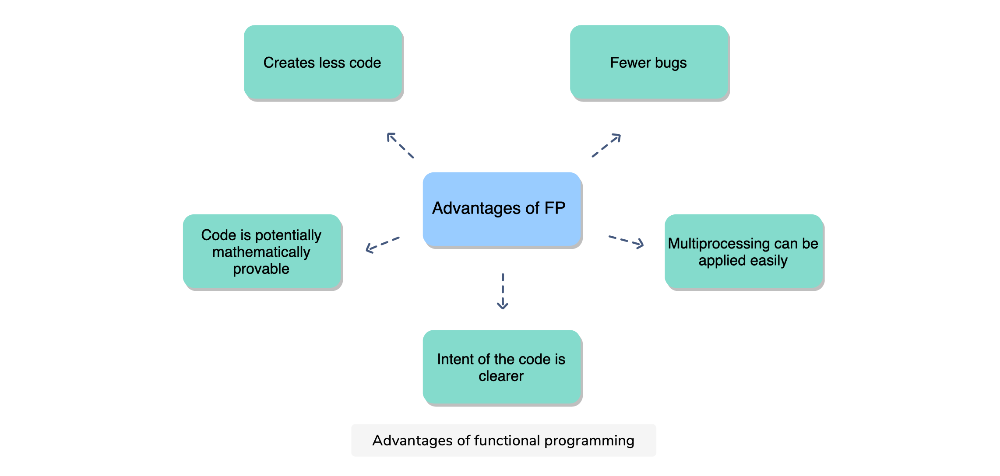

[TOC]


# Functional Programming

The functional programming paradigm can be a powerful tool, especially as it can be integrated seamlessly with procedural and object-oriented code in Python.   In this course, you’ll learn what functional programming is, how it’s used, and the features of Python that support it. To start, you’ll learn how functions act as objects, the role of mutability, and how to perform recursion.   In the latter half of the course, you’ll focus on closures, iterables & iterators, generators, and more. Throughout the course will be three exams which will test your understanding and really drive home what you’ve learned.   By the end, you’ll have a new programming paradigm to add under your belt and have the confidence to start using functional programming in your own projects

## Introduction

Python supports three major programming paradigms: **procedular, object-oriented programming, ** and **functional programming**. The latter is the least understood but it can be an equally powerful tool in your coding repetoire. 

Let's look at these three major programming paradigms in detail.


*   **Procedural Programming** - This is the most basic programming. It involves creating variables, assigning values to variables, using functions, and package and so on. Think of procedural programming as writing scripts to do a specific job. It lacks the sophistication of scalablity and other advanced techniques that object-oriented programming has. 
*   **Object-oriented Programming** - This paradigm makes use of objects and classes. This allows the user to create multiple copies of a class and objects such that the defined methods and attributes can be applied to these objects. OOP allows us scalability, which is often used in production. 
*   **Functional Programming** - This paradigm uses functions as the main building blocks. Functional programming treats functions as objects that can be passed as parameters, allowing new functions to be built dynamically as the program executes. FP tends to be more declarative than imperative. That is, your code defines what you want to happen, rather than stating exactly how the code should do it. 

Let's illustrate these three paradigms with an example: 

We have a list of numbers and we wish to compute their sum: 

```python
# Procedural Programming
def add_vallues(lst):
    return sum(list)

# Object-oriented Programming: 
class ListOperations(object):
    def __init__(self, lst):
        self.lst = lst
        
    def add_values(self):
        return sum(self.lst)
    
# Functional Programming
import functools
sum = functools.reduce(lambda x, y: x + y, lst)
```

## Functional Programming & Its Characteristics

If we were to summarize what functional programming, we would do it in the following way: 

>   Functional Programming uses functions as the fundamental building block for constructing software. It treats functions are objects, just like strings and lists are treated like objects in Python

When functions are treated like objects, we can: 

*   Store them as variables
*   Pass them into other functions as parameters
*   Return other functions as a result

In other words, anything we can do with objects, we do them with functions. One important cornerstone of functional programming is the idea of pure functions - functions that simply calculate a result without any other side effects. 

### Characteristics of Functional Programming


Let's look at these characteristics in more detail: 

*   A **pure function** is a function that calculates the result without any unexpected result or change in the state of the function. That is to say they compute the fundamental processes in a given language such as sum, mathematical operations, sorting, etc...Unpure functions are functions that change or reads from the global variables, modify a parameter, or write a file to a database. 
    *   A pure function is not allowed to return a value other than which depends only on its input parameters
    *   A pure function is not allowed to alter the state of the system
    *   A pure function should be repeatable
*   **Functions** are first-class objects and behave like such
*   Objects in Functional programming are **immutable**. This goes along the idea of pure functions
*   Functional programming prefers **iterators**. This is because an iterator can only read data one element at a time; it ha no ability to change the data. 
*   Functional programming prefers **Lazy Evaluation**. In procedural programming, the call to the function will process the entire list of data in one call. Functional programming is lazy in the sense, a single call will only process what is needed. This reduces the amount of memory used and allows the program to start creating output with less initial delay. 
*   Functional programming avoids **loops** and **if** statements. Instead it makes use of `map`, `filter` and other higher-order functions. 
*   Functional programming often uses recursion to avoid loops
*   Functional programming uses higher-order functions to define new functions

### Advantages of Functional Programming

Here are some main advantages of functional programming: 

*   FP creates less code. This is because it makes use of higher-order functions to create new functions
*   Intent of the code is clearer. Because FP uses higher-order functions, it is clear what the intent of each of the functions are. 
*   There are often fewer bugs. Again, the use of built-in functions cause less bugs 
*   Multiprocessing can be applied easily. As FP makes use of functions, the whole process if modular which allows for multiprocessing.



### Disadvantages of Functional Programming

Here are some disadvantages of FP: 

*   Not all functions can be pure. It is hard to always write pure functions. There will times when you have to work with non-pure functions. 
*   FP is a learning curve. Like any other paradigm, it takes time to learn the trade. 
*   FP can be inefficient. For example, the use of recursion to avoid loops can be more inefficient than using loops


