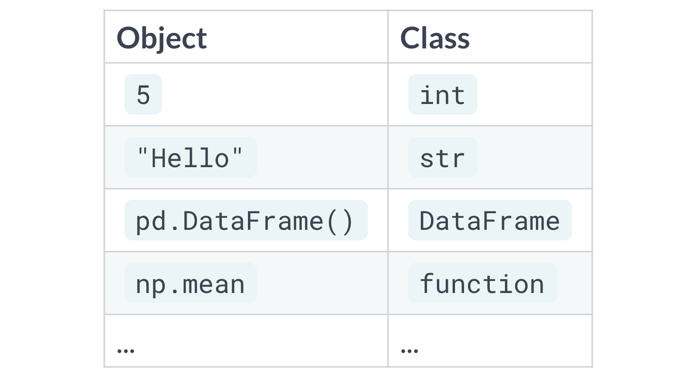
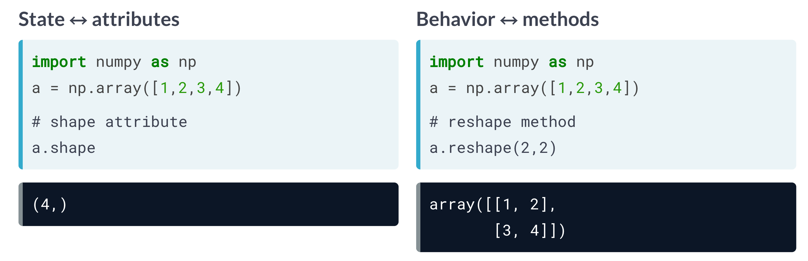
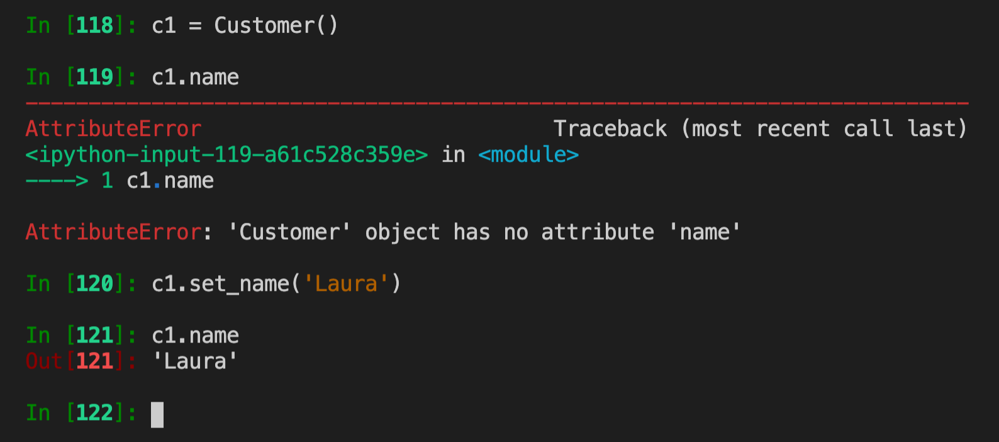
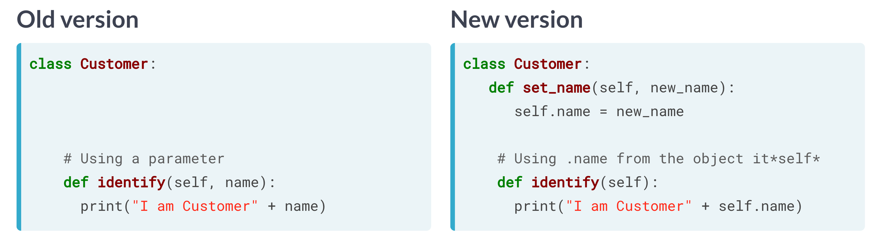
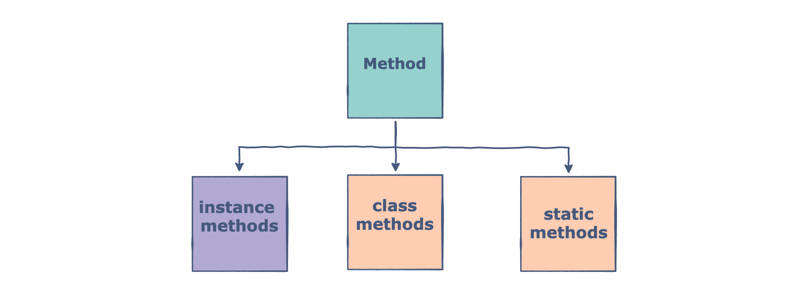
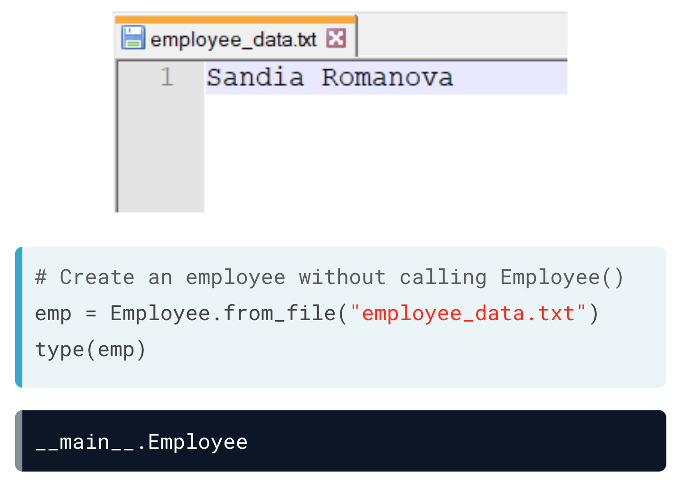
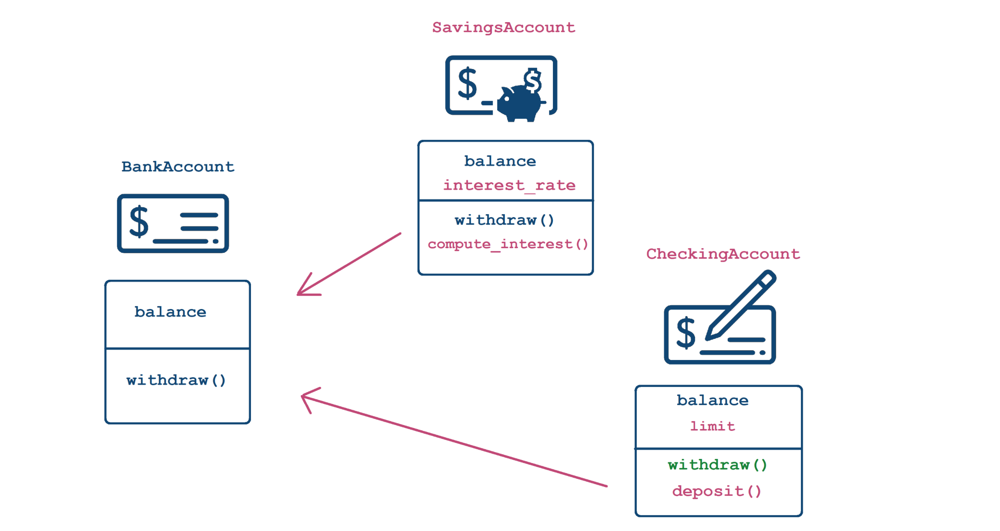
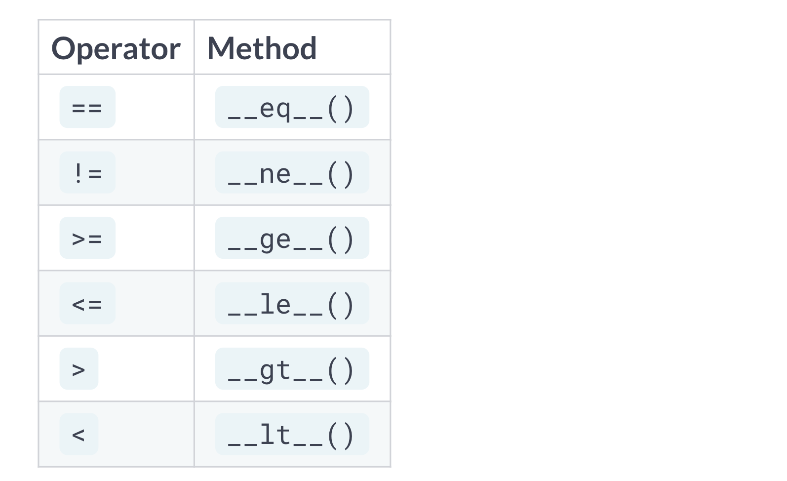

[TOC]


# Object-Oriented Programming in Python

Object-oriented programming (OOP) is a widely used programming paradigm that reduces development times—making it easier to read, reuse, and maintain your code. OOP shifts the focus from thinking about code as a sequence of actions to looking at your program as a collection of objects that interact with each other. In this course, you’ll learn how to create classes, which act as the blueprints for every object in Python. You’ll then leverage principles called inheritance and polymorphism to reuse and optimize code. Dive in and learn how to create beautiful code that’s clean and efficient!

## Chapter 1: OOP Fundamentals

In this chapter, you'll learn what object-oriented programming (OOP) is, how it differs from procedural-programming, and how it can be applied. You'll then define your own classes, and learn how to create methods, attributes, and constructors.

Most of the time the programming we do is procedural. It makes sense because from the time we get up and go to sleep at night, we follow a sequence of steps. However, procedural works great for an individual but we wish to do that for a large number of individuals, writing separate code for each individual will be a challenge. 

Instead we code as interactions of objects. Such a code is great for building frameworks and tools. It helps to organize the code better and reuse the code. At the heart of OOP are the **objects** and **classes**.

>   An object is a data structure that incorporates the state and the behavior. 

For example, an object could be an individual where the state is their email address and phone number while the behavior is if they have placed an order or canceled it. An object could be a button where the state is a label of the button and the behaviour is what happens when the button is pressed. 


We see that the state and behavior are bundled together rather than thinking of this as separate. This is known as **encapsulation**. 

>   Encapsulation is a software design practice of bundling the state and the methods that operate on that data

**Classes** on the other hand are like blueprints that create the objects. They outline what the states and behaviors the objects would possess. For example, a customer class will have objects which in turn will have email address and phone # as states while the behavior would be either placing or canceling orders. The class can create $N$ number of objects: 


In python everything is an object and every object has a class. For example, 



The function `type()` allows us to see what class an object belongs to. In a given object, **attributes** are associated with the state while **methods** are associated with behaviors. For example, 



>   **Attributes** give us the state of the object while **methods** change the behavior of the object

In python attributes are represented by **variables** such as string, tuples or lists while behaviors are represented by **functions**. 

>   Attributes encode the state of an object and are represented by variables

>   Methods encode behavior of an object and are represented by functions

Sometimes attributes are also called **properties** or **members** while the behaviors are called **methods** or **member functions**. 

Methods are like functions that have access to properties (and other methods) of a class. Methods can accept parameters and return values. They are used to perform an action on an object of a class. 

By using the `dir()` on a object, we can list all the attributes associated with the object. 

### Class Anatomy: Attributes & Methods

The class is easily created using the `class` statement followed by the name of the class, followed by the colon. This is known as class **declaration**. Every statement that is indented will be part of the class. An empty class can be created by using the statement `pass` after the class declaration. For example, 

```python
class Customer():
    # code for class goes here
    pass
```

The following rules are adhered to when naming classes: 

*   Must start with a letter or underscore
*   Should only be comprised of numbers, letters, or underscores. 

Even if the class is empty, we can still create objects. The objects are created by using the name of the class followed by a pair of parenthesis. 

```python
c1 = Customer()
c2 = Customer()
```

Here are two objects that we created that belong to the class `Customer`. However, creating empty class is not that much interesting. 

### Attributes

The attributes of the object can easily be accessing using the `object dot-variable_name`. For example, we have: 

```python
class Customer():
    ID = 78493
    salary = 25000
```

Then accessing the `ID` and `Salary` involves: 

```python
c1 = Customer()
print(c1.ID)
print(c1.salary)
```

The properties of an object can also be changed outside the class thought this is soemthing that often done: 

```python
class Customer():
    ID = None
    salary = None
    
c1 = Customer()
c1.ID = 78493
c1.salary - 25000
```

### Methods 

A method is a function that lives within the class. However, unlike ordinary functions in python, the method always requires the `self` argument as the first argument in the class: 

```python
class Customer():
    
    def identify(self, name):
        print('I am Customer ' + name)
```

We can create an object and assign that object a name: 

```python
c1 = Customer()
c1.identify('Megan')

I am Customer Megan
```

We see that we get an output. 

So, what is `self`? Classes are templates. Objects of a class don't yet exist when a class is being defined, but we often need a way to refer to the data of a particular object within class definition. The `self` therefore stands for the future object that will be defined. Therefore every method should include `self` so we can call other attributes and methods from within the class definition even when no object is created. Python handles `self` when the method is called from an object using the dot syntax. In fact, when we use `object.method()` we pass `self` from the object to the method. 

As a good programming practice, the attributes must be passed directly to the object rather than passing them through a method. In python attributes are created by assignment (`=`) operator in methods. 

For example, 

```python
class Customer():
    def set_name(self, new_name):
        self.name = new_name
```

We see here that the method `set_name()` creates an attribute for the object `.name` through an assignment operator. So, when we create an object, it does not have a `.name` attribute but once we use the method, we give it an attribute which we can then access: 



As we can see here before the method was applied the object `c1` did not have a name attribute. But it did after we applied the method on the object. 

Coming back to our `.identify()` method, we can set the name outside of this, directly to the object as an attribute: 



### The `__int_` constructor

To summarize, the methods are function definitions within the a class. Methods take `self` as the first argument. They also define attributes by assignment. The attributes are referred to in a class through the use of `self.`. However, if each method adds an attribute to the object, and there are a whole lot of methods, things may get out of hand and it would be difficult to track which method is adding what attribute to the object. Instead, it would be better to add all possible attributes the methods need when creating the object itself! 

Python has a method called a **constructor** which is automatically called when an object is created. The constructor is like a method but has pre-defined name, `__init__`. The double underscore means that it is a special method that python interpreter will treat as a special case. The constructor looks like this: 

```python
class Customer():
	def __init__(self, name, balance, salary=50000):
    	self.name = name
        self.balance = balance
        self.salary = salary
```

You will notice that the `__init__` method has no return statement. This method is always defined at the very top of the class. 

Now that we have created an instructor, the attributes can easily be passed for a given customer when we create an object: 

```python
c1 = Customer('Alexis', 1000)
```

The constructor also allows us to create default values so we don't see to initiate for each customer. 

>   Always define the attributes within the constructor and not in methods

In the example above, notice that the constructor takes both requires arguments and optional arguments. 

The classes in python are named using the CamelCase while functions and attributes are defined in terms of lowecase chracters with underscores. Also, make use docstrings. 

## Chapter 2: Inheritance & Polymorphism

Inheritance and polymorphism are the core concepts of OOP that enable efficient and consistent code reuse. Learn how to inherit from a class, customize and redefine methods, and review the differences between class-level data and instance-level data.

The core principles of OOP are: 

*   **Inheritance**: Extending functionality of existing code
*   **Polymorphism**: Creating a unified interface
*   **Encapsulation**: Bundling of data and methods

### Instance- and Class-attributes

The instance attributes are attributes that are specific to that instance. For example, 

```python
c1 = Customer('Alexis', 2000)
c2 = Customer('Rachel', 4000)
```

Here we have two instances of the class. The balances are different between these objects and so are the names. Therefore these are called instance attributes. Instance attributes are associated with the methods within a class. They are not associated with the whole class itself. 

Class attributes are associated with a class. For example, we can create a minimum balance that is across the entire class: 

```python
class Employee():
    MIN_BALANCE = 3000
    def __init__(self, name, balance, salary=50000):
        self.name = name
        if balance < Employee.min_balance:
            self.balance = Employee.MIN_BALANCE
        else:
            self.balance = balance
        self.salary = salary
```

We see that `min_balance` is associated with the class that is why we use `Employee.min_balance` inside the constructor. So, the class attributes are global constants that are related to the class. 

>   The class variable is shared by all instances or objects of the class. 
>
>   Instance variable is only shared by the instance of the object in a class.

Here's another example of class and instance variables: 

```python
class Player:
    teamName = 'Liverpool'  # class variables

    def __init__(self, name):
        self.name = name  # creating instance variables


p1 = Player('Mark')
p2 = Player('Steve')

print("Name:", p1.name)
print("Team Name:", p1.teamName)
print("Name:", p2.name)
print("Team Name:", p2.teamName)
```

 And the output will be: 

```python
Name: Mark
Team Name: Liverpool
Name: Steve
Team Name: Liverpool
```

So, we see that instance variables change based on the object created while the class variable remain the same. Thus class attributes and instance attributes can be thought of as global and local variables. 

Here's another use of class and instance variables: 

```python
class Player:
    teamName = 'Liverpool'      # class variables
    teamMembers = []

    def __init__(self, name):
        self.name = name        # creating instance variables
        self.formerTeams = []
        self.teamMembers.append(self.name)


p1 = Player('Mark')
p2 = Player('Steve')

print("Name:", p1.name)
print("Team Members:")
print(p1.teamMembers)
print("")
print("Name:", p2.name)
print("Team Members:")
print(p2.teamMembers)
```

```python
Name: Mark
Team Members:
['Mark', 'Steve']

Name: Steve
Team Members:
['Mark', 'Steve']
```

Notice how we can access the class variable within the constructor and do operations on it. 

### Methods in Python

In Python classes, therea re three types of methods: 

1.  Instance methods
2.  Class methods
3.  Static methods



Let's look at each one of them in greater detail. 

### Instance Methods (or simply: Methods)

A method is a group of statements that performs some operations and may or may not return a result. Here's an example of two methods in a class: 

```python
class Employee:
    # defining the initializer
    def __init__(self, ID=None, salary=None, department=None):
        self.ID = ID
        self.salary = salary
        self.department = department

    def tax(self):
        return (self.salary * 0.2)

    def salaryPerDay(self):
        return (self.salary / 30)
```

As we have seen earlier, the `self` is the first argument in a method which is attributed as a placeholder for future object that will be created by the class. 

### Method Overloading

>   Overloading refers to making a method perform different operations based on the nature of its arguments. 

Here's an example of method overloading: 

```python
class Employee:
    # defining the properties and assigning them None to the
    def __init__(self, ID=None, salary=None, department=None):
        self.ID = ID
        self.salary = salary
        self.department = department

    # method overloading
    def demo(self, a, b, c, d=5, e=None):
        print("a =", a)
        print("b =", b)
        print("c =", c)
        print("d =", d)
        print("e =", e)
        if e is not None:
            p = sum([a, b, c, d, e])
        else:
            p = sum([a, b, c, d])
        return p
```

And here's the response: 

```python
c1 = Employee()
c1.demo(1, 2, 3)

a = 1
b = 2
c = 3
d = 5
e = None
11

c2 = Employee()
c2.demo(1, 2, 3, 4, 5)
a = 1
b = 2
c = 3
d = 4
e = 5

15
```

So, we see that we don't have to write a separate method for `d` and `e`. 

>   Method overloading has the following benefits: 
>
>   1.  Increase execution time
>   2.  Make code cleaner and readable
>   3.  Same method name saves memory
>   4.  Allows the implementation of polymorphism

### Class Methods

Class methods work with class variables and are accessible using the class name rather than its object. Since all the class objects share the class variables, the class methods are used to access and modify class variables. 

>   Class methods are accessed using the class name and can be accessed without creating a class object. 

The class method is created using the **decorator**, `@classmethod` and the use of `cls` within a method instead of `self`:

```python
class MyClass():
    classVariable = 'educative'
    
    @classmethod
    def my_awesome_method(cls, arg1, arg2..):
        # code here
```

However, we cannot use any instance attributes within the class method. To call a class method, simply use <class name>.method rather than object.method which we do for instances. 

```python
MyClass.my_awesome_methods(args...)
```

For example, 

```python
# Create a Player class
class Player:
    MAX_POSITION = 10
    
    def __init__(self):
      self.position = 0

# Print Player.MAX_POSITION  
print(Player.MAX_POSITION)   

# Create a player p and print its MAX_POSITITON
p = Player()
```

We can see the distinction here: 

```python
print(p.position)
0
print(p.MAX_POSITION)
10
```

The only reason to use a class method is if we wish to create objects for the class in a different way from that created using the constructor. This is because a class can only have one constructor. For example, if we wish to create an obejct directly or by reading from a file, we would need to create a class method that creates an object from a file: 

```python
class Employee():
    MIN_BALANCE = 3000
    def __init__(self, name, balance, salary=50000):
        self.name = name
        if balance < Employee.min_balance:
            self.balance = Employee.MIN_BALANCE
        else:
            self.balance = balance
        self.salary = salary
 
    @classmethod
	def from_file(cls, filename):
        with open(filename, 'r'):
            name = f.readlines()
        return cls(name)
```

Notice that the class method returns the `cls`, which is the class itself. And by calling `cls(name)`, the class method calls the class constructor (`__init__`). Now we can create an object for the class from a file: 



### Static Methods

Static methods are methods that are usually limited to class only and not their objects. They have no direct relation to the class variables. They are used as utility functions inside the class or when we do not want the inherited classes. 

>   Static methods can be accessed using the class name or the object name

To declare a method as a static method, we use the decorator `@staticmethod`. It does not use a reference to the object or class, so we do not have to use `self` or `cls`. This allows the method to perform like any function in procedural function without interfering with the instance or class variables. 

### When to Use What method? 

Here's what each type of method does: 

*   **Instance Method**
    *   Can modify object instance state
    *   Can modify class state
*   **Class Method**
    *   *Can't modify object instance state*
    *   Can modify class state
*   **Static Method**
    *   *Can't modify object instance state*
    *   *Can't modify class state*

Here's an example of all the methods used: 

```python
# Creating a pizza
import math
class Pizza():
    def __init__(self, ingredients):
        self.ingredients = ingredients
        
    def compute_area(self, radius):
        return self._circle_area(radius)
        
    @classmethod
    def margherita(cls):
        return cls(['cheese', 'tomatoes'])
    
    @classmethod
    def hawaiian(cls):
        return cls(['cheese', 'tomatoes', 'ham', 'pineapple'])
    
    @staticmethod
    def _circle_area(r):
        return math.pi * (r**2)
    
```

We use `classmethod` to create objects directly. This is particularly helpful if we wish to create objects quickly or don't know what parameters they take. As we saw creating a margherita pizza could also have been created in the following way: 

```python
# Creating Margherita pizza manually: 
m2 = Pizza()
m2 = Pizza(['cheese', 'tomatoes'])

# Creating Margherita pizza automatically
m1 = Pizza.margherita()
```

Finally, we use `staticmethod` sort of a utility function within a class. If we have multiple methods using the same function, we can separate it out into a `staticmethod` and then use it as we have done here. The `staticmethod` can be accessed using `self.`

### Class Inheritance

OOP is all about code reuse. It also allows you to customize functionality. Class inheritance is that when we define a new class, we can have this new class get all the functionaity of the old class including the extra stuff without implementing the code from scratch. 

For example, you begin by writing  a class called `BankAccount`. This class has an attribute `balance` and a method `withdraw()`. You decide to write another class `SavingsAccount`. Such a class also has an attribute `balance` and a method, `withdraw()` in addition to `interest_rate` and `compute_interest()`. Rather than rewritting the same attributes and methods as you did in the `BankAccount` class, the class is inherited by the `SavingsAccount` class. This allows the functionality to be used in this new class. 

 

The inheritance of one class into another is very simple. For example, we write a class first, let's call it `MyParent`. We then write another class, call it, `MyChild` which inherits the `MyParent` class. Then this would be written as, 

````python
class MyChild(MyParent):
    # code appears here
````

In other words, we pass the class we wish to inherit as an argument in the new class. We can write the above example as follows: 

```python
class BankAccount():
    def __init__(self, balance):
        self.balance = balance
        
    def withdraw(self, amount):
        self.balance = self.balance - amount
        
class SavingsAccount(BankAccount):
        pass
        
    def compute_interest(self, amount):
        pass
```

Note that when we inherit the class, we also inherit the methods, the attributes and the constructor. So, writing: 

```python
savings_acct = SavingsAccount(1000)
```

We pass the balance, which the `BankAccount()` class requires to create an object. We can also directly access the balance attribute and use the method from it. 

### Customizing Functionaity via Inheritance

Let's continue to look at the classes we created and customize the classes: 

Suppose we wish to inherit the balance in the SavingsAccount from the BankAccount class but we also wish to add the interest rate along with the bank account. Doing the following does not work: 

```python
class BankAccount():

    def __init__(self, balance):
        self.balance = balance

    def withdraw(self, amount):
        self.balance = self.balance - amount


class SavingsAccount(BankAccount):
    def __init__(self, interest_rate):
        self.interest_rate = interest_rate
    pass

acct = SavingsAccount(1000)
print(acct.interest)

-------------------------------------------------------------------------
AttributeError                            Traceback (most recent call last)
<ipython-input-134-84aa0995170c> in <module>
----> 1 acct.interest

AttributeError: 'SavingsAccount' object has no attribute 'interest'
```

This is because we never pass the `interest_rate`. However, if we create an object directly from the `SavingsAccount` class, we will not have the `balance`. This can be solved by bringing the constructor from the `BankAccount` class into the `SavingsAccount` class:

```python
class BankAccount():
    def __init__(self, balance):
        self.balance = balance
        
    def withdraw(self, amount):
        self.balance = self.balance - amount
        
class SavingsAccount(BankAccount):
    
    def __init__(self, balance, interest_rate):
        BankAccount.__init__(self, balance)
        self.interest_rate = interest_rate
```

We see here that we have introduce the constructor from the parent class into the child class. So, when we call the `SavingsAccount()`, we create an object belonging to the `BankAccount()` class. The `self` here belongs to both classes. Now you don't have to call the parent constructor but you are likely to almost always use the parent constructor. 

With this customization, when we create an object using te new constructor, 

```python
acct = SavingsAccount(1000, 0.03)
print(acct.interest_rate)
0.03
```

We can add methods in the child class as usual. These methods can use data from both the parent and the child class. 

```python
class SavingsAccount(BankAccount):
    def __init__(self, balance, interest_rate):
        BankAccount.__init__(self, balance)
        self.interest_rate = interest_rate
        
    def compute_interest(self, n_periods = 1):
        return self.balance * ((1 - self.interest_rate) ** n_periods - 1)
```

Here the `self` keyword is used for BOTH the parent class and the child class. The parent class can be called in any method of the class that inherits this parent class: 

```python
class BankAccount():
    def __init__(self, balance):
        self.balance = balance
        
    def withdraw(self, amount):
        self.balance = self.balance - amount

class CheckingAccount(BankAccount):
    def __init__(self, balance, limit):
        BankAccount.__init__(self, content):
            self.limit = limit
    def deposit(self, amount):
        self.balance += amount
    def withdraw(self, amount, fee=0):
        if fee <= self.limit:
            BankAccount.withdraw(self, amount - fee)
        else:
            BankAccount.withdraw(self, amount - self.limit)
```

So, we see here that the parent class, `BankAccount` is being used inside the method `withdraw()`. Such an application is called **polymorphism** which we will learn later in the class. 

What has changed here is that in the `BankAccount.withdraw()` method we only have the amount. So, in order to add a `fee` in the `CheckingAccount` class, we first inherited the `BankAccount()` class which came with its version of `withdraw()` method. We call this method directly in the `CheckingAccount.withdraw()` method and pass the fee parameter. This way we did not have to rewrite the code on lines 5 and 6. We simply modified the code in line 14 to adapt the code in line 5-6 to use the `fee` attribute. 

Here's an example how we can modify an existing class and customize it to our liking: 

```python
# Import pandas as pd
import pandas as pd

# Define LoggedDF inherited from pd.DataFrame and add the constructor
class LoggedDF(pd.DataFrame):
  
  def __init__(self, *args, **kwargs):
    pd.DataFrame.__init__(self, *args, **kwargs)
    self.created_at = datetime.today()
    
  def to_csv(self, *args, **kwargs):
    # Copy self to a temporary DataFrame
    temp = self.copy()
    
    # Create a new column filled with self.created at
    temp["created_at"] = self.created_at
    
    # Call pd.DataFrame.to_csv on temp with *args and **kwargs
    pd.DataFrame.to_csv(temp, *args, **kwargs)
```

In this case we use the pandas class. From there we take the `pd.DataFrame` as a class and add a constructor. We then define our own `.to_csv()` method which adds a new column called `create_at` to the data frame before it is saved to file. 

## Chapter 3: Integrating with Standard Python

In this chapter, you'll learn how to make sure that objects that store the same data are considered equal, how to define and customize string representations of objects, and even how to create new error types. Through interactive exercises, you’ll learn how to further customize your classes to make them work more like standard Python data types.

### Operator Overloading: Comparison

If you tried to create two objects with the same parameters and then see if they are identical, you will notice that the answer python gives us false. For example, 

```python
class Customer():
    def __init__(self, name, balance):
        self.name = name
        self.balance = balance
        
c1 = Customer('Alexis', 3000)
c2 = Customer('Alexis', 3000)

c1 == c2
False
```

This is because the comparison is done NOT on the data itself but the location of the memory. Python compares the two memory locations where the two objects have been created and see if those two memory locations are identical. 

In order for us to compare the data itself, we can add our own custom function: 

```python
class Customer():
    def __init__(self, name, balance):
        self.name = name
        self.balance = balance
    def __eq__(self, other):
        if self.name == other.name and \
           self.balance == other.balance:
            return True
        else:
            return False
```

Now the comparison will with data rather than the memory location. 

```python
c1 = Customer('Alexis', 3000)
c2 = Customer('Alexis', 3000)

c1 == c2
True
```

By defining the equivalent operator ourselves, we have now configured now the equivalent operator will behave within the class. However, this does not change the behavior of the equivalent operator outside of this class. 

There are other operators which we can customize and define: 



### Operator Overloading: String Representation

If we were to call the print method on an object we get the location of the memory where the object is stored. Instead, we want to give the user a more useful information. There are two ways that work with string objects: 

*   `__str_()`
*   `__repr__()`

When a print statement is called, the `__str__` is called. It gives the informal definition about what the object is while `__rep__` gives a more formal definition by showing the class that was called. 

Let's first define the informal way: 

```python
class Customer():
    def __init__(self, name, balance):
        self.name, self.balance = name, balance
    
    def __str__(self):
        cust_str = """
        Customer:
        	name: {name}
        	balance:{balance}
        """.format(name = self.name, \
                   balance = self.balance)
        return cust_str
```

Now, when we call print on the customer object, we get: 

```python
print(c1 = Customer('Meryem', 1000))

Customer:
    name: Meryem
    balance: 1000
```

Now the formal way: 

```python
class Customer():
    def __init__(self, name, balance):
        self.name, self.balance = name, balance
        
    def __repr__(self):
        return "Customer('{name}', {balance})".format(name=self.name,\
                                                     balance=self.balance)
```

And the output looks like this: 

```python
c1 = Customer('Meryem', 1000)
print(c1)

Customer('Meryem', 1000)
```

So, we know which class is called. 

### String Formatting Review

Before you start defining custom string representations for objects, make sure you are comfortable working with strings and formatting them. If you need a refresher, take a minute to look through the [official Python tutorial on string formatting](https://docs.python.org/3/library/stdtypes.html#str.format).

If we are given: 

```python
my_num = 5
my_str = "Hello"

# The format of the object f before printing should be: \
f = "my_num is {}, and my_str is \"{}\".".format(my_num, my_str)
print(f)
```

### Exceptions

Exception handling in python we use the `try` and `except` as follows: 

```python
try:
    # try running some code
except ExceptionNameHere:
    # Run this code if ExceptionNameHere happens
except AnotherExceptionNameHere:
    # Run this code if AnotherExceptionNameHere happens
...
finally:
    # Run this code no matter what
```

There is no limit on the number of `except` blocks there can be. 

Sometimes you may wish to raise your own exceptions. This can be done as follows: 

```python
def make_list_of_ones(length):
    if length <= 0:
        raise ValueError("Invalid length!")
    return [1]*length
```

In python exceptions inherited from classes such as `BaseException` or `Exception`

## Chapter 4: Best Practices of Class Design

How do you design classes for inheritance? Does Python have private attributes? Is it possible to control attribute access? You'll find answers to these questions (and more) as you learn class design best practices.

**Polymorphism** is something that is used in OOP. 

>   Polymorphism is a unified interface to operate on objects of different classes

